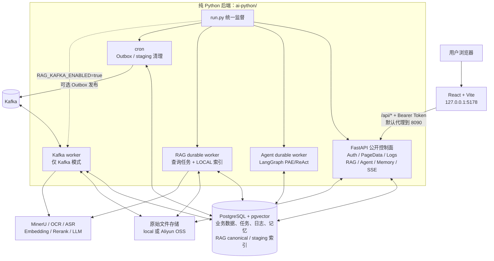
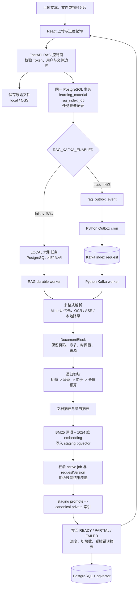
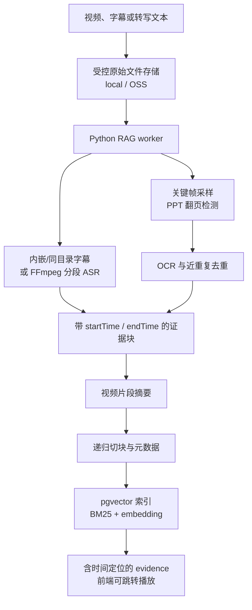
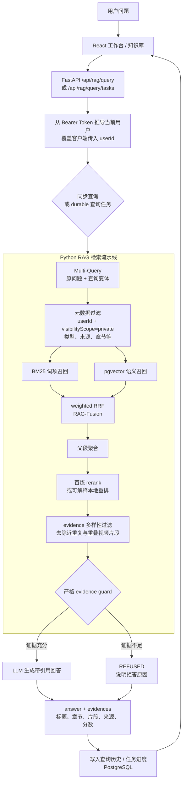
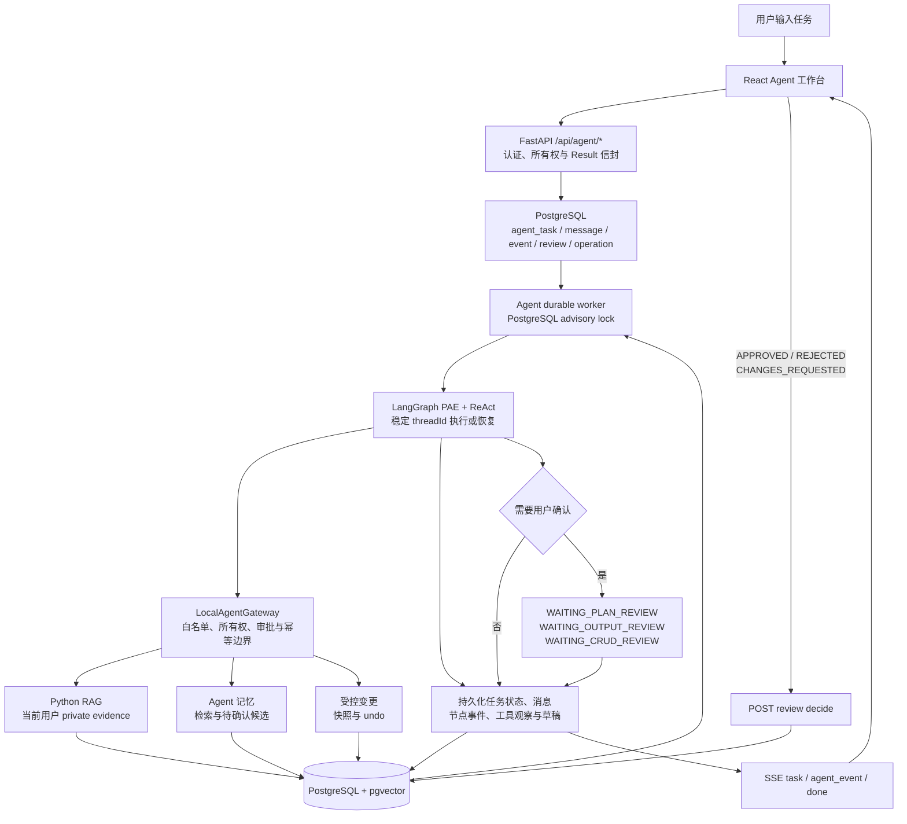
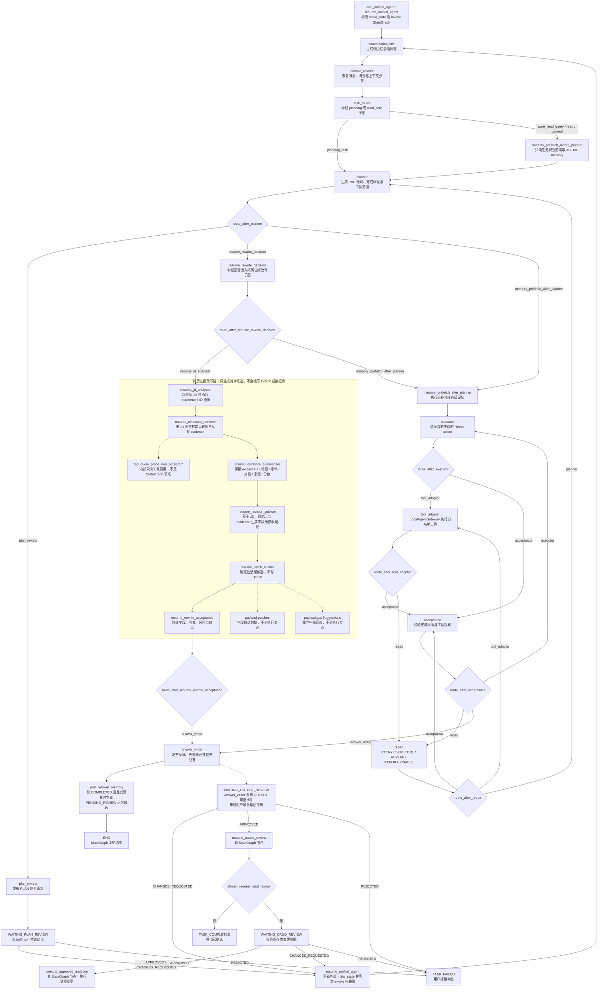

# 学迹智配 Agent

学迹智配 Agent 是面向学习证据沉淀、资料检索和岗位准备的多模态 RAG 与 Agent 项目。当前完整运行形态为 **`React + FastAPI + PostgreSQL/pgvector`**：React 只调用 FastAPI `8090`，Python 直接负责认证、页面数据、日志、RAG、Agent、记忆、SSE 和耐久任务。Spring Boot、JDK、Maven 和 `7080` 都不是当前运行依赖。


## 运行结论

完整程序只需要启动以下两个应用进程：

```powershell
conda run -n learning-evidence-rag python -B ai-python/run.py

cd frontend-react
npm run dev
```

- 前端地址：<http://127.0.0.1:5178>
- Python API：<http://127.0.0.1:8090>
- 健康检查：<http://127.0.0.1:8090/health>
- 数据库：PostgreSQL + pgvector，默认 `127.0.0.1:5433`
- 原始文件：本地目录或阿里 OSS；Kafka 仅在需要高吞吐索引时启用。

`ai-python/run.py` 是后端唯一启动入口。默认会监督 FastAPI、Agent worker、RAG durable worker 和已启用的 cron；Kafka 配置为开启时才会额外启动 Kafka worker。Java 代码只应视为迁移历史，不应启动或配置为联调依赖。

## 项目能力

- 多模态资料入库：文本、PDF、Office 文档、图片、字幕与视频；PDF 优先 MinerU，失败时走本地降级解析。
- 可追溯 RAG：结构化解析、递归切块、文档/章节摘要、元数据隔离、BM25 与 pgvector 向量召回、Multi-Query、RRF/RAG-Fusion、重排和 evidence 引用。
- 耐久任务：资料索引、查询任务、Agent 任务都先写入 PostgreSQL，再由 worker 以租约领取；进程重启后可恢复，不依赖 Web 请求进程存活。
- Agent 工作台：LangGraph PAE/ReAct 编排、受控工具、记忆、审批、撤销、任务消息、事件投影与 SSE。
- 统一业务边界：所有公开接口保持 React 既有 `/api/*` 路径、Bearer Token、camelCase 字段和 `{code,msg,data}` 响应信封。

## 系统总览



**数据事实源：** PostgreSQL/pgvector 同时保存认证、资料、任务、消息、审批、记忆、日志和向量索引。Redis 如启用只用于可丢失的运行态加速，原始文件保存在本地受控目录或 OSS。没有任何业务状态需要回写 Java。

## 资料入库与索引流程

资料上传不会在 HTTP 请求内同步执行解析或 embedding。FastAPI 先完成权限校验、原始文件落盘和事务写入，再由独立 worker 接管长任务；因此刷新页面、重启 API 或网络短暂波动不会让已提交资料丢失。



`--without-kafka` 是完整的本地模式开关：它会同时关闭 `RAG_KAFKA_ENABLED` 和 `AI_KAFKA_WORKER_ENABLED`，新资料一定创建 `LOCAL` 任务并由 RAG durable worker 消费。这样不会出现“API 投递 Kafka 任务，但 Kafka worker 没有启动”的悬挂任务。`--with-kafka` 则同时启用 Kafka 投递和 Kafka worker。

资料状态：`PENDING -> PARSING -> READY / PARTIAL / FAILED`；重建时为 `REINDEXING`。`PARTIAL` 代表部分补充解析失败但已有可检索 evidence，不是接口失败。

## 视频证据处理流程

视频与字幕资料走同一份 Python 索引状态机。字幕、语音、关键帧和 OCR 文本都带有时间位置，最终 evidence 可以让前端定位到对应播放片段。



## RAG 查询与证据回答流程

查询强制按当前登录用户和 `private` 可见范围过滤。无论是同步查询还是带进度的查询任务，最终回答都返回资料标题、章节、片段、来源、位置和分数等 evidence 结构；证据不足时返回结构化拒答，而不是编造答案。



RAG 检索设计采用 Multi-Query 扩展召回范围，再对每个查询的 BM25 与向量排名执行 RRF 融合。这样既保留关键词精确匹配，也保留语义召回，并能在 evidence guard 前保留可解释的检索诊断。

## Agent、记忆与审批闭环

Agent 不通过内部 HTTP 或 Java gateway 回调自身。FastAPI 将任务和用户操作持久化后，Agent worker 使用进程内 `LocalAgentGateway` 调用受控 RAG、记忆和业务服务；每个事件先落 PostgreSQL，再通过 SSE 投影到前端。

### 耐久任务与事件投影



### LangGraph PAE + ReAct 节点编排

这张图严格按 `ai-python/agents/orchestration/pae_react_graph.py` 中 `build_unified_graph()` 的真实节点和条件边重绘。一次 Agent 请求在进入 `StateGraph` 前会先由 `start_unified_agent()` 或 `resume_unified_agent()` 构造 `initial_state`；进入图后的第一个节点是 `conversation_title`，随后是 `context_restore -> task_router`。只有路由完成后，`planning_task` 才进入 `planner`，只读任务会先经过 `memory_prefetch_before_planner` 再进入 `planner`。



`resume_output_review` 和 `execute_approved_mutation` 是审批恢复函数，不是 `StateGraph` 节点。当前生产运行面不提供在线 DOCX 导出；若未来接入模板导出，仍需在该受控审批链外补充独立 API 契约、原文 hash、evidence、长度与版式校验。

任务、消息、审批、操作快照和记忆都以 PostgreSQL 为权威记录。工具失败只能有限重试、降级、重新规划或受控失败；`AGENT_GRAPH_RECURSION_LIMIT=24` 会终止异常循环。连接中断后的前端可以重新读取任务快照并重新连接 SSE；worker 重启后可继续领取未完成的耐久任务。

## 运行模式与进程职责

| 模式 | 资料索引通道 | `run.py` 启动的关键进程 | 适用场景 |
| --- | --- | --- | --- |
| 默认本地模式 | PostgreSQL `LOCAL` durable job | FastAPI、Agent worker、RAG durable worker、已启用 cron | 本机开发、单机部署、无需 Kafka |
| Kafka 高吞吐模式 | PostgreSQL Outbox -> Kafka -> Kafka worker | 默认进程加 Kafka worker | 多资料并发、独立 Kafka 集群 |
| 排障本地模式 | 强制 `LOCAL` durable job | `python ai-python/run.py --without-kafka` | Kafka 暂不可用或只排查 Python 链路 |

`run.py` 会在退出时回收它启动的子进程。worker 不在 Uvicorn Web 进程内运行，避免 reload 导致重复消费或丢失长任务。

## 目录结构

| 路径 | 用途 |
| --- | --- |
| `frontend-react/` | React + Vite 管理后台，开发端口 `5178` |
| `ai-python/app/` | FastAPI 公开 API、认证、页面数据、日志、持久任务、对象存储和 worker |
| `ai-python/rag/` | 解析、递归切块、摘要、pgvector、混合检索、融合、重排与 evidence |
| `ai-python/agents/` | LangGraph 编排与进程内 Agent gateway |
| `ai-python/run.py` | FastAPI 与所有受管 Python worker 的唯一启动入口 |
| `infra/sql/` | PostgreSQL/pgvector 初始化脚本与增量迁移 |
| `docs/api/` | Auth、PageData、Logs、RAG、Agent 和 Memory API 契约 |
| `docs/architecture/` | 纯 Python 后端迁移与 RAG 架构说明 |

## 首次初始化与数据库

Python 使用 Conda 环境 `learning-evidence-rag`：

```powershell
conda env create -f ai-python/environment.yml
conda activate learning-evidence-rag
```

空数据库使用 Python 非破坏性 bootstrap。它读取同一份 `infra/sql/init.sql`，跳过 `DROP`，并把建表和建索引转换为幂等操作：

```powershell
$env:PYTHONPATH = 'ai-python'
conda run -n learning-evidence-rag python -B -m app.core.database_bootstrap --dry-run
conda run -n learning-evidence-rag python -B -m app.core.database_bootstrap
```

已有数据库不要反复执行 `init.sql`。`run.py` 启动时只执行仓库内的 Python 幂等增量迁移；也可以在新环境首次启动时合并为：

```powershell
conda run -n learning-evidence-rag python -B ai-python/run.py --bootstrap-database
```

`backend-java/src/main/resources/application.yml` 的 Spring 配置没有被 Python 复用。Python 从 `ai-python/config/application.yml` 加载非敏感默认值，并允许 `ai-python/config/application.local.yml` 和环境变量覆盖；业务数据、任务与索引统一使用 PostgreSQL `learning_evidence` schema。详细说明见 [PostgreSQL/pgvector 建库说明](docs/database/postgresql-pgvector.md)。

## 配置与启动

将 `ai-python/config/application.local.example.yml` 复制为 `ai-python/config/application.local.yml`，本地密钥和覆盖配置均不提交。常用配置如下：

| 变量 | 用途 |
| --- | --- |
| `RAG_DATABASE_URL` | PostgreSQL 连接串，默认使用本机 `5433` 的 `learning_evidence` schema |
| `DASHSCOPE_API_KEY` | 百炼 embedding、rerank、LLM、OCR 与 ASR |
| `MINERU_COMMAND` | 可选 MinerU 命令模板，使用 `{input}` 与 `{output}` 占位符 |
| `EVIDENCE_STORAGE_PROVIDER` | `local` 或 `oss` 原始文件存储 |
| `RAG_KAFKA_ENABLED` | 启用 Kafka 索引通道；默认 `false` |
| `TAVILY_API_KEY` | 预留配置；当前纯 Python Agent 尚未启用联网搜索，默认留空 |

启动后端：

```powershell
conda run -n learning-evidence-rag python -B ai-python/run.py
```

本地排障：

```powershell
conda run -n learning-evidence-rag python -B ai-python/run.py --without-kafka
conda run -n learning-evidence-rag python -B ai-python/run.py --without-cron --without-agent-worker --without-rag-worker
```

启动前端：

```powershell
cd frontend-react
npm ci
npm run dev
```

`VITE_API_PROXY_TARGET` 未设置时，前端默认代理到 `http://127.0.0.1:8090`。

## 公开 API

| 模块 | 路径 |
| --- | --- |
| 认证 | `/api/auth/*` |
| 工作台和设置 | `/api/page-data/*` |
| 系统日志 | `/api/logs/*` |
| 学习资料和 RAG | `/api/rag/*` |
| Agent、审批、记忆和 SSE | `/api/agent/*` |

完整请求、鉴权、错误和异步状态说明见 [API 文档](docs/api/)。

## 验证

```powershell
conda run -n learning-evidence-rag python -B -m pytest ai-python/tests -q

cd frontend-react
npm run build
```

RAG 小样本评估入口：

```powershell
conda run -n learning-evidence-rag python -B ai-python/rag/evaluation/run_ragas_small_eval.py --mode offline
```

## 设计资料

- [纯 Python FastAPI 后端迁移计划](docs/architecture/python-backend-migration-plan.md)
- [RAG 架构说明](docs/architecture/rag-architecture.md)
- [RAG 接口契约](docs/api/rag.md)
- [Agent 接口契约](docs/api/agent.md)
- [日志接口契约](docs/api/logs.md)
- [PostgreSQL/pgvector 建库说明](docs/database/postgresql-pgvector.md)
