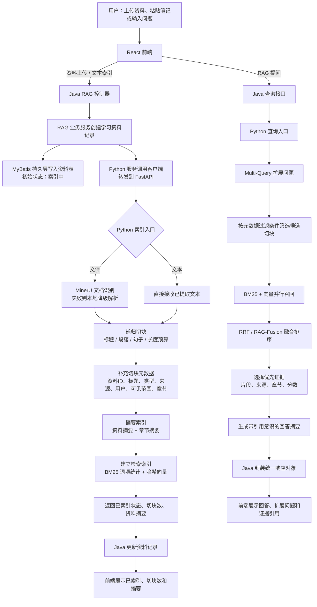
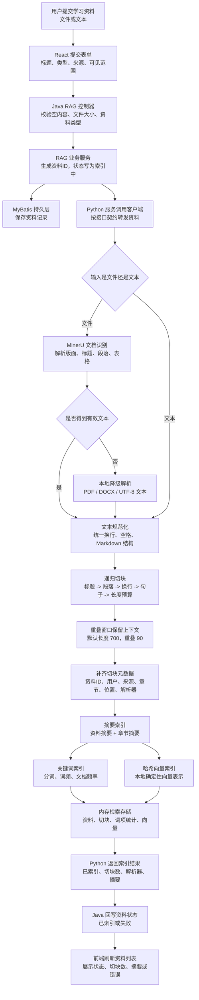
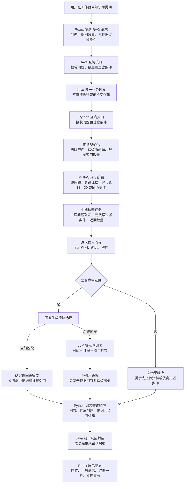
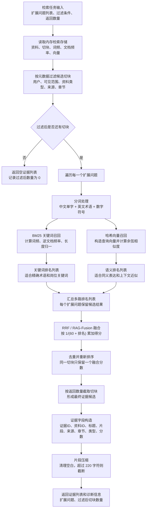

# Multimodal RAG Agent Learning Evidence Platform

中文名：学迹智配 Agent：基于 RAG 的多模态学习证据库与岗位适配系统

技术栈：React + Java Spring Boot + Python FastAPI + RAG。当前阶段完成到 RAG，暂不实现 Agent 任务编排。

## 项目定位

本项目面向大学生与求职准备人群，用于把个人学习资料、课程笔记、项目材料、视频片段和简历内容沉淀为可检索、可引用、可复用的个人学习证据库。系统第一阶段聚焦 RAG：

- 文档识别：优先使用 MinerU，通过 `MINERU_COMMAND` 接入；未配置时走本地解析降级。
- 切块：使用递归切块，优先保留标题、段落、句子结构。
- 检索：Multi-Query + BM25 + 哈希向量召回 + RRF/RAG-Fusion。
- 引用：回答返回证据片段、来源、章节和分数。

## RAG 业务流程

本项目的 RAG 不是前端直接调用 Python，也不是把 AI 逻辑写在 Java 里。业务边界是：React 只面向用户交互，Java Spring Boot 负责业务状态、资料记录、权限边界和统一 `Result<T>` 响应，Python FastAPI 负责文档识别、递归切块、索引、混合检索和证据引用。这样后续替换向量库、embedding 模型或增加重排序模型时，不需要破坏 Java 业务接口。

### 整体业务流程图



### 细分 RAG 流程图

这里把 RAG 拆成“索引流程”“查询流程”“检索流程”三张图。查询流程解决“用户问题如何进入 RAG 并形成响应”，检索流程解决“候选切块如何被召回、融合、排序并变成证据”。Java 只承载业务状态和统一响应，Python 承载 RAG 计算。

#### 索引流程图：资料到可检索证据



#### 查询流程图：用户问题到响应封装



#### 检索流程图：召回、融合、排序到证据



### 索引阶段：把学习资料变成可检索证据

1. 用户在前端上传文件，或在“学习资料”页面粘贴文本笔记。
2. 前端只调用 Java API：文件走 `/api/rag/materials/upload`，文本走 `/api/rag/materials/text`。
3. Java 在 `learning_material` 中先创建资料记录，状态设为 `INDEXING`，用于前端展示处理状态和最近资料列表。
4. Java 通过 `PythonRagClient` 调 Python 内部接口。文本会被包装为 `documentId/title/documentType/source/userId/visibilityScope/content`；文件会用 `multipart/form-data` 转发给 Python。
5. Python 文件入口优先调用 `MINERU_COMMAND` 配置的 MinerU 命令。MinerU 未配置、执行失败或没有解析出文本时，使用本地降级解析：PDF 走 `pypdf`，DOCX 走 `python-docx`，其他文本按 UTF-8 解码。
6. Python 使用递归切块器做切块，按 Markdown 标题、空行、换行、句号、分号、逗号和空格逐级拆分；默认切块长度为 700，重叠窗口为 90，尽量保留上下文。
7. 每个切块都保留元数据：资料 ID、标题、类型、来源、用户、可见范围、解析器、上传时间、章节名和切块位置。
8. 摘要索引组件生成文档级摘要和章节级摘要；同时为每个切块建 BM25 词项统计和确定性哈希向量。
9. Python 返回已索引状态、切块数量、解析器和摘要；Java 更新资料记录，前端就能看到“已索引”、切块数和摘要。

### 查询阶段：把问题变成带证据引用的回答

1. 用户在工作台或知识库页面输入问题。
2. 前端调用 Java `/api/rag/query`，Java 不做检索逻辑，只做统一接口和错误边界，然后调用 Python `/internal/rag/query`。
3. Python 先做 Multi-Query 扩展：保留原问题，再补充“关键证据”“学习资料/笔记”等查询变体；如果问题包含 JD、岗位、简历、项目等词，会补充更贴近岗位适配或简历证据的查询变体。
4. Python 按元数据过滤条件过滤候选切块。当前第一阶段默认本地演示用户是 `demo-user`，后续可接真实登录态和资料权限。
5. 每个查询变体同时走两路召回：BM25 负责关键词精确匹配，哈希向量负责语义近似匹配。
6. 多个查询变体、多个召回器的结果通过 RRF 做 RAG-Fusion 融合排序，避免单一路径漏召回。
7. 系统按返回数量选择证据，并返回证据 ID、资料 ID、标题、片段、来源、章节、资料类型和融合分数。
8. 当前阶段生成的是确定性回答摘要：说明检索到几条证据、优先参考哪些资料和章节，并提醒正式输出保留证据引用。后续可以把这一步替换为真实 LLM 生成，但证据结构不需要改。

### 当前实现边界

- 当前 Python 检索索引是内存态，适合第一阶段端到端验证；服务重启后需要重新索引资料。后续可替换为 PostgreSQL + pgvector、Qdrant、Milvus 或 Elasticsearch。
- 当前向量召回使用 deterministic hash embedding，保证本地无模型密钥也能运行；后续可以替换为真实 embedding 模型。
- 当前回答生成是规则化摘要，不调用大模型；后续接 LLM 时应继续保留 evidence 引用和检索诊断。
- 当前 Agent 任务只保留页面入口，不实现自主规划、工具调用或长任务编排。

## 目录结构

```text
frontend-react/   React 前端，复刻 Stitch 生成的工作台风格并绑定路由
backend-java/     Java Spring Boot API，Controller + Service + Mapper
ai-python/        Python FastAPI RAG 服务，负责解析、切块、索引和检索
docs/             API、架构、Stitch 页面提取记录
infra/sql/        数据库初始化 SQL 与增量迁移
samples/          示例 JD、简历和学习资料
```

## 本地启动

Python RAG 服务：

```powershell
cd ai-python
python -m pip install -r requirements.txt
$env:PYTHONPATH='.'
python -m uvicorn app.main:app --host 127.0.0.1 --port 8090
```

Java 后端：

```powershell
cd backend-java
mvn spring-boot:run
```

React 前端：

```powershell
cd frontend-react
npm install
npm run dev
```

访问：`http://127.0.0.1:5178`

## MinerU 接入

配置环境变量后，Python 文件索引会优先调用 MinerU：

```powershell
$env:MINERU_COMMAND='mineru -p {input} -o {output}'
```

命令需要把 Markdown 或 TXT 结果写入 `{output}` 目录。未配置或执行失败时，服务会使用本地解析降级，保证本地开发可运行。

## 验证命令

```powershell
$env:PYTHONPATH='ai-python'
python -B -m pytest ai-python/tests -q

cd backend-java
mvn test

cd frontend-react
npm run build
```

## Stitch 页面使用说明

前端基于 Chrome 中 Stitch 项目 `学迹智配管理后台` 生成页实现。已提取并固化：

- 左侧导航、顶部搜索栏、上传入口、工作台统计卡片。
- RAG 问答、多模态资料接入、JD 分析、视频切片、简历证据对齐模块。
- 主色 `#4F46E5`、辅色 `#0EA5E9`、浅色后台、约 8px 卡片圆角和 Inter 字体风格。

记录见 [docs/product/stitch-design-notes.md](docs/product/stitch-design-notes.md)。
