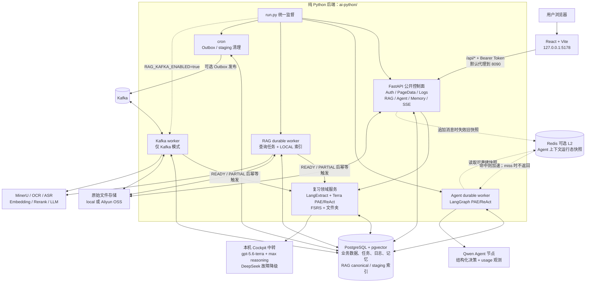
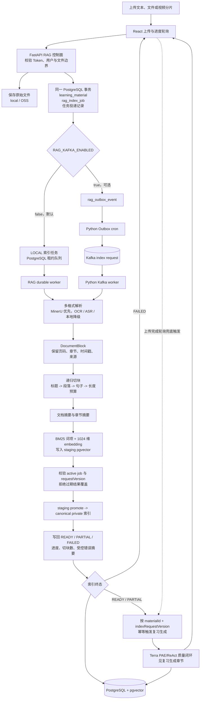
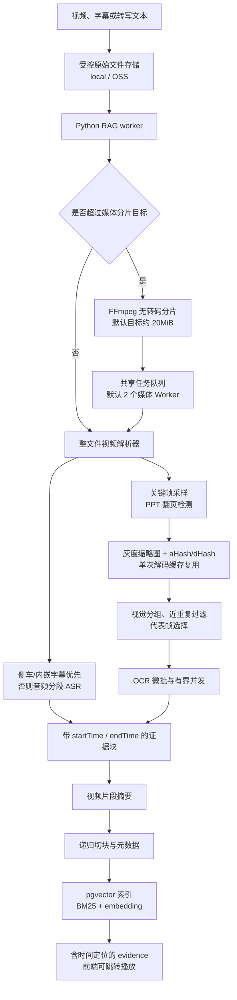
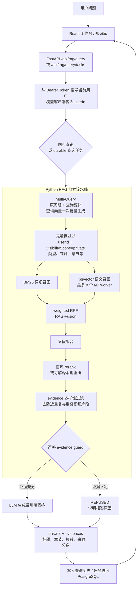
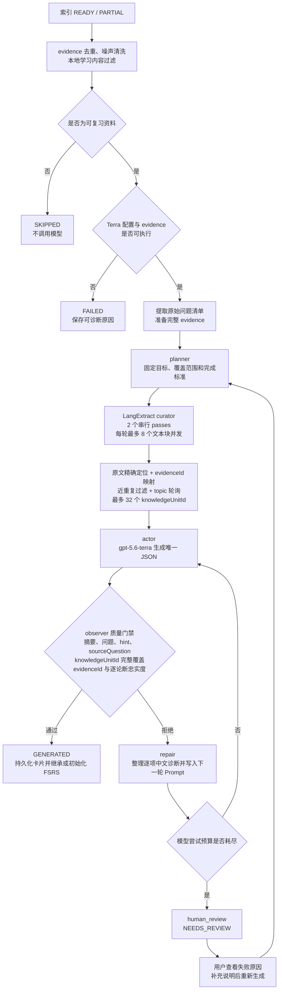
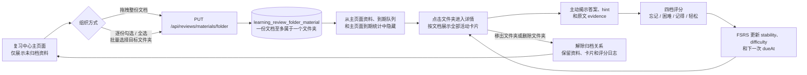
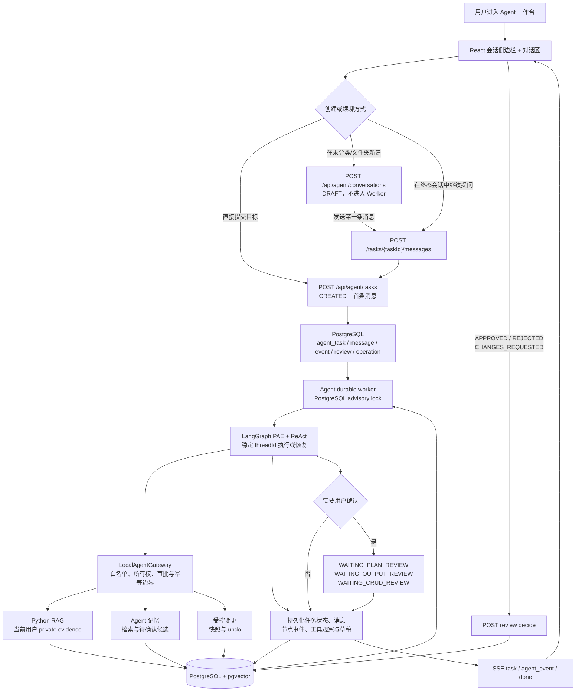
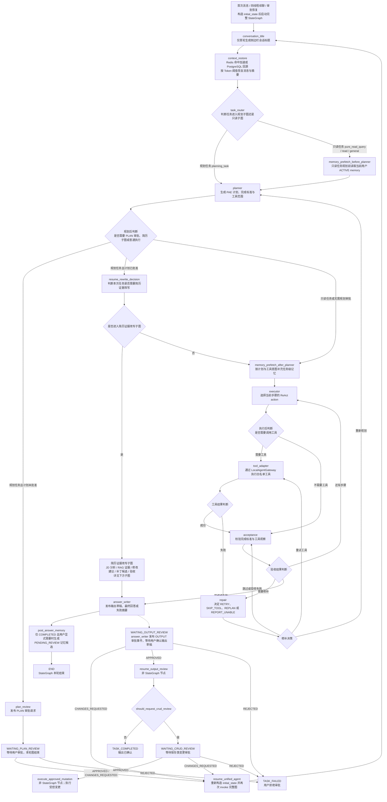
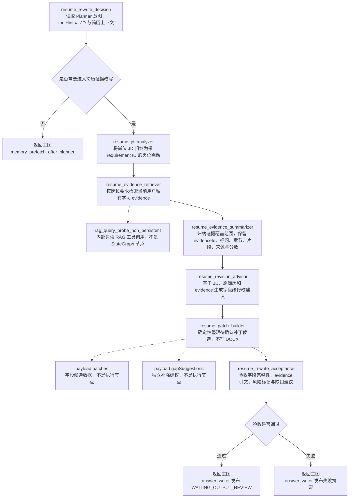

# 学迹智配 Agent：多模态 RAG 学习证据与岗位适配平台

学迹智配 Agent 是面向学习证据沉淀、资料检索和岗位准备的多模态 RAG 与 Agent 平台，英文仓库名为 **`Multimodal-RAG-Agent-Learning-Evidence-Platform`**。当前完整运行形态为 **`React + FastAPI + PostgreSQL/pgvector`**：React 只调用 FastAPI `8090`，Python 直接负责认证、页面数据、日志、RAG、Agent、记忆、SSE 和耐久任务；仓库中没有 Java 源码，Spring Boot、JDK、Maven 和 `7080` 都不是运行依赖。


## 运行结论

完整程序只需要启动以下两个应用进程：

```powershell
.\ai-python\start.ps1

cd frontend-react
npm run dev
```

- 前端地址：<http://127.0.0.1:5178>
- Python API：<http://127.0.0.1:8090>
- 健康检查：<http://127.0.0.1:8090/health>
- 数据库：PostgreSQL + pgvector，默认 `127.0.0.1:5433`
- 原始文件：本地目录或阿里 OSS；Kafka 仅在需要高吞吐索引时启用。

`ai-python/run.py` 是后端唯一启动入口。默认会监督 FastAPI、Agent worker、RAG durable worker 和已启用的 cron；Kafka 配置为开启时才会额外启动 Kafka worker。旧文档中的 Java 架构仅作为迁移历史，不是当前代码、启动或联调依据。

## 项目能力

- 多模态资料入库：文本、PDF、Office 文档、图片、字幕与视频；PDF 优先 MinerU，失败时走本地降级解析。
- 可追溯 RAG：结构化解析、递归切块、文档/章节摘要、元数据隔离、BM25 与 pgvector 向量召回、Multi-Query、RRF/RAG-Fusion、重排和 evidence 引用。
- 间隔复习：以用户上传资料为 group，自动识别八股、面经、课程与技术讲解；LangExtract 从完整资料发现陈述式与问答式知识单元，结构化问题或候选较多时最多生成 32 张。
- 复习质量闭环：独立 LangGraph 按 Planner → LangExtract Curator → Actor → Observer → Repair 运行；Curator 候选精确回指 evidence 并只执行一次，质量门禁反馈会进入下一轮 Prompt，自动修复耗尽后转为 `NEEDS_REVIEW`。
- 复习文件夹：文档可拖拽或批量移入文件夹；归档后从主页面隐藏，在文件夹内逐文档查看、揭示、评分，也可移出文件夹恢复主页面展示。
- Prompt 与证据边界：复习 Prompt 集中在 `ai-python/prompts/review.py`；摘要、问题、答案和提示默认由 `gpt-5.6-terra` 基于当前 evidence 生成，本地只做过滤、结构校验和忠实度门禁，不生成内容降级结果。
- 耐久任务：资料索引、查询任务、Agent 任务都先写入 PostgreSQL，再由 worker 以租约领取；进程重启后可恢复，不依赖 Web 请求进程存活。
- Agent 工作台：支持在未分类或指定文件夹创建空白 `DRAFT` 会话、在同一 `taskId/threadId` 上多轮续聊、历史消息分页、LangGraph PAE/ReAct、受控工具、记忆、审批、撤销、事件投影与 SSE。
- 长会话上下文：使用 `tiktoken` 做本地预算，未摘要原文超过 Token 阈值后才生成滚动摘要；PostgreSQL 保存消息与摘要事实，Redis 只缓存可重建的 L2 运行态快照。
- Prompt 与模型观测：Agent、RAG、复习、简历、OCR 和 ASR Prompt 集中在 `ai-python/prompts/`；Agent Qwen 调用保留 provider usage，支持审计输入 Token、输出 Token 和总 Token。
- 工程基准：提供默认关闭的固定场景 Agent A/B 基准，验证同线程长会话、工具安全和 Redis miss/Worker 重启恢复，不接受浏览器注入任意测试工具或测试正文。
- 统一业务边界：所有公开接口保持 React 既有 `/api/*` 路径、Bearer Token、camelCase 字段和 `{code,msg,data}` 响应信封。

## 系统总览


```mermaid
flowchart TB
    U["用户浏览器"] --> FE["React + Vite\n127.0.0.1:5178"]
    FE -->|"/api/* + Bearer Token\n默认代理到 8090"| API

    subgraph PY["纯 Python 后端：ai-python/"]
        SUP["run.py 统一监督"]
        API["FastAPI 公开控制面\nAuth / PageData / Logs\nRAG / Agent / Memory / SSE"]
        AGW["Agent durable worker\nLangGraph PAE/ReAct"]
        RAGW["RAG durable worker\n查询任务 + LOCAL 索引"]
        REVIEW["复习领域服务\nLangExtract + Terra PAE/ReAct\nFSRS + 文件夹"]
        CRON["cron\nOutbox / staging 清理"]
        KAFKAW["Kafka worker\n仅 Kafka 模式"]
        SUP --> API
        SUP --> AGW
        SUP --> RAGW
        SUP --> CRON
        SUP -. "RAG_KAFKA_ENABLED=true" .-> KAFKAW
    end

    API --> REVIEW
    RAGW -->|"READY / PARTIAL 后幂等触发"| REVIEW
    KAFKAW -->|"READY / PARTIAL 后幂等触发"| REVIEW

    API <--> DB[("PostgreSQL + pgvector\n业务数据、任务、日志、记忆\nRAG canonical / staging 索引")]
    AGW <--> DB
    RAGW <--> DB
    REVIEW <--> DB
    CRON <--> DB
    KAFKAW <--> DB

    API -. "追加消息时失效旧快照" .-> REDIS[("Redis 可选 L2\nAgent 上下文运行态快照")]
    AGW -. "读取可重建快照" .-> REDIS
    REDIS -. "命中则加速；miss 时不返回" .-> AGW

    API <--> STORE["原始文件存储\nlocal 或 Aliyun OSS"]
    RAGW <--> STORE
    KAFKAW <--> STORE
    RAGW --> MODEL["MinerU / OCR / ASR\nEmbedding / Rerank / LLM"]
    KAFKAW --> MODEL
    REVIEW --> REVIEW_LLM["本机 Cockpit 中转\ngpt-5.6-terra + max reasoning\nDeepSeek 故障降级"]
    AGW --> QWEN["Qwen Agent 节点\n结构化决策 + usage 观测"]

    CRON -->|"可选 Outbox 发布"| KAFKA[("Kafka")]
    KAFKA <--> KAFKAW
```

**数据事实源：** PostgreSQL/pgvector 同时保存认证、资料、任务、消息、上下文摘要、审批、记忆、日志和向量索引。Redis 如启用只保存带 `userId + taskId + threadId` 身份校验和 TTL 的可丢失快照；miss、不可用或进程重启均回源 PostgreSQL。原始文件保存在本地受控目录或 OSS，没有任何业务状态需要回写 Java。

## 资料入库与索引流程

资料上传不会在 HTTP 请求内同步执行解析或 embedding。FastAPI 先完成权限校验、原始文件落盘和事务写入，再由独立 worker 接管长任务；因此刷新页面、重启 API 或网络短暂波动不会让已提交资料丢失。


```mermaid
flowchart TB
    U["上传文本、文件或视频分片"] --> FE["React 上传与进度轮询"]
    FE --> API["FastAPI RAG 控制面\n校验 Token、用户与文件边界"]
    API --> STORE["保存原始文件\nlocal / OSS"]
    API --> TX["同一 PostgreSQL 事务\nlearning_material\nrag_index_job\n任务投递记录"]

    TX --> MODE{"RAG_KAFKA_ENABLED"}
    MODE -->|"false，默认"| LOCAL["LOCAL 索引任务\nPostgreSQL 租约队列"]
    MODE -->|"true，可选"| OUTBOX["rag_outbox_event"]
    OUTBOX --> CRON["Python Outbox cron"]
    CRON --> KAFKA[("Kafka index request")]

    LOCAL --> RAGW["RAG durable worker"]
    KAFKA --> KAFKAW["Python Kafka worker"]
    RAGW --> PARSE
    KAFKAW --> PARSE

    PARSE["多格式解析\nMinerU 优先，OCR / ASR / 本地降级"] --> BLOCK["DocumentBlock\n保留页码、章节、时间戳、来源"]
    BLOCK --> CHUNK["递归切块\n标题 -> 段落 -> 句子 -> 长度预算"]
    CHUNK --> SUMMARY["文档摘要与章节摘要"]
    SUMMARY --> INDEX["BM25 词项 + 1024 维 embedding\n写入 staging pgvector"]
    INDEX --> CHECK["校验 active job 与 requestVersion\n拒绝过期结果覆盖"]
    CHECK --> PROMOTE["staging promote -> canonical private 索引"]
    PROMOTE --> RESULT["写回 READY / PARTIAL / FAILED\n进度、切块数、受控错误摘要"]
    RESULT --> STATUS{"索引终态"}
    STATUS --> DB[("PostgreSQL + pgvector")]
    STATUS -->|"READY / PARTIAL"| REVIEW_SYNC["按 materialId + indexRequestVersion\n幂等触发复习生成"]
    STATUS -->|"FAILED"| FE
    FE -. "上传完成轮询兜底触发" .-> REVIEW_SYNC
    REVIEW_SYNC --> REVIEW_FLOW["Terra PAE/ReAct 质量闭环\n见复习生成章节"]
    REVIEW_FLOW --> DB
    REVIEW_FLOW --> FE
```

`--without-kafka` 是完整的本地模式开关：它会同时关闭 `RAG_KAFKA_ENABLED` 和 `AI_KAFKA_WORKER_ENABLED`，新资料一定创建 `LOCAL` 任务并由 RAG durable worker 消费。这样不会出现“API 投递 Kafka 任务，但 Kafka worker 没有启动”的悬挂任务。`--with-kafka` 则同时启用 Kafka 投递和 Kafka worker。

资料状态：`PENDING -> PARSING -> READY / PARTIAL / FAILED`；重建时为 `REINDEXING`。`PARTIAL` 代表部分补充解析失败但已有可检索 evidence，不是接口失败。

## 视频证据处理流程

视频与字幕资料走同一份 Python 索引状态机。前端上传分片和后端媒体解析均以约 `20MiB` 为目标；大视频合并后会再次用 FFmpeg 无转码切成独立媒体片段，再由共享队列和有界 Worker 聚合。字幕、语音、关键帧和 OCR 文本都带有时间位置，最终 evidence 可以让前端定位到对应播放片段。


```mermaid
flowchart TB
    V["视频、字幕或转写文本"] --> STORE["受控原始文件存储\nlocal / OSS"]
    STORE --> WORKER["Python RAG worker"]
    WORKER --> SIZE{"是否超过媒体分片目标"}
    SIZE -->|"否"| PARSER["整文件视频解析器"]
    SIZE -->|"是"| SPLIT["FFmpeg 无转码分片\n默认目标约 20MiB"]
    SPLIT --> POOL["共享任务队列\n默认 2 个媒体 Worker"]
    POOL --> PARSER
    PARSER --> SUB["侧车/内嵌字幕优先\n否则音频分段 ASR"]
    PARSER --> FRAME["关键帧采样\nPPT 翻页检测"]
    FRAME --> FEATURE["灰度缩略图 + aHash/dHash\n单次解码缓存复用"]
    FEATURE --> DEDUP["视觉分组、近重复过滤\n代表帧选择"]
    DEDUP --> OCR["OCR 微批与有界并发"]
    SUB --> BLOCK["带 startTime / endTime 的证据块"]
    OCR --> BLOCK
    BLOCK --> SUMMARY["视频片段摘要"]
    SUMMARY --> CHUNK["递归切块与元数据"]
    CHUNK --> INDEX["pgvector 索引\nBM25 + embedding"]
    INDEX --> EVIDENCE["含时间定位的 evidence\n前端可跳转播放"]
```

媒体分片大小是按码率和时长估算的目标值，无转码切片还要服从关键帧边界，因此单片不保证严格等于 `20MiB`。分片失败、FFmpeg 不可用或并发解析没有形成有效字幕/OCR evidence 时，会回落到原整视频解析路径。`RAG_VIDEO_PARALLEL_WORKERS` 默认保持 `2`，避免常见开发机在抽帧、OCR 和 ASR 同时执行时出现无界资源竞争。

## RAG 查询与证据回答流程

查询强制按当前登录用户和 `private` 可见范围过滤。无论是同步查询还是带进度的查询任务，最终回答都返回资料标题、章节、片段、来源、位置和分数等 evidence 结构；证据不足时返回结构化拒答，而不是编造答案。


```mermaid
flowchart TB
    Q["用户问题"] --> FE["React 工作台 / 知识库"]
    FE --> API["FastAPI /api/rag/query\n或 /api/rag/query/tasks"]
    API --> AUTH["从 Bearer Token 推导当前用户\n覆盖客户端传入 userId"]
    AUTH --> TASK{"同步查询\n或 durable 查询任务"}
    TASK --> RETRIEVE

    subgraph RETRIEVE["Python RAG 检索流水线"]
        MQ["Multi-Query\n原问题 + 查询变体\n查询向量一次批量生成"]
        FILTER["元数据过滤\nuserId + visibilityScope=private\n类型、来源、章节等"]
        BM25["BM25 词项召回"]
        VECTOR["pgvector 语义召回\n最多 8 个 I/O worker"]
        FUSION["weighted RRF\nRAG-Fusion"]
        PARENT["父段聚合"]
        RERANK["百炼 rerank\n或可解释本地重排"]
        DIVERSITY["evidence 多样性过滤\n去除近重复与重叠视频片段"]
        GUARD{"严格 evidence guard"}
        MQ --> FILTER
        FILTER --> BM25
        FILTER --> VECTOR
        BM25 --> FUSION
        VECTOR --> FUSION
        FUSION --> PARENT --> RERANK --> DIVERSITY --> GUARD
    end

    GUARD -->|"证据充分"| LLM["LLM 生成带引用回答"]
    GUARD -->|"证据不足"| REFUSE["REFUSED\n说明拒答原因"]
    LLM --> EVIDENCE["answer + evidences\n标题、章节、片段、来源、分数"]
    REFUSE --> EVIDENCE
    EVIDENCE --> HISTORY["写入查询历史 / 任务进度\nPostgreSQL"]
    HISTORY --> FE
```

RAG 检索设计采用 Multi-Query 扩展召回范围，查询变体先通过一次批量 embedding 生成全部向量，再以默认 8、硬上限 10 的有界线程池并发查询 pgvector；结果按原查询下标复位后执行 RRF 融合。这样既减少串行网络等待，也保留关键词精确匹配、语义召回和可解释检索诊断。

## 复习生成、文件夹与 FSRS 闭环

RAG 索引进入 `READY` 或 `PARTIAL` 后，LOCAL worker 与 Kafka worker 都会按 `materialId + indexRequestVersion + extractorVersion` 幂等触发复习生成；前端上传完成轮询也会按 `materialId` 兜底触发同一服务。系统先做确定性的 evidence 清洗和学习内容过滤，只有通过过滤的资料才交给独立复习 LangGraph，面向用户的摘要、问题、答案和提示默认由 `gpt-5.6-terra` 基于当前 evidence 生成。

### Terra PAE/ReAct 生成质量闭环


```mermaid
flowchart TB
    INDEXED["索引 READY / PARTIAL"] --> CLEAN["evidence 去重、噪声清洗\n本地学习内容过滤"]
    CLEAN --> LEARNING{"是否为可复习资料"}
    LEARNING -->|"否"| SKIPPED["SKIPPED\n不调用模型"]
    LEARNING -->|"是"| CONFIG{"Terra 配置与 evidence\n是否可执行"}
    CONFIG -->|"否"| FAILED["FAILED\n保存可诊断原因"]
    CONFIG -->|"是"| QUESTIONS["提取原始问题清单\n准备完整 evidence"]
    QUESTIONS --> PLANNER["planner\n固定目标、覆盖范围和完成标准"]
    PLANNER --> CURATOR["LangExtract curator\n2 个串行 passes\n每轮最多 8 个文本块并发"]
    CURATOR --> GROUND["原文精确定位 + evidenceId 映射\n近重复过滤 + topic 轮询\n最多 32 个 knowledgeUnitId"]
    GROUND --> ACTOR["actor\ngpt-5.6-terra 生成唯一 JSON"]
    ACTOR --> OBSERVER{"observer 质量门禁\n摘要、问题、hint、sourceQuestion\nknowledgeUnitId 完整覆盖\nevidenceId 与逐论断忠实度"}
    OBSERVER -->|"通过"| GENERATED["GENERATED\n持久化卡片并继承或初始化 FSRS"]
    OBSERVER -->|"拒绝"| REPAIR["repair\n整理逐项中文诊断并写入下一轮 Prompt"]
    REPAIR --> BUDGET{"模型尝试预算是否耗尽"}
    BUDGET -->|"否"| ACTOR
    BUDGET -->|"是"| MANUAL["human_review\nNEEDS_REVIEW"]
    MANUAL --> FEEDBACK["用户查看失败原因\n补充说明后重新生成"]
    FEEDBACK --> PLANNER
```

LangExtract Curator 在一轮图中只运行一次，Repair 会复用同一候选上下文；默认每轮最多 8 个并发复习模型请求、整个进程也限制为 8，避免多资料叠加后无界扩张。LangGraph 固定使用 `recursion_limit=999` 作为多节点循环的总步数兜底；它不代表会调用模型 999 次。`REVIEW_GENERATION_MAX_ATTEMPTS` 控制卡片生成的真实模型预算，默认 8 次，安全范围为 1-20 次。尝试耗尽后保存 `generationAttempts` 与 `qualityFeedback`，转入 `NEEDS_REVIEW` 并停止后台自动重试；用户补充说明后才开始新一轮图执行。

### 文件夹归档与文件夹内复习


```mermaid
flowchart LR
    HOME["复习中心主页面\n仅展示未归档资料"] --> SELECT{"组织方式"}
    SELECT -->|"拖拽整份文档"| ASSIGN["PUT /api/reviews/materials/folder"]
    SELECT -->|"逐份勾选 / 全选\n批量选择目标文件夹"| ASSIGN
    ASSIGN --> RELATION[("learning_review_folder_material\n一份文档至多属于一个文件夹")]
    RELATION --> HIDDEN["从主页面资料、到期队列\n和主页面到期统计中隐藏"]
    HIDDEN --> DETAIL["点击文件夹进入详情\n按文档展示全部活动卡片"]
    DETAIL --> REVEAL["主动揭示答案、hint\n和原文 evidence"]
    REVEAL --> GRADE["四档评分\n忘记 / 困难 / 记得 / 轻松"]
    GRADE --> FSRS["FSRS 更新 stability、difficulty\n和下一次 dueAt"]
    FSRS --> DETAIL
    DETAIL -->|"移出文件夹或删除文件夹"| UNFILE["解除归档关系\n保留资料、卡片和评分日志"]
    UNFILE --> HOME
```

文件夹只改变资料的展示归属，不修改 RAG 索引、资料优先级或 FSRS 排程。归档资料不再出现在主页面；文件夹详情仍能逐张揭示、查看 evidence 并评分。PostgreSQL 中的卡片状态、`dueAt` 和评分日志始终是排程事实源，移出文件夹后资料恢复到主页面。

## Agent、记忆与审批闭环

Agent 不通过内部 HTTP 或 Java gateway 回调自身。FastAPI 将会话、消息和用户操作持久化后，Agent worker 使用进程内 `LocalAgentGateway` 调用受控 RAG、记忆和业务服务；每个事件先落 PostgreSQL，再通过 SSE 投影到前端。空白会话使用 `DRAFT` 状态且不会被 Worker 领取，第一次发送或在终态会话中续聊时才进入 `CREATED`，并复用原 `taskId/threadId`。

### 耐久任务与事件投影


```mermaid
flowchart TB
    U["用户进入 Agent 工作台"] --> FE["React 会话侧边栏 + 对话区"]
    FE --> ENTRY{"创建或续聊方式"}
    ENTRY -->|"直接提交目标"| CREATE["POST /api/agent/tasks\nCREATED + 首条消息"]
    ENTRY -->|"在未分类/文件夹新建"| DRAFT["POST /api/agent/conversations\nDRAFT，不进入 Worker"]
    DRAFT -->|"发送第一条消息"| CONTINUE["POST /tasks/{taskId}/messages"]
    ENTRY -->|"在终态会话中继续提问"| CONTINUE
    CONTINUE --> CREATE
    CREATE --> TASK["PostgreSQL\nagent_task / message / event / review / operation"]
    TASK --> AGW["Agent durable worker\nPostgreSQL advisory lock"]
    AGW --> GRAPH["LangGraph PAE + ReAct\n稳定 threadId 执行或恢复"]
    GRAPH --> GATE["LocalAgentGateway\n白名单、所有权、审批与幂等边界"]

    GATE --> RAG["Python RAG\n当前用户 private evidence"]
    GATE --> MEM["Agent 记忆\n检索与待确认候选"]
    GATE --> OPS["受控变更\n快照与 undo"]
    RAG --> DB[("PostgreSQL + pgvector")]
    MEM --> DB
    OPS --> DB

    GRAPH --> EVENT["持久化任务状态、消息\n节点事件、工具观察与草稿"]
    EVENT --> DB
    EVENT --> SSE["SSE task / agent_event / done"]
    SSE --> FE

    GRAPH --> REVIEW{"需要用户确认"}
    REVIEW -->|"否"| EVENT
    REVIEW -->|"是"| WAIT["WAITING_PLAN_REVIEW\nWAITING_OUTPUT_REVIEW\nWAITING_CRUD_REVIEW"]
    WAIT --> EVENT
    FE -->|"APPROVED / REJECTED\nCHANGES_REQUESTED"| DECIDE["POST review decide"]
    DECIDE --> DB
    DB --> AGW
```

长会话使用三层上下文：L1 是本轮 Prompt 中的摘要段和阈值内最近原文；L2 是 Redis `agent:ctx:{userId}:{taskId}` 可重建快照；L3 是 PostgreSQL `agent_chat_message` 与 `agent_conversation_summary` 权威事实。恢复层不再固定截取最近 12 条消息，而是从未摘要原文中按 Token 预算拆分 `messageWindow` 和 `compressionCandidateMessages`。追加新轮次会失效旧 Redis 快照，下一次 Worker 从 PostgreSQL 重建。

### LangGraph PAE + ReAct 节点编排

这组图严格按 `ai-python/agents/orchestration/pae_react_graph.py` 的 `build_unified_graph()` 重绘。第一张是**整个 Agent 的主调用图**：从真实入口 `conversation_title` 开始，覆盖任务路由、规划审批、ReAct 执行、修补、验收、回答、记忆和人工审批恢复；简历证据改写在主图中折叠为一个子图节点。第二张只展开这个简历子图，避免主图被简历细节淹没。`context_budget_guard` 与 `conversation_compression` 是节点内部调用的预算守卫和压缩辅助函数，不是 `StateGraph.add_node()` 注册节点，因此不伪画成主图节点。

#### Agent 主调用图


```mermaid
flowchart TB
    START["首次消息 / 同线程续聊 / 审批恢复<br/>构造 initial_state 后启动完整 StateGraph"] --> TITLE["conversation_title<br/>仅首轮生成侧边栏会话标题"]
    TITLE --> CONTEXT["context_restore<br/>Redis 命中加速或 PostgreSQL 回源<br/>按 Token 阈值恢复消息与摘要"]
    CONTEXT --> ROUTER{"task_router<br/>判断任务进入规划子图还是只读子图"}

    ROUTER -->|"规划任务 planning_task"| PLANNER["planner<br/>生成 PAE 计划、完成标准与工具范围"]
    ROUTER -->|"只读任务 pure_read_query / read / general"| PREPLAN["memory_prefetch_before_planner<br/>只读任务规划前读取当前用户 ACTIVE memory"]
    PREPLAN --> PLANNER

    PLANNER --> PLAN_ROUTE{"规划后判断<br/>是否需要 PLAN 审批、简历子图或普通执行"}
    PLAN_ROUTE -->|"规划任务且计划未批准"| PLAN_REVIEW["plan_review<br/>发布 PLAN 审批请求"]
    PLAN_REVIEW --> WAIT_PLAN["WAITING_PLAN_REVIEW<br/>等待用户审批，本轮图结束"]

    PLAN_ROUTE -->|"规划任务且计划已批准"| REWRITE_DECISION["resume_rewrite_decision<br/>判断本次任务是否需要简历证据改写"]
    PLAN_ROUTE -->|"只读任务或无需规划审批"| POSTPLAN["memory_prefetch_after_planner<br/>按计划与工具意图补充任务级记忆"]

    REWRITE_DECISION --> REWRITE_GATE{"是否进入简历证据改写子图"}
    REWRITE_GATE -->|"是"| RESUME_SUBGRAPH["简历证据改写子图<br/>JD 分析 / RAG 证据 / 修改建议 / 补丁候选 / 验收<br/>详见下方子图"]
    REWRITE_GATE -->|"否"| POSTPLAN
    RESUME_SUBGRAPH --> ANSWER["answer_writer<br/>发布输出草稿、最终回答或失败摘要"]

    POSTPLAN --> EXECUTOR["executor<br/>选择当前步骤的 ReAct action"]
    EXECUTOR --> EXEC_ROUTE{"执行后判断<br/>是否需要调用工具"}
    EXEC_ROUTE -->|"需要工具"| TOOL["tool_adapter<br/>通过 LocalAgentGateway 执行白名单工具"]
    EXEC_ROUTE -->|"不需要工具"| ACCEPT["acceptance<br/>校验完成标准与工具观察"]

    TOOL --> TOOL_ROUTE{"工具结果判断"}
    TOOL_ROUTE -->|"成功"| ACCEPT
    TOOL_ROUTE -->|"失败"| REPAIR["repair<br/>决定 RETRY、SKIP_TOOL、REPLAN 或 REPORT_UNABLE"]

    REPAIR --> REPAIR_ROUTE{"修补决策"}
    REPAIR_ROUTE -->|"重试工具"| TOOL
    REPAIR_ROUTE -->|"重新规划"| PLANNER
    REPAIR_ROUTE -->|"跳过或受控失败"| ACCEPT

    ACCEPT --> ACCEPT_ROUTE{"验收结果判断"}
    ACCEPT_ROUTE -->|"还有步骤"| EXECUTOR
    ACCEPT_ROUTE -->|"需要修补"| REPAIR
    ACCEPT_ROUTE -->|"完成或失败"| ANSWER

    ANSWER --> MEMORY["post_answer_memory<br/>仅 COMPLETED 且用户显式需要时生成 PENDING_REVIEW 记忆候选"]
    MEMORY --> GRAPH_END["END<br/>StateGraph 本轮结束"]

    ANSWER -.-> WAIT_OUTPUT["WAITING_OUTPUT_REVIEW<br/>answer_writer 发布 OUTPUT 审批事件，等待用户确认输出草稿"]

    WAIT_PLAN -->|"APPROVED / CHANGES_REQUESTED"| RESUME_AGAIN["resume_unified_agent<br/>重新构造 initial_state 并再次 invoke 完整图"]
    WAIT_OUTPUT -->|"CHANGES_REQUESTED"| RESUME_AGAIN
    WAIT_OUTPUT -->|"APPROVED"| OUTPUT_REVIEW["resume_output_review<br/>非 StateGraph 节点"]
    WAIT_PLAN -->|"REJECTED"| REVIEW_FAILED["TASK_FAILED<br/>用户拒绝审批"]
    WAIT_OUTPUT -->|"REJECTED"| REVIEW_FAILED
    RESUME_AGAIN --> TITLE

    OUTPUT_REVIEW --> SAVE_GATE{"should_request_crud_review"}
    SAVE_GATE -->|"否"| OUTPUT_DONE["TASK_COMPLETED<br/>输出已确认"]
    SAVE_GATE -->|"是"| WAIT_CRUD["WAITING_CRUD_REVIEW<br/>等待保存类变更审批"]
    WAIT_CRUD -->|"APPROVED"| MUTATION["execute_approved_mutation<br/>非 StateGraph 节点；执行受控变更"]
    WAIT_CRUD -->|"CHANGES_REQUESTED"| RESUME_AGAIN
    WAIT_CRUD -->|"REJECTED"| REVIEW_FAILED
```

#### 简历证据改写子图


```mermaid
flowchart TB
    REWRITE_DECISION["resume_rewrite_decision<br/>读取 Planner 意图、toolHints、JD 与简历上下文"] --> REWRITE_GATE{"是否需要进入简历证据改写"}

    REWRITE_GATE -->|"否"| BACK_TO_MAIN["返回主图<br/>memory_prefetch_after_planner"]
    REWRITE_GATE -->|"是"| JD_ANALYZER["resume_jd_analyzer<br/>将岗位 JD 归纳为带 requirement ID 的岗位画像"]

    JD_ANALYZER --> EVIDENCE_RETRIEVER["resume_evidence_retriever<br/>按岗位要求检索当前用户私有学习 evidence"]
    EVIDENCE_RETRIEVER -.-> RAG_PROBE["rag_query_probe_non_persistent<br/>内部只读 RAG 工具调用，不是 StateGraph 节点"]
    EVIDENCE_RETRIEVER --> EVIDENCE_SUMMARIZER["resume_evidence_summarizer<br/>归纳证据覆盖范围，保留 evidenceId、标题、章节、片段、来源与分数"]

    EVIDENCE_SUMMARIZER --> REVISION_ADVISOR["resume_revision_advisor<br/>基于 JD、原简历和 evidence 生成字段级修改建议"]
    REVISION_ADVISOR --> PATCH_BUILDER["resume_patch_builder<br/>确定性整理待确认补丁候选，不写 DOCX"]
    PATCH_BUILDER -.-> PATCHES["payload.patches<br/>字段候选数据，不是执行节点"]
    PATCH_BUILDER -.-> GAPS["payload.gapSuggestions<br/>独立补强建议，不是执行节点"]

    PATCH_BUILDER --> REWRITE_ACCEPT["resume_rewrite_acceptance<br/>验收字段完整性、evidence 引文、风险标记与缺口建议"]
    REWRITE_ACCEPT --> ACCEPT_ROUTE{"验收是否通过"}

    ACCEPT_ROUTE -->|"通过"| TO_OUTPUT["返回主图<br/>answer_writer 发布 WAITING_OUTPUT_REVIEW"]
    ACCEPT_ROUTE -->|"失败"| TO_FAIL["返回主图<br/>answer_writer 发布失败摘要"]
```

`resume_output_review` 和 `execute_approved_mutation` 是审批恢复函数，不是 `StateGraph` 节点。当前生产运行面不提供在线 DOCX 导出；若未来接入模板导出，仍需在该受控审批链外补充独立 API 契约、原文 hash、evidence、长度与版式校验。

业务节点在组装长 Prompt 前统一执行 `context_budget_guard`。默认触发窗口为 `256000` Token，单段摘要目标 `25000`、硬上限 `30000`，单次图执行最多压缩 2 段；本地预算由 `tiktoken/cl100k_base` 估算，真实计费口径以 DashScope `usage.prompt_tokens` 为准。摘要必须先保存到 PostgreSQL 才能进入后续 Prompt，保存失败不会把临时摘要伪装成长期记忆。

任务、消息、上下文摘要、审批、操作快照和记忆都以 PostgreSQL 为权威记录。工具失败只能有限重试、降级、重新规划或受控失败；`AGENT_GRAPH_RECURSION_LIMIT=24` 会终止异常循环。连接中断后的前端可以重新读取任务快照并重新连接 SSE；worker 重启后可继续领取未完成的耐久任务。

## 运行模式与进程职责

| 模式 | 资料索引通道 | `run.py` 启动的关键进程 | 适用场景 |
| --- | --- | --- | --- |
| 默认本地模式 | PostgreSQL `LOCAL` durable job | FastAPI、Agent worker、RAG durable worker、已启用 cron | 本机开发、单机部署、无需 Kafka |
| Kafka 高吞吐模式 | PostgreSQL Outbox -> Kafka -> Kafka worker | 默认进程加 Kafka worker | 多资料并发、独立 Kafka 集群 |
| 排障本地模式 | 强制 `LOCAL` durable job | `python ai-python/run.py --without-kafka` | Kafka 暂不可用或只排查 Python 链路 |

`run.py` 会在退出时回收它启动的子进程。worker 不在 Uvicorn Web 进程内运行，避免 reload 导致重复消费或丢失长任务。

## 目录结构

| 路径 | 用途 |
| --- | --- |
| `frontend-react/` | React + Vite 管理后台，开发端口 `5178` |
| `ai-python/app/` | FastAPI 公开 API、认证、页面数据、日志、持久任务、对象存储和 worker |
| `ai-python/app/agent_runtime/` | Agent 会话、消息、事件、审批、操作、上下文摘要的 PostgreSQL 事实服务与 Redis L2 快照 |
| `ai-python/app/review/` | 复习领域服务、独立 PAE/ReAct 生成图、质量门禁、文件夹仓储与 FSRS 排程 |
| `ai-python/rag/` | 解析、递归切块、摘要、pgvector、混合检索、融合、重排与 evidence |
| `ai-python/agents/` | LangGraph 编排与进程内 Agent gateway |
| `ai-python/prompts/` | Agent、RAG、复习、简历、视觉 OCR 和音频 ASR Prompt 及版本号的集中维护入口 |
| `ai-python/app/services/agent_online_benchmark.py` | 默认关闭的固定场景 Agent 长会话、工具边界和恢复工程基准 |
| `ai-python/run.py` | FastAPI 与所有受管 Python worker 的唯一启动入口 |
| `infra/sql/` | PostgreSQL/pgvector 初始化脚本与增量迁移 |
| `docs/api/` | Auth、PageData、Logs、RAG、Review、Agent 和 Memory API 契约 |
| `docs/architecture/` | 纯 Python 后端、RAG、复习生成图、文件夹与 FSRS 架构说明 |
| `docs/testing/` | RAG、Agent 运行效率、长期记忆和在线工程基准的测试计划与结果口径 |

## 首次初始化与数据库

Python 使用 Conda 环境 `learning-evidence-rag`：

```powershell
conda env create -f ai-python/environment.yml
conda activate learning-evidence-rag
```

空数据库使用 Python 非破坏性 bootstrap。它读取同一份 `infra/sql/init.sql`，跳过 `DROP`，并把建表和建索引转换为幂等操作：

```powershell
$env:PYTHONPATH = 'ai-python'
conda run -n learning-evidence-rag python -B -m app.core.database_bootstrap --dry-run
conda run -n learning-evidence-rag python -B -m app.core.database_bootstrap
```

已有数据库不要反复执行 `init.sql`。`run.py` 启动时只执行仓库内的 Python 幂等增量迁移；也可以在新环境首次启动时合并为：

```powershell
conda run -n learning-evidence-rag python -B ai-python/run.py --bootstrap-database
```

Python 从 `ai-python/config/application.yml` 加载非敏感默认值，并允许 `ai-python/config/application.local.yml` 和环境变量覆盖；业务数据、任务与索引统一使用 PostgreSQL `learning_evidence` schema，不读取任何历史 Spring 配置。详细说明见 [PostgreSQL/pgvector 建库说明](docs/database/postgresql-pgvector.md)。

## 配置与启动

将 `ai-python/config/application.local.example.yml` 复制为 `ai-python/config/application.local.yml`，本地密钥和覆盖配置均不提交。常用配置如下：

| 变量 | 用途 |
| --- | --- |
| `RAG_DATABASE_URL` | PostgreSQL 连接串，默认使用本机 `5433` 的 `learning_evidence` schema |
| `DASHSCOPE_API_KEY` | 百炼 embedding、rerank、LLM、OCR 与 ASR |
| `MINERU_COMMAND` | 可选 MinerU 命令模板，使用 `{input}` 与 `{output}` 占位符 |
| `EVIDENCE_STORAGE_PROVIDER` | `local` 或 `oss` 原始文件存储 |
| `RAG_KAFKA_ENABLED` | 启用 Kafka 索引通道；默认 `false` |
| `SOCIALDATAX_API_KEY` | 抖音语音转写 RAG 使用的 SocialDataX MCP Bearer 密钥；不写入仓库 |
| `RAG_DOUYIN_MCP_ENABLED` | 启用抖音 MCP 转写路线；默认 `true` |
| `RAG_DOUYIN_TRANSCRIPT_POLL_INTERVAL_SECONDS` | 抖音转写任务轮询间隔；默认 `5` 秒 |
| `RAG_DOUYIN_TRANSCRIPT_MAX_WAIT_SECONDS` | 单次抖音转写最大等待时间；默认 `900` 秒 |
| `REVIEW_LLM_API_KEY` | 复习摘要、知识单元发现和卡片生成使用的本机中转密钥；不继承通用 RAG 模型配置 |
| `DEEPSEEK_API_KEY` | 可选的复习降级密钥；本机中转连接、超时或 OpenAI API 错误时才直连 DeepSeek |
| `REVIEW_EXTRACTION_TIMEOUT_SECONDS` | 单次 Cockpit 复习模型等待窗口，默认 `615` 秒，覆盖两次流打开、空闲窗口和余量 |
| `REVIEW_COCKPIT_REQUEST_RETRIES` | Terra 在降级 DeepSeek 前重新请求 Cockpit 的次数，默认 `1` |
| `REVIEW_COCKPIT_RETRY_BASE_DELAY_MS` | Cockpit 首次重试退避，默认 `300` 毫秒；最大值由 `REVIEW_COCKPIT_RETRY_MAX_DELAY_MS=1500` 限制 |
| `REVIEW_LANGEXTRACT_MAX_WORKERS` | 单份资料 LangExtract 同一 pass 的 I/O worker，默认 `8`、硬上限 `10` |
| `REVIEW_LANGEXTRACT_MAX_MODEL_REQUESTS` | 单份资料 LangExtract 总请求预算，默认 `32` |
| `REVIEW_GENERATION_MAX_ATTEMPTS` | 每轮卡片生成模型调用上限，默认 `8`，安全范围 `1-20`；与图的 `recursion_limit=999` 相互独立 |
| `RAG_EMBEDDING_MAX_IN_FLIGHT` | 百炼 embedding 远程批次并发，默认 `8`、硬上限 `10` |
| `RAG_RETRIEVAL_IO_WORKERS` | Multi-Query pgvector I/O worker，默认 `8`、硬上限 `10` |
| `RAG_VIDEO_PARALLEL_SEGMENT_TARGET_MIB` | 后端大视频媒体分片目标，默认 `20`；实际边界受关键帧影响 |
| `RAG_VIDEO_PARALLEL_WORKERS` | 大视频片段解析 Worker，默认 `2`；该任务同时消耗 CPU、内存和外部 I/O |
| `RAG_KAFKA_MAX_POLL_INTERVAL_MS` | Kafka RAG Worker 单次处理允许的最大轮询间隔，默认 `21600000`（6 小时），覆盖长视频任务 |
| `REDIS_URL` | 可选复习资料生成短锁和 Agent L2 运行态缓存；PostgreSQL 始终是恢复事实源 |
| `REVIEW_GENERATION_LOCK_TTL_SECONDS` | 复习资料级生成锁 TTL，默认 `180` 秒 |
| `AGENT_CONTEXT_BEST_WINDOW_TOKENS` | Agent 未摘要原文的压缩触发窗口，默认 `256000` |
| `AGENT_CONTEXT_SUMMARY_TARGET_TOKENS` | 单段滚动摘要目标，默认 `25000` Token |
| `AGENT_CONTEXT_SUMMARY_HARD_LIMIT_TOKENS` | 单段滚动摘要硬上限，默认 `30000` Token |
| `AGENT_CONTEXT_RAW_MESSAGE_FETCH_LIMIT` | 单次恢复最多从 PostgreSQL 读取的原文消息数，默认 `2000` |
| `AGENT_CONTEXT_MAX_COMPRESSIONS` | 单次图执行最多生成的摘要段数，默认 `2`、上限 `4` |
| `EVIDENCE_AGENT_REDIS_RUNNING_CONTEXT_TTL_HOURS` | Agent 运行中上下文快照 TTL，默认 `24` 小时 |
| `EVIDENCE_AGENT_REDIS_COMPLETED_CONTEXT_TTL_DAYS` | Agent 终态上下文快照 TTL，默认 `7` 天 |
| `AGENT_BENCHMARK_ENABLED` | 开放固定场景 Agent 工程基准 API，默认 `false` |
| `VITE_AGENT_ONLINE_BENCHMARK_UI` | 显示前端工程基准入口，默认不显示；仍需后端开关和登录鉴权 |
| `TAVILY_API_KEY` | 预留配置；当前纯 Python Agent 尚未启用联网搜索，默认留空 |

公开视频链接接入（包括抖音 MCP 语音转写路线）的请求、流程和安全边界见 [公公开视频链接接入 API](docs/api/remote-video-import.md)。

启动后端：

```powershell
conda run -n learning-evidence-rag python -B ai-python/run.py
```

本地排障：

```powershell
conda run -n learning-evidence-rag python -B ai-python/run.py --without-kafka
conda run -n learning-evidence-rag python -B ai-python/run.py --without-cron --without-agent-worker --without-rag-worker
```

启动前端：

```powershell
cd frontend-react
npm ci
npm run dev
```

`VITE_API_PROXY_TARGET` 未设置时，前端默认代理到 `http://127.0.0.1:8090`。

## 公开 API

| 模块 | 路径 |
| --- | --- |
| 认证 | `/api/auth/*` |
| 工作台和设置 | `/api/page-data/*` |
| 系统日志 | `/api/logs/*` |
| 学习资料和 RAG | `/api/rag/*` |
| 学习复习与提醒 | `/api/reviews/*` |
| Agent、审批、记忆和 SSE | `/api/agent/*` |

Agent 会话可通过 `POST /api/agent/conversations` 创建不入队的 `DRAFT`，再通过 `POST /api/agent/tasks/{taskId}/messages` 发送首轮或继续终态会话；会话文件夹、消息分页、审批和 SSE 都保持当前登录用户所有权边界。工程基准接口位于 `/api/agent/benchmarks/runs`，只有显式开启服务端开关后才可调用。

完整请求、鉴权、错误和异步状态说明见 [API 文档](docs/api/)。

## 验证

```powershell
conda run -n learning-evidence-rag python -B -m pytest ai-python/tests -q

cd frontend-react
npm run build
```

RAG 小样本评估入口：

```powershell
conda run -n learning-evidence-rag python -B ai-python/rag/evaluation/run_ragas_small_eval.py --mode offline
```

Agent 会话、上下文缓存和固定基准的确定性测试：

```powershell
conda run -n learning-evidence-rag python -B -m pytest `
  ai-python/tests/test_agent_api.py `
  ai-python/tests/test_public_agent_runtime_api.py `
  ai-python/tests/test_agent_online_benchmark.py -q
```

开发环境如需运行连接真实基础设施的工程基准，必须同时准备 PostgreSQL、Redis 和 `DASHSCOPE_API_KEY`，再显式打开后端与前端入口：

```powershell
$env:AGENT_BENCHMARK_ENABLED='true'
$env:VITE_AGENT_ONLINE_BENCHMARK_UI='true'
```

该基准只展开服务端冻结的 `agent-control-long-context-v1` 场景，并将审计产物写入 `test-results/agent-online-ab-<runId>/`。它用于验证恢复链路和工具安全，不应在没有正式样本量、置信区间和完整审计包时表述为真实用户效果提升。

## 设计资料

- [纯 Python FastAPI 后端迁移计划](docs/architecture/python-backend-migration-plan.md)
- [RAG 架构说明](docs/architecture/rag-architecture.md)
- [RAG 接口契约](docs/api/rag.md)
- [学习复习接口契约](docs/api/review.md)
- [FSRS 复习排程设计](docs/architecture/learning-review-scheduling.md)
- [复习卡片 PAE/ReAct 生成图](docs/architecture/review-pae-react-generation.md)
- [复习文件夹与结构化卡片保真设计](docs/architecture/review-folder-and-structured-card-preservation.md)
- [Agent 接口契约](docs/api/agent.md)
- [Agent 运行效率工程基准](docs/testing/agent-runtime-efficiency-benchmark.md)
- [Agent 长期记忆三臂评测计划](docs/testing/agent-memory-three-arm-evaluation-plan.md)
- [日志接口契约](docs/api/logs.md)
- [PostgreSQL/pgvector 建库说明](docs/database/postgresql-pgvector.md)
