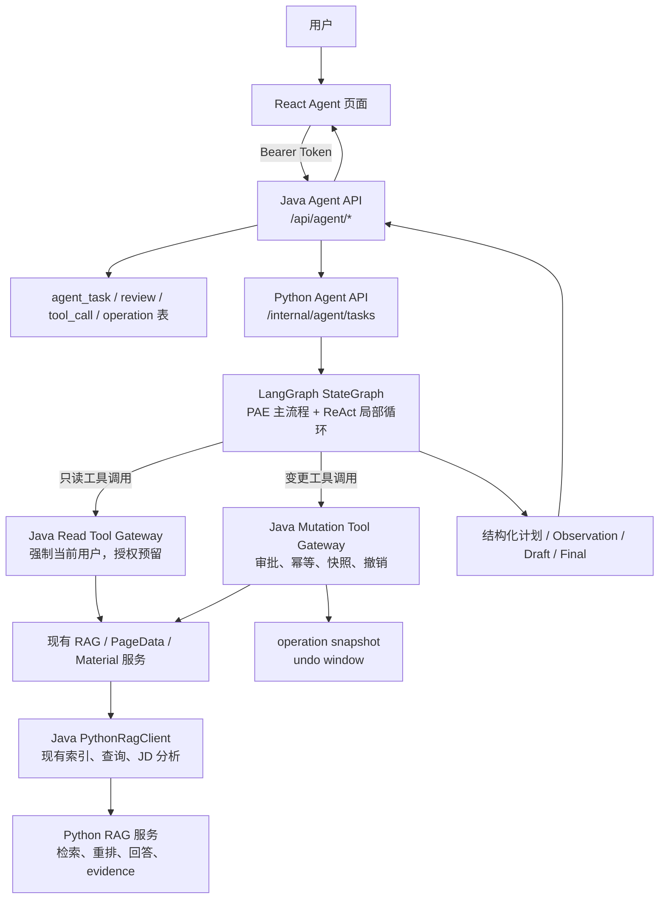

# Agent 开发计划

更新日期：2026-07-18

## 1. 背景输入

本计划综合了 Codex 对话 `019ee61f-2662-7eb0-b046-ce7ebfe630ce` 与 OpenCode 会话 `ses_119a1169fffeJAkQ4qOeqkAikT`、`ses_119ac8a5cffeWi92d5VE6X8igI` 的结论；当前 README 已按代码实现更新为“第二阶段 Agent 能力现状与后续边界”，本文件保留阶段性设计背景和后续扩展清单。

已确认的硬约束：

- 普通文件上传、分片上传、确定性 RAG 入库不进入 Agent 工具链，继续走现有 React -> Java -> Python RAG 接口。
- Agent 主流程采用 PAE（Plan-and-Execute），Executor 内部允许 ReAct 式工具观察循环。
- React 只调用 Java；Java 负责登录用户、权限、业务状态、统一响应、审计、幂等和错误映射。
- Python Agent 负责 LangGraph 编排、计划生成、工具结果整合、草稿生成和 evidence/citation guard；所有 RAG 检索、资料读取、JD 分析都必须先通过 Java Tool Gateway，再由 Java 调用现有 `PythonRagClient`。
- 查询和只读工具不需要 Human-in-the-Loop，但必须由 Java 根据当前登录用户强制资源归属过滤。
- Create/Update/Delete、业务状态变更、高成本重处理、保存草稿、撤销操作必须进入 `human_crud_review`。
- 变更执行前必须生成 `beforeSnapshotRef`，执行后记录 `afterSnapshotRef/auditEventId/undoDeadline`，给用户保留撤销窗口。
- 外部联网搜索优先 Tavily，由 Java Tool Gateway 直调 REST API；第一阶段不引入 MCP。MCP 只作为后续扩展，不允许 Python Agent 直连 MCP server。
- 简历 DOCX 模板保排版能力采用占位符和 `python-docx` run 级替换，是确定性文档能力；不作为第一批 Agent 工具主线。

## 2. 总目标

实现一个可审计、可暂停、可恢复、可撤销的第二阶段 Agent 闭环：

```text
用户目标
-> Java 创建 Agent 任务并绑定当前用户
-> Python LangGraph 编排 PAE 状态图
-> Python 通过 Java Tool Gateway 调用只读或变更工具
-> Java 强制资源归属、审批、幂等、审计和撤销窗口
-> 前端展示计划、工具观察、审批卡片、最终输出和撤销入口
```

最终系统应支持三类任务：

1. **纯只读查询**：资料状态、evidence 读取、RAG 探针、覆盖率诊断，无需人工审批。
2. **规划类任务**：JD/简历适配、学习路线、资料证据质量诊断，需要计划确认和最终输出确认。
3. **变更类任务**：重建索引、高精度补跑、保存简历改写、保存学习计划、取消任务、撤销操作，需要具体 CRUD 审批。

## 3. 非目标

- 不把普通上传入库改造成 Agent 工具。
- 不让 Python Agent/LangGraph 直连业务库、对象存储、Java 内部 Mapper 或 Python RAG `/internal/*`；RAG 能力只能通过 Java Tool Gateway 间接触发。
- 不在第一阶段实现自主长任务调度、自动批量操作、多 Agent 协作、MCP 直连、招聘平台爬虫。
- 不把外部搜索结果自动写入个人 RAG evidence 库；联网搜索只作为带来源的参考上下文。
- 不允许模型自由改写 DOCX/PDF 排版；简历模板只做占位符内容替换。

## 4. 总体架构



关键边界：

- Java 是唯一对外 API 和业务权限边界。
- Python Agent 只能带 `taskId/toolCallId/approvalId` 调 Java Tool Gateway；Java 从数据库中的 `agent_task.user_id` 推导用户，不信任 Python 传入的 `userId`。
- Python Agent 节点不得导入 `rag.retrievers`、不得调用 Python RAG 路由函数，也不得直接访问 `/internal/rag/*`；这些能力由 Java Gateway 封装。
- 只读工具可直接执行，但所有资源 ID 都由 Java 校验归属。
- 变更工具必须先由 Python 生成候选，再由 Java 创建审批记录，用户确认后才可执行。
- `utc_time_provider` 是纯系统工具，可在 Python 本地执行，不访问用户数据。
- 当前版本只实现 `ownerUserId == currentUserId` 归属校验；`explicitGrant` 是预留能力，在授权表和审计规则落地前，非 owner 资源一律拒绝。

## 5. 数据库设计

新增表放入 `infra/sql/init.sql`，并同步新增增量迁移文件。表名先按最小闭环设计，后续字段可扩展。

### 5.1 `agent_task`

保存 Agent 任务主状态。

| 字段 | 说明 |
| --- | --- |
| `id` | 主键，建议 UUID |
| `user_id` | 当前登录用户，Java 从 token 写入 |
| `task_type` | `pure_read_query` / `planning_task` / `mutation_task` |
| `status` | `CREATED` / `RUNNING` / `WAITING_TOOL_RESULT` / `WAITING_PLAN_REVIEW` / `WAITING_CRUD_REVIEW` / `WAITING_OUTPUT_REVIEW` / `COMPLETED` / `CANCELED` / `FAILED` |
| `input_json` | 用户输入快照，脱敏后保存 |
| `plan_json` | 当前计划 |
| `draft_json` | 草稿输出 |
| `final_json` | 最终输出 |
| `python_thread_id` | Agent 恢复使用的稳定 `threadId`；当前尚未接入持久 LangGraph checkpoint |
| `error_message` | 失败摘要，不存模型密钥或简历全文 |
| `created_at/updated_at` | 时间戳 |

### 5.2 `agent_tool_call`

保存每次工具调用的可观测记录。

| 字段 | 说明 |
| --- | --- |
| `id` | 主键 |
| `task_id` | 所属任务 |
| `tool_name` | 工具名 |
| `tool_type` | `READ` / `MUTATION` / `SYSTEM` |
| `status` | `PENDING` / `RUNNING` / `SUCCEEDED` / `FAILED` / `REJECTED` |
| `request_json` | 脱敏请求参数 |
| `response_json` | 脱敏响应摘要 |
| `ownership_verified` | Java 是否完成归属校验 |
| `scope` | `current_user_or_authorized` |
| `error_code/error_message` | 错误摘要 |
| `created_at/updated_at` | 时间戳 |

### 5.3 `agent_human_review`

保存计划、CRUD 和输出确认。

| 字段 | 说明 |
| --- | --- |
| `id` | 主键 |
| `task_id` | 所属任务 |
| `review_type` | `PLAN` / `CRUD` / `OUTPUT` |
| `status` | `PENDING` / `APPROVED` / `REJECTED` / `CHANGES_REQUESTED` / `EXPIRED` |
| `proposal_json` | 待确认内容 |
| `decision_json` | 用户决策和修改意见 |
| `reviewed_by` | 当前用户 ID |
| `reviewed_at` | 确认时间 |
| `created_at/expires_at` | 时间戳 |

### 5.4 `agent_operation`

保存变更操作和撤销窗口。

| 字段 | 说明 |
| --- | --- |
| `id` | 主键 |
| `task_id` | 所属任务 |
| `review_id` | 对应 CRUD 审批 |
| `operation_type` | `MATERIAL_REINDEX` / `RESUME_REVISION_SAVE` / `JD_PLAN_SAVE` / `TASK_CANCEL` / `UNDO` |
| `resource_type/resource_id` | 资源类型和 ID |
| `status` | `PENDING_APPROVAL` / `APPLIED_UNDOABLE` / `UNDONE` / `UNDO_EXPIRED` / `FINALIZED` / `FAILED` |
| `before_snapshot_ref` | 执行前快照引用，格式 `agent-operation-snapshot:{snapshotId}` |
| `after_snapshot_ref` | 执行后快照引用，格式 `agent-operation-snapshot:{snapshotId}` |
| `idempotency_key` | 幂等键，必须有唯一约束 |
| `undo_deadline` | 撤销截止时间 |
| `audit_event_id` | 审计日志 ID |
| `created_at/updated_at` | 时间戳 |

约束：

- `idempotency_key` 建唯一索引，建议范围为 `(user_id, operation_type, resource_type, resource_id, idempotency_key)`。
- 撤销只允许当前用户撤销自己的 `APPLIED_UNDOABLE` 操作，且当前时间必须小于 `undo_deadline`。
- `UNDO_EXPIRED` 和 `FINALIZED` 初版采用查询时流转：读取操作详情或任务详情时，如果 `undo_deadline` 已过且未撤销，则更新为 `UNDO_EXPIRED`；后续再加定时任务批量归档为 `FINALIZED`。
- `MATERIAL_REINDEX` 的 before/after 保存旧索引引用、资料状态、parser、chunkCount、parseQuality 摘要；不可恢复已消耗的模型或视频处理成本。
- `RESUME_REVISION_SAVE` 和 `JD_PLAN_SAVE` 的 before/after 保存业务记录版本、草稿 ID、内容摘要和完整记录 JSON 的安全快照。
- `TASK_CANCEL` 的 before/after 保存任务状态、待审批项状态和取消原因。

### 5.5 `agent_operation_snapshot`

保存可撤销操作的快照内容。

| 字段 | 说明 |
| --- | --- |
| `id` | 主键 |
| `operation_id` | 所属操作 |
| `snapshot_type` | `BEFORE` / `AFTER` |
| `resource_type/resource_id` | 资源类型和 ID |
| `snapshot_json` | 脱敏后的完整恢复数据或引用数据 |
| `content_hash` | 快照内容哈希，便于审计 |
| `created_at` | 时间戳 |

快照禁止保存模型密钥、对象存储签名 URL、未脱敏的长篇资料正文；简历/JD 正文如需回滚，必须限制在当前用户资源内并按业务表权限读取。

## 6. API 契约规划

实现前先新建 `docs/api/agent.md`，并按以下契约落地。

### 6.1 Java 对外接口

| 方法 | 路径 | 用途 |
| --- | --- | --- |
| `POST` | `/api/agent/tasks` | 创建 Agent 任务 |
| `GET` | `/api/agent/tasks/{taskId}` | 查询任务状态、计划、工具调用、审批项、输出 |
| `POST` | `/api/agent/tasks/{taskId}/reviews/{reviewId}/decide` | 提交计划、CRUD 或输出审批结果 |
| `POST` | `/api/agent/tasks/{taskId}/cancel` | 用户确认取消任务 |
| `POST` | `/api/agent/operations/{operationId}/undo` | 撤销窗口内回滚操作 |
| `GET` | `/api/agent/tools` | 返回前端可展示的工具能力和审批规则 |

### 6.2 Java 内部 Tool Gateway

仅 Python Agent 服务可调用，使用内部 token 或服务端签名。

| 方法 | 路径 | 用途 |
| --- | --- | --- |
| `POST` | `/api/internal/agent/tools/read` | 执行只读工具 |
| `POST` | `/api/internal/agent/tools/mutation/execute` | 执行已审批变更工具 |
| `POST` | `/api/internal/agent/tasks/{taskId}/events` | Python 回写状态、Observation、草稿和 review 请求 |

安全要求：

- Java 通过 `taskId` 查询 `agent_task.user_id`，不信任 Python 传入用户 ID。
- 内部接口必须校验 `X-Agent-Internal-Token`，并写 `domain=agent` 审计日志。
- 任何 resourceId 都必须走当前用户归属校验；当前版本只支持 owner 校验，后续有授权表时再扩展 explicit grant。
- 只读工具不写 `rag_query_history`；只能写脱敏 `log_event/log_error`。
- `/api/internal/agent/tools/read` 是阶段 1 必须交付的 HTTP 接口，不允许只停留在 Java 内部方法。
- 未知工具名、缺失 `taskId`、token 错误、资源不属于当前用户时必须返回明确错误码，并记录脱敏审计。
- `rag_query_probe_non_persistent` 只能走 Tool Gateway 专用分支 `queryNonPersistent`：复用 `RagServiceImpl.scopedQuery()` 覆盖 `userId/visibilityScope`，调用 Python `/internal/rag/query`，返回 `RagQueryVO` 和 diagnostics，不调用 `saveSynchronousQueryHistory`、不创建 query task、不写 `rag_query_history`。

### 6.3 Python Agent 内部接口

仅 Java 调用。

| 方法 | 路径 | 用途 |
| --- | --- | --- |
| `POST` | `/internal/agent/tasks` | 启动 LangGraph 任务 |
| `POST` | `/internal/agent/tasks/{taskId}/resume` | 根据用户审批结果恢复图执行 |
| `GET` | `/internal/agent/tasks/{taskId}` | 后续接入持久 checkpoint 后可开放脱敏状态摘要；当前未实现 |

安全要求：

- Java 调用 Python `/internal/agent/*` 时必须携带 `X-Agent-Internal-Token`。
- Python Agent API 必须校验 token，失败返回 401/403。
- Python 调 Java `/api/internal/agent/*` 时也必须携带同一个内部 token。
- token 为空时本地开发可拒绝启动 Agent API，避免误开无鉴权内部接口。

## 7. 工具清单

### 7.1 固定图节点与 Guardrail

这些不是 Planner 可选工具：

- `auth_context_resolver`：Java 从 token 解析当前用户。
- `scope_ownership_guard`：Java 统一做资源归属校验。
- `intent_router`：区分纯只读、规划、变更任务。
- `tool_router`：根据计划和观察结果选择工具。
- `human_plan_review`：复杂任务目标和工具路线确认。
- `human_crud_review`：具体变更审批。
- `human_output_review`：规划类最终输出确认。
- `privacy_guard`：输出脱敏。
- `citation_guard`：evidence 引用检查。
- `undo_window_manager`：撤销窗口状态流转。
- `audit_logging`：审计副作用，不作为可选工具。

### 7.2 第一批只读工具

| 工具 | 实现位置 | 说明 |
| --- | --- | --- |
| `utc_time_provider` | Python 本地 | 返回当前 UTC 时间，不访问用户数据 |
| `material_status_reader` | Java Read Gateway | 封装 `RagService.getMaterial` |
| `material_evidence_reader` | Java Read Gateway | 封装 `RagService.listMaterialEvidences` |
| `material_preview_reader` | Java Read Gateway | 封装 `RagService.previewMaterial`，Java 控制长度和类型 |
| `rag_query_probe_non_persistent` | Java Read Gateway -> Java `queryNonPersistent` -> Python RAG | 临时检索，不写 `rag_query_history`，不创建 query task |
| `retrieval_coverage_probe` | Java Read Gateway | 基于 query diagnostics 输出召回覆盖摘要 |

### 7.3 第二批分析工具

| 工具 | 实现位置 | 说明 |
| --- | --- | --- |
| `evidence_quality_auditor` | Python Agent | 基于已授权 evidence 检查证据充分性 |
| `resume_evidence_aligner` | Python Agent + Java Read Gateway | 对齐 JD/简历 supported / weak / missing |
| `gap_analyzer` | Python Agent + Java Read Gateway | 生成能力缺口和学习建议 |

### 7.4 联网只读工具

| 工具 | 实现位置 | 说明 |
| --- | --- | --- |
| `web_search_probe` | Java Tool Gateway | 调 Tavily Search API，读取 `evidence.tools.tavily.api-key` |
| `web_page_fetcher` | Java Tool Gateway | 抓取指定 URL 内容，带 SSRF 防护、大小限制、超时和 content type 限制 |

联网工具输出必须包含 `sourceUrl/retrievedAt/snippet/confidence`，并通过 `citation_guard`。外部内容默认只作为参考，不进入 RAG evidence 库。

`web_page_fetcher` 安全约束：

- 仅允许 `http` 和 `https`。
- 禁止访问 `localhost`、`127.0.0.0/8`、`::1`、内网网段、链路本地地址和云 metadata 地址。
- 最多允许 3 次重定向，每一跳都重新做地址校验。
- 限制响应字节数、连接超时和读取超时。
- 不执行脚本，不加载子资源，不保存网页全文到日志。
- 日志只保存 URL 哈希、域名、状态码、字节数和错误摘要。

### 7.5 变更工具

| 工具 | 说明 |
| --- | --- |
| `material_reindex_request` | 后续接入重建索引、高精度补跑、长视频重处理；当前继续走现有 RAG 接口 |
| `resume_revision_save` | 保存简历改写版本或模板填充结果 |
| `jd_learning_plan_save` | 保存学习路线或计划 |
| `agent_task_cancel_request` | 取消本人 Agent 任务 |
| `operation_undo_request` | 当前不作为 Python Tool Gateway 工具；前端通过 Java 撤销 API 回滚已执行操作 |

## 8. LangGraph 设计

Python Agent 统一放在 `ai-python/agents/`：

```text
ai-python/agents/
  __init__.py
  gateway/              # Java Tool Gateway client，不直连 Python RAG
  llm/                  # Agent 使用的模型客户端
  orchestration/        # 统一 PAE/ReAct 图及只读、规划辅助函数
  memory/               # Agent 记忆提炼、冲突判断和检索
  resume_adapter/       # 简历模板兼容填充能力
  note_writer/          # 后续笔记生成 Agent 预留目录
```

状态字段：

```text
taskId, userId, taskType, input, plan, route,
toolResults, observations, evidences,
reviewRequest, reviewDecision,
mutationProposal, draft, finalAnswer,
retryCount, status, diagnostics
```

当前统一图的职责流如下，节点均位于 `orchestration/pae_react_graph.py`：

```text
所有任务
-> conversation_title
-> context_restore
-> task_router

pure_read_query
-> memory_prefetch_before_planner
-> planner（免计划审批）
-> memory_prefetch_after_planner
-> executor <-> tool_adapter / repair / acceptance
-> answer_writer
-> post_answer_memory

planning_task（未审批）
-> planner
-> plan_review
-> END（向 Java 发布 WAITING_PLAN_REVIEW）

planning_task（审批后恢复）
-> 使用同一 threadId 重建状态
-> planner
-> resume_rewrite 子流程（按需）
-> executor <-> tool_adapter / repair / acceptance
-> answer_writer
-> post_answer_memory
```

HITL 必须使用稳定 `thread_id`。当前实现由 Java 保存任务和审批权威状态，Python 恢复接口根据同一 `threadId`、任务输入和审批结果重建确定性状态；`pae_react_graph.py` 当前直接调用 `workflow.compile()`，尚未传入持久 checkpointer。下面的 SQLite 路径仅是后续接入 `SqliteSaver` 时的预留配置，不是当前有效配置：

```text
# 预留：接入 SqliteSaver 后再启用
AGENT_CHECKPOINT_DB_PATH=tmp/agent-checkpoints.sqlite
EVIDENCE_AGENT_INTERNAL_TOKEN=
AGENT_JAVA_BASE_URL=http://127.0.0.1:7080
```

Python Agent 的 `read_tool_node` 和 `mutation_tool_node` 只调用 Java 内部 Tool Gateway。即使 Python RAG 服务与 Python Agent 部署在同一进程，也禁止直接调用 `app.api.rag`、`create_rag_store()` 或 `/internal/rag/*`，避免绕过 Java 的用户隔离、审计和非持久化查询控制。

## 9. 前端实现计划

新增 `/agent` 页面，保持现有后台管理风格。

页面区域：

- 顶部：任务输入区，支持普通问题、JD、简历文本、资料 ID。
- 左侧：任务列表和状态筛选。
- 中间：计划、工具调用时间线、Observation、证据卡片。
- 右侧：审批卡片，包括计划确认、CRUD 确认、输出确认、撤销入口。
- 底部：最终结果，保留 evidence 引用、来源、分数和风险提示。

前端类型和 API：

```text
frontend-react/src/api/agent.ts
frontend-react/src/api/types.ts
frontend-react/src/pages/agent/AgentWorkspace.tsx
```

第一版用轮询 `GET /api/agent/tasks/{taskId}`，不引入 WebSocket。

## 10. 分阶段实施

### 阶段 0：契约和表结构

目标：先把实现边界写清楚。

- 新建 `docs/api/agent.md`，必须包含 request/response 示例，覆盖 task create、task detail、tool call、review decide、operation undo 和错误响应。
- 更新 `README.md` 的 Agent 规划中与新契约冲突的表述。
- 新增数据库表和迁移。
- 新增 Java DTO/VO 名称清单。
- 明确当前版本只支持 owner 资源；`explicitGrant` 只作为预留，未建授权表前跨 owner 资源全部拒绝。
- 验证文档、README、SQL 字段名一致。

验收：

- `docs/api/agent.md` 覆盖接口、状态机、审批、错误、权限、Java-Python 契约。
- `infra/sql/init.sql` 和 `infra/sql/alter-database/...agent...sql` 同步。

### 阶段 1：Java Agent 任务和只读 Tool Gateway

目标：跑通不依赖 LangGraph 的只读工具骨架。

- 新增 `AgentController`、`AgentService`、`AgentToolGatewayService`。
- 实现 `agent_task` 创建和查询。
- 实现 HTTP 级 `/api/internal/agent/tools/read`，校验 `X-Agent-Internal-Token`，按 `taskId` 推导 userId。
- 实现 `material_status_reader`、`material_evidence_reader`、`material_preview_reader`。
- 实现 `RagService.queryNonPersistent` 或 Tool Gateway 专用查询分支，作为 `rag_query_probe_non_persistent` 唯一路径，确保不写 `rag_query_history`。
- 实现 `retrieval_coverage_probe`，复用 RAG diagnostics。
- 增加 Java 单元测试：内部 token、用户隔离、未知工具拒绝、只读不写历史、Python 4xx/5xx 错误映射。

验收：

- Java HTTP Read Tool Gateway 可执行每个只读工具。
- 用户 A 不能读取用户 B 的资料。
- `rag_query_probe_non_persistent` 调用后 `rag_query_history` 无新增记录。

### 阶段 2：Python LangGraph 纯只读闭环

目标：实现第一条可运行 Agent 路径。

- 新增 `ai-python/app/api/agent.py` 和 schemas。
- 新增 `ai-python/agents/*`。
- 实现 `utc_time_provider`。
- Python 通过 Java Read Tool Gateway 调用只读工具。
- Java `/api/agent/tasks` 调 Python `/internal/agent/tasks`。
- Java Agent client、Python Agent API、Python Tool Gateway client 全部校验或携带 `X-Agent-Internal-Token`。
- Python 通过 `/api/internal/agent/tasks/{taskId}/events` 回写任务状态，Java 不轮询 Python 任务状态。
- 增加 401/403、token 缺失、taskId 不存在的测试。
- 前端新增 `/agent` 最小页面，支持创建只读任务和轮询结果。

验收：

- 用户问“我的某份资料解析状态如何”时，Agent 返回结构化结果。
- 用户问“我的知识库里 Redis 学到了什么”时，Agent 调 RAG 探针返回带 evidence 的回答。

### 阶段 3：规划类 JD/简历适配

目标：支持计划确认、证据对齐和最终输出确认。

- 实现 `planner` 和 `human_plan_review`。
- 实现 `resume_evidence_aligner`、`gap_analyzer`、`evidence_quality_auditor`。
- 接入 `human_output_review`。
- 前端展示计划审批、supported/weak/missing 矩阵和草稿修改意见。
- 保证生成结论必须带 evidence 或明确缺证据。

验收：

- 用户提交 JD + 简历文本后，系统先给计划，确认后生成 JD 匹配和简历修改建议。
- 纯只读查询仍不进入计划审批。

### 阶段 4：变更工具、审批和撤销

目标：完成完整 Human-in-the-Loop 写操作。

- 实现 `human_crud_review`。
- `material_reindex_request` 保留为后续资料重建链路扩展，当前不作为已暴露工具。
- 实现 `resume_revision_save`、`jd_learning_plan_save`。
- 实现 `agent_task_cancel_request`，撤销窗口通过 Java `POST /api/agent/operations/{operationId}/undo` 暴露给前端。
- 实现 before/after snapshot 和撤销窗口状态机。
- 实现 `agent_operation_snapshot` 写入、`idempotency_key` 唯一约束、查询时 `UNDO_EXPIRED` 流转和同用户撤销校验。
- 前端展示 CRUD 审批、成本提示和撤销倒计时。

验收：

- 未审批的变更工具不能执行。
- 审批通过后执行变更，撤销窗口内可回滚。

### 阶段 5：Tavily 联网参考工具

目标：补充公司背景、技能趋势和外部学习资源。

- Java 新增 Tavily client，读取 `evidence.tools.tavily.api-key`。
- 实现 `web_search_probe`。
- 可选实现带 SSRF 防护的 `web_page_fetcher`。
- 输出必须带 URL、检索时间、摘要和可信度。
- 没有 `TAVILY_API_KEY` 时工具返回可恢复错误，不影响本地资料分析。

验收：

- JD 分析可选择联网补充公司背景和技能趋势。
- 外部内容不会写入 RAG evidence 库。

### 阶段 6：简历 DOCX 模板能力集成

目标：把已规划的 DOCX 占位符填充接入 Agent 保存草稿流程。

- 先独立实现 `docs/resume-template-plan.md` 中的确定性模板能力。
- Agent 只负责根据 JD、evidence 和用户确认生成填充值。
- 保存生成的简历版本时走 `resume_revision_save` 和撤销窗口。

验收：

- DOCX 模板样式不变，只替换占位符文本。
- PDF 只作为文字型 PDF 转 DOCX 的辅助入口，扫描型 PDF 给出明确提示。

## 11. 验证计划

每个阶段至少执行对应窄测试；涉及全链路时执行全量命令。

```powershell
conda run -n learning-evidence-rag python -B -m pytest ai-python/tests -q

cd backend-java
mvn test

cd frontend-react
npm run build
```

新增测试建议：

- Python：LangGraph 路由、基于 Java 权威状态的确定性恢复、只读工具调用、审批恢复、evidence guard；接入持久 checkpointer 后再补充节点级 checkpoint resume 测试。
- Java：Tool Gateway 权限隔离、`rag_query_probe_non_persistent` 不写历史、CRUD 审批、撤销窗口。
- 前端：构建通过，审批按钮、取消、撤销、轮询状态可用。
- 集成：启动 Java + Python，创建任务、审批、恢复、完成。

## 12. 风险和处理策略

| 风险 | 处理 |
| --- | --- |
| Python 进程退出后没有持久 checkpoint | 当前根据 Java 权威任务状态和恢复请求重建确定性状态；需要节点级断点续跑前，应先接入并测试 SQLite 或 PostgreSQL checkpointer |
| Agent 误读跨用户资源 | Java 从 `taskId` 推导 userId，不信任 Python 入参；所有 read/mutation 工具二次归属校验 |
| 只读 RAG 探针写入查询历史 | 新增非持久化查询路径，只写脱敏审计日志 |
| 外部搜索污染 evidence | Tavily 输出只作为参考上下文，不自动入库 |
| 变更重复执行 | 所有 mutation 带 `idempotencyKey`，Java 操作表去重 |
| 简历排版被模型破坏 | LLM 只输出 JSON/纯文本填充值，DOCX run 级替换由代码执行 |
| 内部接口被误调用 | Java 和 Python 内部接口统一校验 `X-Agent-Internal-Token`，测试覆盖 401/403 |
| 联网抓取触发 SSRF | Java `web_page_fetcher` 做协议、DNS/IP、重定向、内网地址和响应大小校验 |

## 13. 新实现线程建议目标

新对话窗口应采用 `gpt-5.5` + `xhigh`，并在开头创建 Goal：

```text
完成本仓库 Agent 第二阶段的分阶段实现，先交付阶段 0-2 的可运行只读闭环，再继续阶段 3-6；每阶段先更新契约和测试，再实现，验证通过后再进入下一阶段。
```

第一轮实现优先级：

1. 阶段 0：`docs/api/agent.md`、SQL、DTO/VO 清单。
2. 阶段 1：Java Agent 任务表和只读 Tool Gateway。
3. 阶段 2：Python LangGraph 纯只读闭环和前端最小 Agent 页面。

阶段 3-6 在阶段 0-2 验证通过后继续，不应在第一轮同时铺开全部代码。
