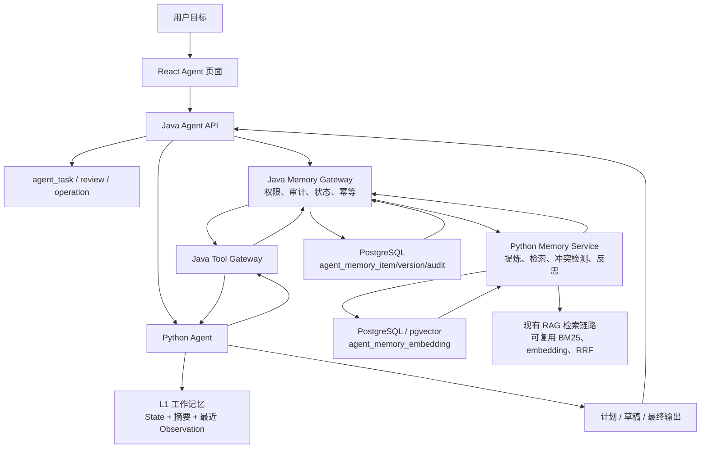

# Agent 记忆方案

更新日期：2026-06-24

## 1. 设计目标

本方案为“学迹智配 Agent：基于 RAG 的多模态学习证据库与岗位适配系统”补充可审计、可检索、可修正的 Agent 记忆能力。方案只设计 Agent 记忆子系统，不改变现有 RAG 入库、Agent 任务审批、Java 权限边界和 Python RAG 检索边界。

核心目标：

- 让 Agent 能跨任务记住用户目标岗位、学习偏好、资料使用习惯、简历改写约束、历史能力缺口和工具执行经验。
- 记忆写入必须经过提炼、作用域标注、冲突检测、版本化和脱敏处理，避免把完整对话、完整简历、完整 JD 或资料正文直接沉淀为记忆。
- 记忆检索必须结合作用域、时近性、相关性、重要性、置信度和证据来源，不做单纯向量相似度召回。
- 记忆使用必须遵守现有项目边界：React 只调用 Java；Java 管用户、权限、审计、幂等、状态和统一响应；Python 负责记忆提炼、检索、冲突判断、反思和上下文组装；Python Agent 不直连业务库。
- 用户需要能查看、确认、修改、归档或删除自己的长期记忆。

## 2. 参考知识点

本方案参考了以下本地笔记：

- `C:\Users\WhenJayHe\notes\study\八股\llm相关\07_agent_memory.md`
- `C:\Users\WhenJayHe\notes\study\八股\llm相关\08_agent_memory_cover.md`
- `C:\Users\WhenJayHe\notes\study\八股\llm相关\15_agent_memory_design.md`

采用的关键原则：

- 记忆分为工作记忆、情景记忆、语义记忆和程序记忆。
- 短期记忆用“摘要 + Buffer + 结构化状态”管理上下文窗口。
- 长期记忆使用向量检索、结构化元数据、关系数据库和可选知识图谱协作。
- 写入链路采用“感知 -> 判断 -> 提炼 -> 冲突检测 -> 版本化存储”。
- 检索链路采用“作用域过滤 -> 混合召回 -> 时近性/相关性/重要性打分 -> 重排 -> 上下文裁决”。
- 记忆覆盖问题通过版本化、语义冲突检测、作用域隔离和摘要防失真解决。

## 3. 项目现状约束

当前仓库已经具备以下基础：

- `agent_task` 保存任务主状态、输入、计划、草稿、最终输出和 `python_thread_id`。
- `agent_tool_call` 保存只读或变更工具调用的脱敏请求和响应摘要。
- `agent_human_review` 保存计划、CRUD 和输出审批。
- `agent_operation` 和 `agent_operation_snapshot` 保存可撤销变更、幂等键、before/after snapshot 和撤销窗口。
- Python Agent 已有只读任务和规划任务流程，能够通过 Java Tool Gateway 调 RAG 探针、联网参考和保存类变更工具。
- RAG 检索已经具备递归切块、summary index、Multi-Query、BM25、pgvector、RRF/RAG-Fusion、rerank 和 evidence 引用。

这些能力不能直接替代 Agent 记忆：

- `python_thread_id` 和 LangGraph checkpoint 只用于任务恢复，不是长期记忆库。
- `agent_task.input_json/draft_json/final_json` 是任务快照，不适合跨任务检索和冲突管理。
- `agent_tool_call.response_json` 是脱敏 Observation 摘要，不应被无脑注入新任务上下文。
- `rag_query_history` 是用户问答历史，不等同于 Agent 记忆；它可作为情景记忆候选来源，但不能直接作为记忆使用。
- 外部联网结果默认只是参考上下文，不自动写入 RAG evidence 或长期记忆。

### 3.1 新增记忆边界

为避免“Python Agent 不直连业务库”的边界被记忆系统绕开，Agent 记忆采用以下职责拆分：

- Java 是记忆元数据和用户操作的权威边界，负责 `agent_memory_item`、`agent_memory_version`、`agent_memory_audit` 的创建、状态流转、用户确认、删除、归档、审计和错误映射。
- Python Memory Service 只负责智能处理：候选提炼、冲突判断、embedding 生成、BM25/向量混合检索、RRF 融合、反思建议和上下文裁决。
- Python Memory Service 可以读写专用 `agent_memory_embedding` 检索索引，类似当前 Python RAG 写入 `rag_chunk.embedding`；但它只能处理 Java 已授权的 `memoryId/userId/scope`，不能读取或修改 `agent_task`、`learning_material`、`resume_template`、`rag_query_history` 等业务表。
- Python Agent 不直接调用 Python Memory Service，也不直接查数据库；它只能通过 Java Tool Gateway 请求 `agent_memory_retriever`、`agent_memory_candidate_proposer` 等工具。
- 记忆写入分两段：Java 先写入或更新记忆元数据，再调用 Python 生成或删除检索索引；索引失败时记忆可保留为 `INDEX_FAILED` 或 `PENDING_INDEX`，不得让 Python 直接补写权威业务状态。
- 用户删除、归档或拒绝记忆时，Java 必须同步通知 Python 删除或停用对应 embedding，确保后续默认检索不再召回。

## 4. 记忆类型映射

| 类型 | 项目内含义 | 生命周期 | 存储建议 |
| --- | --- | --- | --- |
| 工作记忆 | 当前任务目标、计划、工具观察、草稿、中间状态、最近几轮对话 | 单任务或单会话 | Python Agent state、`agent_task`、LangGraph checkpoint |
| 情景记忆 | 某次任务发生的事实，例如一次 JD 适配暴露 Redis 证据不足、一次模板填充用户拒绝某种表达 | 跨任务，可衰减 | `agent_memory_item` + 来源任务引用 |
| 语义记忆 | 从多次任务中提炼出的稳定偏好、长期目标、能力画像、资料使用习惯 | 长期，需版本化 | `agent_memory_item` + `agent_memory_embedding` |
| 程序记忆 | Agent 学到的稳定流程和工具策略，例如 JD 适配固定先查本地 evidence，再按缺口生成计划 | 长期，系统作用域 | 配置化 SOP、`agent_memory_item` 的 `PROCEDURAL` 类型 |

在本项目中，长期记忆不应保存大段资料正文，而应保存“可追溯摘要 + 证据引用”。例如：

```json
{
  "memoryType": "SEMANTIC",
  "namespace": "career_profile",
  "subjectKey": "target_role",
  "content": "用户近期重点准备 AI Agent / RAG 后端实习，关注 Java Spring Boot、Python FastAPI、RAG-Fusion 和简历证据对齐。",
  "evidenceRefs": [
    {"type": "agent_task", "id": "agent-task-xxx"},
    {"type": "rag_evidence", "id": "material-12-3"}
  ],
  "confidence": 0.82,
  "importance": 0.9
}
```

## 5. 分层架构



### L1：工作记忆层

工作记忆只服务当前任务，采用“结构化状态 + 最近 Observation + 压缩摘要”的组合：

- Python Agent state 保存 `goal/plan/toolResults/draft/reviewDecision/memoryContext`。
- 最近 3-5 个关键 Observation 保留摘要，不注入完整工具响应。
- 更早的任务过程压缩为 `workingSummary`，摘要前先抽取关键事实，避免摘要压缩丢失用户硬约束。
- `agent_task` 仍保存输入、计划、草稿和最终输出，作为任务审计记录。

### L2：近期情景记忆层

近期情景记忆保存当前用户最近一段时间的重要任务经验：

- 来源包括 `agent_task`、`agent_tool_call`、`agent_human_review`、`rag_query_history` 和用户显式反馈。
- 只保存提炼后的事件摘要，例如“用户在 2026-06-23 的 JD 适配任务中认为 Redis 证据偏弱”。
- 默认参与 7-30 天内的高权重召回，之后按时近性衰减。
- 可使用 PostgreSQL 表承载，后续再加 Redis 缓存；MVP 不强依赖 Redis。

### L3：长期语义和程序记忆层

长期记忆使用 PostgreSQL + pgvector，不混入 `rag_document/rag_chunk`，避免污染学习资料 evidence：

- 结构化字段保存在 `agent_memory_item`，由 Java Mapper 写入和更新。
- 检索向量和 BM25 词频保存在 `agent_memory_embedding`，由 Python Memory Service 生成和检索。
- 版本关系保存在 `agent_memory_version`，由 Java 按 Python 冲突判断结果落库。
- 冲突、合并、归档、用户确认、删除和索引状态记录保存在 `agent_memory_audit`，同时可向 `log_event` 写脱敏摘要。

## 6. 数据模型建议

### 6.1 `agent_memory_item`

保存一条可使用的记忆或待确认记忆。

| 字段 | 说明 |
| --- | --- |
| `id` | 记忆 ID |
| `user_id` | 当前用户 ID；系统程序记忆可使用 `system` |
| `memory_type` | `EPISODIC` / `SEMANTIC` / `PROCEDURAL` / `PREFERENCE` / `FACT` |
| `namespace` | 领域隔离，例如 `career_profile`、`resume_style`、`learning_plan`、`tool_strategy` |
| `scope_type` | `USER` / `PROJECT` / `MATERIAL` / `TASK` / `SESSION` / `SYSTEM` |
| `scope_id` | 对应项目、资料、任务或会话 ID；用户级可为空 |
| `subject_key` | 主题键，例如 `target_role`、`preferred_resume_tone`、`weak_skill.redis` |
| `content` | 提炼后的中文记忆内容 |
| `summary` | 更短的上下文注入摘要 |
| `evidence_refs_json` | 来源引用，不保存大段正文 |
| `source_task_id` | 来源 Agent 任务 |
| `source_tool_call_id` | 来源工具调用，可空 |
| `source_review_id` | 来源人工确认，可空 |
| `source_hash` | 来源片段哈希，用于去重和审计 |
| `status` | `ACTIVE` / `PENDING_REVIEW` / `PENDING_INDEX` / `INDEX_FAILED` / `ARCHIVED` / `SUPERSEDED` / `REJECTED` / `DELETED` |
| `confidence` | 置信度，0-1 |
| `importance` | 重要性，0-1 |
| `sensitivity_level` | `LOW` / `MEDIUM` / `HIGH`，高敏记忆默认不自动注入 |
| `consent_source` | `EXPLICIT_USER` / `USER_REVIEW` / `AGENT_INFERRED` / `SYSTEM` |
| `access_count` | 被召回或注入次数 |
| `last_accessed_at` | 最近使用时间 |
| `valid_from/valid_until` | 生效时间窗 |
| `deleted_at` | 用户删除时间；软删除后默认不再检索 |
| `created_at/updated_at` | 时间戳 |

### 6.2 `agent_memory_embedding`

保存可检索文本和向量。

| 字段 | 说明 |
| --- | --- |
| `id` | 主键 |
| `memory_id` | 关联 `agent_memory_item.id` |
| `chunk_id` | 记忆切块 ID，通常一条记忆一块 |
| `retrieval_text` | 用于 BM25 和 embedding 的文本 |
| `term_counts` | BM25 词频 |
| `embedding` | `VECTOR(1024)`，复用当前百炼 embedding 维度 |
| `metadata` | `userId/memoryType/namespace/scopeType/scopeId/subjectKey/status/confidence/importance` |
| `created_at` | 时间戳 |

约束：

- `memory_id` 必须外键关联 `agent_memory_item.id`，删除或软删除记忆后必须删除 embedding 或将索引状态置为不可检索。
- 默认检索只使用 `ACTIVE` 且 `deleted_at IS NULL` 的记忆。
- `retrieval_text` 只能使用记忆摘要和主题信息，不能保存完整简历、完整 JD、资料正文、密钥或签名 URL。

### 6.3 `agent_memory_version`

保存版本化和覆盖关系。

| 字段 | 说明 |
| --- | --- |
| `id` | 主键 |
| `memory_id` | 当前记忆 |
| `previous_memory_id` | 被更新、合并或归档的旧记忆 |
| `relation_type` | `SUPERSEDES` / `MERGES` / `CONFLICTS_WITH` / `REFINES` / `DUPLICATES` |
| `decision` | `ADD_NEW` / `MERGE` / `ARCHIVE_OLD` / `KEEP_BOTH` / `REVIEW_REQUIRED` / `IGNORE` |
| `reason` | 中文决策原因 |
| `decided_by` | `PYTHON_MEMORY_SERVICE` / `USER` / `SYSTEM` |
| `user_id` | 冗余用户 ID，便于隔离和审计 |
| `created_at` | 时间戳 |

### 6.4 `agent_memory_audit`

保存记忆生命周期审计，不保存完整敏感正文。

| 字段 | 说明 |
| --- | --- |
| `id` | 主键 |
| `memory_id` | 关联记忆 |
| `user_id` | 当前用户 |
| `task_id` | 来源任务，可空 |
| `action` | `CREATE_CANDIDATE` / `CONFIRM` / `EDIT` / `ARCHIVE` / `DELETE` / `INDEX_UPSERT` / `INDEX_DELETE` / `CONFLICT_DETECTED` |
| `actor_type` | `USER` / `JAVA_SERVICE` / `PYTHON_MEMORY_SERVICE` / `SYSTEM_JOB` |
| `before_hash/after_hash` | 操作前后内容哈希 |
| `summary` | 脱敏中文摘要 |
| `created_at` | 时间戳 |

### 6.5 状态流转和一致性

记忆状态必须由 Java 控制，Python 只能返回建议和索引结果。

```text
PENDING_REVIEW
  -> PENDING_INDEX   用户确认或显式“记住”后等待索引
  -> REJECTED        用户拒绝候选
  -> ARCHIVED        用户暂时停用或系统过期归档

PENDING_INDEX
  -> ACTIVE          Python embedding 索引成功后激活
  -> INDEX_FAILED    Python 索引失败，默认不可检索

ACTIVE
  -> ARCHIVED        用户归档或系统过期
  -> SUPERSEDED      被新版本替代，但版本链保留
  -> DELETED         用户删除，正文擦除或软删除

INDEX_FAILED
  -> PENDING_INDEX   用户或系统重试索引
  -> ARCHIVED        用户归档
  -> DELETED         用户删除

ARCHIVED / SUPERSEDED / REJECTED / DELETED
  -> ACTIVE          只能由用户显式恢复，且恢复时必须重建索引
```

一致性规则：

- Java 写 `agent_memory_item` 和 `agent_memory_version` 成功后，再调用 Python 写 `agent_memory_embedding`；Python 成功后 Java 才允许状态进入 `ACTIVE`。
- Python 写索引失败时，Java 将记忆置为 `INDEX_FAILED` 或保留 `PENDING_INDEX` 并记录 `agent_memory_audit`；这类记忆不参与默认检索。
- Java 删除、归档、拒绝或替换记忆时，必须同步调用 Python 删除或停用 `agent_memory_embedding`；如果 Python 删除失败，Java 保持记忆不可检索，并记录可重试补偿任务。
- `agent_memory_embedding.memory_id` 必须有外键；物理删除时 embedding 级联删除，软删除时 embedding 按 `status/deleted_at` 过滤并优先执行索引删除。
- `agent_memory_version` 和 `agent_memory_audit` 可保留脱敏哈希和关系记录，但不得保留已删除记忆的可读正文。

## 7. 写入链路

记忆写入不做全量记录，而是事件驱动。

候选生成触发时机：

- 用户显式说“记住”“以后都按这个来”“不要再这样改”。
- `planning_task` 或 `mutation_task` 完成后，输出审批被用户确认；这只允许生成记忆候选，不等于长期记忆写入授权。
- 用户拒绝计划、输出或 CRUD 审批，并给出修改意见。
- 同一类能力缺口、资料质量问题或工具失败多次出现。
- 周期性反思任务发现多条情景记忆可合并为语义记忆。

候选生成流水线：

1. **候选采集**：从任务输入、草稿、最终输出、审批意见和脱敏工具观察中采集候选，不读取未授权资料正文。
2. **关键事实前置**：先抽取结构化 facts，再生成自然语言摘要，避免摘要压缩丢失硬约束。
3. **记忆分类**：判断记忆类型、namespace、scope、subjectKey、重要性和置信度。
4. **脱敏校验**：拒绝 token、密钥、对象存储签名 URL、未脱敏简历全文、完整 JD、长篇资料正文。
5. **相似召回**：按 `user_id + namespace + subjectKey + scope` 召回 Top-K 旧记忆。
6. **语义冲突检测**：判断新旧关系是矛盾、补充、重复、细化还是无关。
7. **版本化决策**：输出 `ADD_NEW/MERGE/ARCHIVE_OLD/KEEP_BOTH/REVIEW_REQUIRED/IGNORE`。
8. **写入授权判定**：任务审批、输出审批、CRUD 审批都不等于记忆持久化授权。只有用户在当前请求中明确表达“记住/以后按这个来/保存为记忆”，或在记忆候选页二次确认后，记忆才可进入激活流程。
9. **状态落库**：Java 写入 `agent_memory_item/version/audit`，并根据索引结果更新为 `ACTIVE/PENDING_INDEX/INDEX_FAILED`。
10. **向量写入**：Java 调 Python 为可检索记忆写入 `agent_memory_embedding`；默认检索只使用 `ACTIVE`。
11. **审计记录**：记录 memory id、来源任务、决策、置信度、冲突对象、脱敏原因和索引状态。

长期落库门控：

| 记忆来源 | 默认状态 | 是否可默认检索 |
| --- | --- | --- |
| 用户显式“记住”且通过脱敏校验 | `PENDING_INDEX -> ACTIVE` | 索引成功后可以 |
| 用户在记忆候选页确认 | `PENDING_INDEX -> ACTIVE` | 索引成功后可以 |
| Agent 从输出审批、拒绝意见或任务结果推断 | `PENDING_REVIEW` | 不可以 |
| 周期性反思生成的用户画像、偏好或职业目标 | `PENDING_REVIEW` | 不可以 |
| 系统级程序记忆 | `PENDING_REVIEW` 或管理员确认后 `ACTIVE` | 仅系统 scope 可用 |

`PENDING_REVIEW` 只允许在待确认列表、任务详情候选区和审计页展示，不能进入 `memoryContext`，也不能作为 mutation 工具依据。

## 8. 覆盖和冲突规则

为避免记忆覆盖问题，所有更新都使用追加和版本化，不做直接覆盖。

规则：

- 新记忆和旧记忆直接矛盾时，默认 `KEEP_BOTH`，并按 scope、时间和当前任务裁决使用哪条。
- 低层级记忆可以临时遮蔽高层级记忆，但不能永久修改高层级记忆。例如单次任务要求“这次简历语气更激进”，不覆盖用户长期偏好“简历语气稳健”。
- `namespace` 不同的记忆不参与合并。例如“沟通风格简洁”和“代码风格简洁”必须分开。
- 摘要压缩前必须抽取 key facts；压缩后要做完整性校验，发现遗漏时将遗漏事实保存为独立记忆候选。
- 过期记忆不删除，先置为 `ARCHIVED`；用户主动删除时再物理删除或按合规策略擦除内容。
- 低置信冲突进入 `PENDING_REVIEW`，不参与默认检索注入。
- `AGENT_INFERRED` 记忆不得直接覆盖 `EXPLICIT_USER` 或 `USER_REVIEW` 记忆，只能提出冲突候选。

同一 `namespace + subjectKey` 多版本并存时，默认裁决顺序：

1. 当前用户本次输入中的显式指令优先于所有历史记忆。
2. `scope` 越具体越优先：`TASK > SESSION > MATERIAL > PROJECT > USER > SYSTEM`，但具体 scope 只在当前任务匹配时生效。
3. `consent_source` 优先级：`EXPLICIT_USER > USER_REVIEW > SYSTEM > AGENT_INFERRED`。
4. `status=ACTIVE` 且 `deleted_at IS NULL` 才能参与默认裁决。
5. `valid_from/valid_until` 命中当前时间窗的记忆优先。
6. 置信度和重要性更高的记忆优先；分数接近时使用更新的 `updated_at`。
7. 裁决后仍存在冲突时，向 Agent 注入冲突摘要，而不是强行选择单条记忆。

### 8.1 删除和归档链路

删除和归档必须保证“不可再默认召回”。

- `ARCHIVED`：保留正文和版本链，默认检索过滤；用户可恢复，恢复时重建 embedding。
- `DELETED`：用户删除后，`agent_memory_item.content/summary/retrieval_text` 必须擦除或替换为不可逆删除标记，只保留哈希、时间、操作者和审计摘要。
- `agent_memory_embedding`：删除时优先物理删除；若补偿任务失败，也必须把 metadata status 标为 `DELETED` 并在检索 SQL 中强制过滤。
- `agent_memory_version`：保留关系记录和哈希，不保留已删除正文；版本链不能让已删除内容被间接展示。
- `agent_memory_audit`：保留脱敏操作记录，不保留正文、简历、JD 或资料片段。
- 默认检索条件必须包含：`status = ACTIVE`、`deleted_at IS NULL`、`valid_until IS NULL OR valid_until > now()`、`sensitivity_level != HIGH`，除非用户在管理页显式查看归档或高敏记忆。

## 9. 检索链路

记忆检索由 Python Memory Service 执行，但必须通过 Java Gateway 进入，保持权限边界。Java 必须先根据 `taskId` 解析 `userId` 和可用 scope，再把授权过滤条件传给 Python；Python 返回结果后，Java 再做一次结果用户校验和脱敏摘要记录。

调用路径：

```text
Python Agent
-> Java Tool Gateway: agent_memory_retriever
-> Java Memory Gateway 校验 taskId/userId/scope
-> Python Memory Service: /internal/agent/memory/query
-> agent_memory_embedding 混合检索
-> Java Memory Gateway 脱敏和审计
-> Python Agent 组装 memoryContext
```

检索步骤：

1. **作用域预过滤**：按 `user_id/status/deleted_at/namespace/memory_type/scope_type/valid_until/sensitivity_level` 过滤；默认只检索 `ACTIVE`，不检索 `PENDING_REVIEW/ARCHIVED/SUPERSEDED/REJECTED/DELETED/INDEX_FAILED`。
2. **查询扩展**：根据当前任务目标生成 3-5 条记忆查询变体；例如 JD 适配会扩展目标岗位、弱技能、简历表达偏好、资料证据习惯。
3. **混合召回**：每个查询同时做 BM25 和向量召回。
4. **RRF 融合**：复用 RAG-Fusion 思路合并多路候选。
5. **综合评分**：结合相关性、时近性、重要性、置信度、作用域优先级和访问反馈。
6. **冲突裁决**：同一 subjectKey 下多版本同时出现时，按当前任务 scope、valid window 和置信度选择，必要时向 LLM 提供冲突说明。
7. **Java 结果复核**：Java 验证返回的 `memoryId/userId/status/deleted_at/scope` 仍属于当前任务用户，过滤 `PENDING_REVIEW/DELETED/ARCHIVED/SUPERSEDED/REJECTED/INDEX_FAILED`。
8. **上下文预算控制**：只注入 Top 3-8 条短摘要和引用，不注入完整任务历史。

推荐评分：

```text
finalScore =
  0.40 * relevanceScore
  + 0.20 * importance
  + 0.15 * recencyScore
  + 0.15 * confidence
  + 0.10 * scopePriority
```

默认权重可按任务调整：

- 纯知识库查询：提高 `relevanceScore`。
- JD/简历适配：提高 `importance` 和 `scopePriority`。
- 延续型多轮任务：提高 `recencyScore`。
- 高风险保存类任务：提高 `confidence`，低置信记忆仅提示不直接执行。

## 10. 上下文注入格式

Agent 不应把记忆当作不可质疑事实。注入格式应明确来源、置信度和作用域：

```json
{
  "memoryContext": [
    {
      "memoryId": "mem-20260623-001",
      "memoryType": "SEMANTIC",
      "namespace": "career_profile",
      "scope": "USER",
      "summary": "用户近期目标是 AI Agent / RAG 后端实习，偏好 Java + Python 双栈表达。",
      "confidence": 0.86,
      "importance": 0.9,
      "sourceRefs": [
        {"type": "agent_task", "id": "agent-task-xxx"}
      ],
      "usagePolicy": "可作为规划偏好，不可替代 RAG evidence。"
    }
  ]
}
```

Prompt 约束：

- 记忆只用于理解用户偏好和历史上下文。
- 涉及事实性结论、岗位能力判断、学习证据和简历证明时，仍必须引用 RAG evidence。
- 当记忆和当前用户输入冲突时，以当前用户输入优先，并生成记忆冲突候选。
- 不得把低置信或待确认记忆作为保存类操作依据。

## 11. 反思和整合

反思任务用于把多条情景记忆提炼为更稳定的语义或程序记忆。

触发条件：

- 最近 N 条情景记忆的重要性累计超过阈值，例如 5.0。
- 同一 `namespace + subjectKey` 出现多条相似情景记忆。
- 用户多次审批或拒绝同类输出。
- 定时任务每天或每周执行一次。

反思输出：

- 新的语义记忆，例如“用户简历改写偏好：强调可追溯 evidence，不喜欢空泛自评”。
- 新的程序记忆，例如“JD 适配任务应先检索本地 evidence，再判断 supported/weak/missing，不要先给泛化建议”。
- 归档建议，例如旧的目标岗位、过期临时任务、已被用户纠正的偏好。

反思安全：

- 不处理其他用户资源。
- 不读取资料正文，只读取已脱敏记忆摘要和引用。
- 生成的长期偏好默认进入 `PENDING_REVIEW`，除非来源是用户明确确认。

## 12. Java 和 Python API 建议

### 12.1 Java 对外接口

| 方法 | 路径 | 用途 |
| --- | --- | --- |
| `GET` | `/api/agent/memories` | 查看当前用户记忆，支持 type、namespace、status 过滤 |
| `GET` | `/api/agent/memories/{memoryId}` | 查看单条记忆、版本和来源引用 |
| `POST` | `/api/agent/memories/{memoryId}/confirm` | 确认待审记忆 |
| `PATCH` | `/api/agent/memories/{memoryId}` | 修改用户可编辑字段，必须生成新版本 |
| `POST` | `/api/agent/memories/{memoryId}/archive` | 归档记忆 |
| `DELETE` | `/api/agent/memories/{memoryId}` | 删除当前用户自己的记忆 |

`PATCH` 字段权限矩阵：

| 字段 | 用户可改 | 规则 |
| --- | --- | --- |
| `content/summary` | 可以 | 必须生成新 `agent_memory_item` 版本，旧版本置为 `SUPERSEDED` 或归档 |
| `namespace/subject_key` | 限制修改 | 只能在同一大类内修正标签，修改后必须重建索引 |
| `scope_type/scope_id` | 只能收窄 | 允许 `USER -> PROJECT -> MATERIAL -> TASK/SESSION`，禁止把 `TASK/SESSION` 放大到 `USER/PROJECT` |
| `status` | 限制修改 | 只能执行确认、归档、删除、恢复这些显式动作；不能任意写枚举 |
| `importance/confidence` | 不可直接改 | 由系统评分或用户确认动作间接调整 |
| `source_task_id/source_tool_call_id/source_review_id/evidence_refs_json/source_hash/consent_source` | 不可改 | provenance 只读，防止伪造来源和扩大可信度 |
| `user_id/sensitivity_level/deleted_at/access_count/last_accessed_at` | 不可改 | 由系统维护 |

任何内容或 scope 修改都不得原地覆盖。Java 必须写入版本链和审计记录，并删除旧 embedding 或重建新 embedding。

### 12.2 Java 内部 Tool Gateway 工具

| 工具名 | 类型 | 用途 |
| --- | --- | --- |
| `agent_memory_retriever` | READ | 按当前任务和用户检索可注入记忆 |
| `agent_memory_candidate_proposer` | READ | 生成记忆候选和冲突判断，只返回候选不落库 |
| `agent_memory_candidate_save` | MUTATION | 保存候选为 `PENDING_REVIEW` 或显式授权后的 `PENDING_INDEX` |
| `agent_memory_consolidation_request` | MUTATION | 触发反思整合任务，初版仅管理员或系统定时使用 |

记忆写入属于用户数据变更。建议初版策略：

- 用户显式“记住”的记忆可进入 `PENDING_INDEX -> ACTIVE`，但仍要有撤销或删除入口，并写入 `consent_source=EXPLICIT_USER`。
- Agent 推断出的个人偏好、职业目标、简历风格默认保存为 `PENDING_REVIEW`。
- 系统级程序记忆只能由开发配置或管理员确认，不由普通任务自动改写。
- `agent_memory_candidate_save` 作为 MUTATION 工具，必须复用现有 Agent CRUD 审批和幂等规则；唯一例外是当前用户在同一请求中明确表达“记住”，Java 可记录显式授权后保存为 `PENDING_INDEX` 并等待索引成功。

### 12.3 Python 内部接口

| 方法 | 路径 | 用途 |
| --- | --- | --- |
| `POST` | `/internal/agent/memory/query` | 执行记忆混合检索和评分 |
| `POST` | `/internal/agent/memory/extract` | 从任务快照提炼记忆候选 |
| `POST` | `/internal/agent/memory/conflicts` | 对新旧记忆做冲突检测 |
| `POST` | `/internal/agent/memory/consolidate` | 执行反思、合并、归档建议 |

Java 调 Python 仍使用 `X-Agent-Internal-Token`，Python 只接受 Java 传入的已授权上下文，不信任前端直接调用。Python 内部接口不得暴露给浏览器，也不得接收前端可直达的记忆写入参数；所有写入、确认、删除、归档和 scope 修改都必须由 Java 先完成权限校验。

错误码建议：

| 错误码 | 含义 |
| --- | --- |
| `AGENT_MEMORY_NOT_FOUND` | 记忆不存在或不属于当前用户 |
| `AGENT_MEMORY_FORBIDDEN` | 当前任务无权访问该记忆或 scope |
| `AGENT_MEMORY_VALIDATION_FAILED` | 记忆内容、类型、scope 或状态非法 |
| `AGENT_MEMORY_SENSITIVE_REJECTED` | 命中敏感内容，拒绝写入 |
| `AGENT_MEMORY_REVIEW_REQUIRED` | 记忆需要用户确认后才能激活 |
| `AGENT_MEMORY_INDEX_FAILED` | 记忆元数据已保存，但 embedding 索引失败 |
| `AGENT_MEMORY_DELETED` | 记忆已删除，不可检索或修改 |

## 13. 与现有 Agent 流程集成

### 13.1 任务启动

在 Python Agent 进入 planner 或 read-only graph 前增加 `memory_prefetch`：

1. Python Agent 根据 `taskType/input/toolHints` 构造记忆检索请求。
2. 通过 Java Tool Gateway 调 `agent_memory_retriever`。
3. Java 根据 `taskId` 查询 `agent_task.user_id`，强制当前用户范围。
4. Python 将返回的 Top 记忆写入 `memoryContext`，供 planner 和 finalizer 使用。

### 13.2 工具执行中

工具 Observation 只进入工作记忆，不直接写长期记忆。只有当任务完成、审批被拒绝或用户显式反馈时，才进入候选提炼。

### 13.3 输出确认后

`planning_task` 的 OUTPUT 审批通过后：

1. Python 调 `agent_memory_candidate_proposer` 提炼候选。
2. Java 校验候选来源、脱敏结果、scope、`consent_source` 和冲突决策。
3. 没有显式授权的候选保存为 `PENDING_REVIEW`，不进入默认检索。
4. 前端在任务详情页展示“本次建议记住的内容”，用户二次确认后才进入 `PENDING_INDEX`。
5. Java 调 Python upsert embedding，索引成功后将记忆置为 `ACTIVE`。
6. 若用户未二次确认，候选只能停留在 `PENDING_REVIEW`。

### 13.4 保存类变更后

`CRUD` 审批通过且 mutation 执行成功后，可生成情景记忆，例如：

- 用户保存了某份 JD 学习计划。
- 用户确认某个简历模板填充输出。
- 用户撤销某次保存，说明该类输出需要更谨慎。

## 14. 前端交互建议

新增“Agent 记忆”管理入口，保持后台管理风格：

- 记忆列表：按领域、类型、状态、更新时间筛选。
- 待确认记忆：展示来源任务、记忆摘要、置信度、冲突提示，支持确认、编辑、拒绝。
- 记忆详情：展示版本链、来源引用、最近使用任务和生效范围；来源可追溯但默认不展示原始正文。
- 任务详情页：展示本次使用了哪些记忆，以及本次新产生了哪些记忆候选。
- 删除和归档入口：用户可以移除不希望继续使用的记忆。

页面文案必须明确区分：

- “学习资料 evidence”：来自 RAG 资料库，可用于事实引用。
- “Agent 记忆”：来自历史交互和偏好提炼，只作为个性化上下文。

## 15. 隐私和安全策略

- 记忆默认按 `user_id` 隔离，Java 从登录态或 `taskId` 推导用户，不信任 Python 入参。
- 日志只保存记忆 ID、长度、哈希、状态和错误摘要，不保存完整记忆正文。
- 记忆内容不得包含 token、API Key、对象存储签名 URL、身份证、手机号等敏感字段；命中敏感字段时直接拒绝或脱敏。
- 简历、JD、资料正文只允许以摘要和引用形式进入记忆；完整正文保留在原业务数据或 RAG evidence 中。
- 外部联网结果默认不写记忆；除非用户确认“记住该外部参考来源”。
- 用户可查看、编辑、归档和删除自己的记忆。
- 高风险记忆必须带 `confidence` 和 `sourceRefs`；没有来源的记忆不进入自动检索注入。
- 删除必须同时停用 `agent_memory_item` 和 `agent_memory_embedding`；如果物理删除受审计约束限制，则至少软删除正文并保留不可逆哈希。
- 高敏记忆即使是 `ACTIVE`，默认也只作为提示展示，不自动注入保存类 mutation 任务。
- `rag_query_history` 只能作为候选提炼来源，且只能读取问题/回答的脱敏摘要、evidence ID 和 diagnostics 摘要；不得把原始问答整段直接写入记忆。

## 16. 分阶段实施

### 阶段 0：契约和表结构

- 新建 `docs/api/agent-memory.md` 或扩展 `docs/api/agent.md`。
- 新增 `infra/sql/alter-database/*_create_agent_memory_tables.sql` 并同步 `infra/sql/init.sql`。
- 明确记忆类型、状态、作用域、冲突决策、索引状态、删除语义和错误码。

### 阶段 1：Java 记忆管理和权限边界

- 新增 Java DTO/VO、Mapper、Service、Controller。
- 实现 `/api/agent/memories` 查看、确认、编辑、归档、删除。
- 实现 Java Memory Gateway，强制 `taskId -> userId`。
- 增加用户隔离、状态流转、敏感内容拒绝、索引失败、删除级联和归档测试。

### 阶段 2：Python 记忆检索

- 在 `ai-python/agents/memory/` 下实现记忆检索、候选提炼和冲突判断。
- 实现 `query/extract/conflicts` schema。
- 复用现有 embedding、BM25、RRF/RAG-Fusion 思路，建立独立 `agent_memory_embedding` 检索。
- 在 `pure_read_query` 和 `planning_task` 前接入 `memory_prefetch`。
- Python 只访问专用记忆索引表和 Java 已授权的记忆 ID，不读取其他业务表。

### 阶段 3：记忆候选写入和用户确认

- 在任务完成、审批拒绝和用户显式反馈后生成候选。
- 支持 `PENDING_REVIEW`，前端展示待确认记忆。
- 显式“记住”进入 `ACTIVE`，并提供撤销/删除入口。

### 阶段 4：反思整合和遗忘机制

- 定时或阈值触发反思，把情景记忆提炼为语义记忆。
- 实现版本合并、过期归档、重复去重、冲突审计。
- 增加访问次数和 `last_accessed_at`，长期未用且低重要性记忆自动降权。

### 阶段 5：效果评估

- 构建小规模 Agent 记忆评测集。
- 覆盖目标岗位延续、简历风格偏好、能力缺口延续、冲突偏好、用户删除后不再召回等用例。
- 指标包括召回准确率、错误注入率、冲突处理正确率、隐私泄漏率和端到端延迟。

## 17. 验收标准

- 用户 A 的记忆不会被用户 B 检索、查看或写入。
- Agent 启动任务时能召回与当前目标相关的 Top 记忆，并在任务详情中可追踪。
- 当前用户输入和历史记忆冲突时，以当前输入优先，并生成冲突候选。
- 待确认记忆不会默认注入上下文。
- 用户删除或归档记忆后，该记忆不再参与默认检索。
- RAG evidence 和 Agent 记忆在接口、前端和 prompt 中有明确区分。
- 记忆写入不会保存完整简历、完整 JD、资料正文、密钥或签名 URL。
- Python Agent 仍只通过 Java Gateway 读写记忆，不直连业务库。

## 18. 推荐优先落地范围

首轮不建议一次性实现完整反思系统。最小可运行版本应先做：

1. `agent_memory_item`、`agent_memory_embedding`、`agent_memory_version` 三张表。
2. Java 当前用户记忆 CRUD 和内部 `agent_memory_retriever`。
3. Python 记忆检索混合召回。
4. `planning_task` 启动前注入 Top 记忆。
5. 任务完成后生成 `PENDING_REVIEW` 记忆候选。
6. 前端任务详情展示“本次使用的记忆”和“待确认记忆”。

这样能先解决“Agent 每次都像第一次认识用户”的问题，同时不会过早引入自动反思带来的错误记忆风险。
