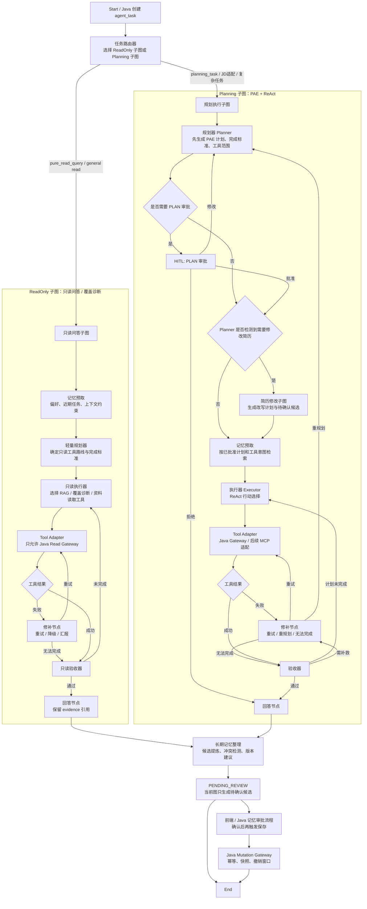

# Agent 接口文档

更新日期：2026-07-21

> 迁移状态：本文开头的“纯 Python 对外契约”是唯一生效契约。文末保留的旧 Gateway、内部 callback 和 Java Redis 章节仅为历史迁移背景；当前代码、配置和启动流程不得读取这些地址或令牌。

## 纯 Python 对外契约

### 服务边界

- FastAPI（`ai-python`）是 Agent、会话、审批、操作审计和 Agent 记忆的业务权威服务，对外提供全部 `/api/agent/*` 路径。
- PostgreSQL `learning_evidence.agent_*` 表是唯一持久事实源；任务、消息、审批、操作、文件夹和记忆均由 Python 事务写入，不通过 Java 回调同步。
- Bearer Token 由 Python `AuthService.current_user()` 解析。服务端从登录会话得到 `userId`，忽略请求体、查询参数或图状态中的任何 `userId`。
- 统一图通过进程内 `LocalAgentGateway` 访问受控只读能力、记忆检索与任务事件写入；不允许调用 Java URL、`X-Agent-Internal-Token`、Java Tool Gateway 或 Java callback URL。
- Worker 只接收已落库的 `agent_task`，从 PostgreSQL 读取任务并回写状态、消息、工具观测与审批；HTTP 创建接口不等待 LangGraph 完成。
- Redis 仅可作为 SSE 或运行态加速缓存。Redis 不可用时，SSE 重连与任务详情必须从 PostgreSQL 恢复。

### 通用约定

- 所有 JSON 接口返回 `Result<T>`：成功为 `{"code":1,"data":...}`，受控业务失败为 `{"code":0,"msg":"中文错误说明","data":null}`。
- 除 SSE 外，所有路径要求 `Authorization: Bearer <token>`。缺失、过期或被撤销的令牌返回 `登录状态已失效`。
- 当前用户无权访问的任务、审批、操作、文件夹或记忆统一按“不存在或不属于当前用户”处理，不泄露其他用户资源。
- 任务状态：`CREATED`、`RUNNING`、`WAITING_PLAN_REVIEW`、`WAITING_OUTPUT_REVIEW`、`WAITING_CRUD_REVIEW`、`COMPLETED`、`CANCELED`、`FAILED`。终态为 `COMPLETED`、`CANCELED`、`FAILED`；三个 `WAITING_*` 状态均表示等待当前用户审批。

### 公开路径

| 方法 | 路径 | 用途 |
| --- | --- | --- |
| `POST` | `/api/agent/tasks` | 创建任务并入队执行 |
| `GET` | `/api/agent/tasks?limit=20` | 查询当前用户最近任务 |
| `GET` | `/api/agent/tasks/{taskId}` | 查询任务详情、消息、审批与操作 |
| `GET` | `/api/agent/tasks/{taskId}/messages` | 按 `beforeSequenceNo` / `afterSequenceNo` 分页消息 |
| `GET` | `/api/agent/tasks/{taskId}/stream?token=...` | 订阅 `task`、`agent_event`、`done` SSE 事件 |
| `POST` | `/api/agent/tasks/{taskId}/folder` | 移动会话，`folderId=null` 表示未分类 |
| `POST` | `/api/agent/tasks/{taskId}/reviews/{reviewId}/decide` | 提交 `APPROVED`、`REJECTED` 或 `CHANGES_REQUESTED` |
| `POST` | `/api/agent/operations/{operationId}/undo` | 在撤销窗口内按幂等键撤销操作 |
| `GET` | `/api/agent/conversations/tree` | 查询会话树 |
| `POST` | `/api/agent/conversation-folders` | 创建会话文件夹 |
| `PUT` | `/api/agent/conversation-folders/{folderId}` | 更新文件夹名称和排序 |
| `DELETE` | `/api/agent/conversation-folders/{folderId}` | 删除文件夹并将会话移回未分类 |
| `GET` | `/api/agent/tools` | 查询当前阶段开放的受控工具定义 |
| `GET` | `/api/agent/memories` | 按状态、类型、命名空间和作用域查询当前用户记忆 |
| `POST` | `/api/agent/memories` | 创建当前用户显式授权的记忆 |
| `GET` | `/api/agent/memories/{memoryId}` | 查询当前用户的一条记忆 |
| `PATCH` | `/api/agent/memories/{memoryId}` | 修改记忆并生成收窄作用域的新版本 |
| `POST` | `/api/agent/memories/{memoryId}/confirm` | 确认待审记忆并激活索引 |
| `POST` | `/api/agent/memories/{memoryId}/reject` | 拒绝待审记忆 |
| `POST` | `/api/agent/memories/{memoryId}/archive` | 归档记忆 |
| `DELETE` | `/api/agent/memories/{memoryId}` | 擦除正文并保留审计链 |

### 任务请求与异步状态

`POST /api/agent/tasks` 请求体：

```json
{
  "taskType": "pure_read_query",
  "folderId": null,
  "title": "Redis 缓存策略",
  "input": {
    "goal": "说明 Redis 缓存策略并引用资料证据",
    "workspaceMode": "read",
    "topK": 5,
    "metadataFilter": {}
  }
}
```

服务端写入 `agent_task` 和首条 `agent_chat_message` 后返回 `CREATED`。Worker 将其更新为 `RUNNING`，并持续写入 `agent_event` 与消息投影。只读任务可使用进程内 RAG/记忆 gateway；规划或变更任务需要写入 `agent_human_review` 后进入 `WAITING_REVIEW`。审批恢复也由 Python Worker 完成，前端以详情轮询或 SSE 获取最终快照。

失败示例：

```json
{
  "code": 0,
  "msg": "AGENT_VALIDATION_FAILED: 任务目标不能为空",
  "data": null
}
```

### 请求与响应边界

- `POST /api/agent/tasks/{taskId}/folder` 请求体为 `{"folderId":"agent-folder-..."}`；`folderId=null` 表示移入未分类。服务端必须验证该文件夹归属于当前登录用户。
- `POST /api/agent/tasks/{taskId}/reviews/{reviewId}/decide` 请求体为 `{"decision":"APPROVED","comment":"可继续","changes":{}}`。`decision` 仅允许 `APPROVED`、`REJECTED`、`CHANGES_REQUESTED`；接口只持久化决策并把可恢复任务置为 `RUNNING`，不在 HTTP 请求内执行 Agent 图。
- `POST /api/agent/operations/{operationId}/undo` 请求体必须包含非空 `idempotencyKey`，可选 `reason`。重复撤销已完成操作返回同一操作快照；过期、非当前用户或不可撤销操作返回受控业务错误。
- 会话文件夹创建或更新请求为 `{"name":"RAG 学习","sortOrder":0}`；名称不能为空且最长 80 个字符。
- 记忆创建请求至少包含 `memoryType`、`namespace`、`scopeType`、`subjectKey`、`content`，可选 `summary`、`scopeId`、`evidenceRefs`、`importance`。`PATCH` 只接受正文、摘要、命名空间、主题和收窄后的作用域字段；服务端忽略任何客户端提供的 `userId`、来源任务所有者或审计字段。
- 任务详情返回任务摘要以及 `toolCalls`、`reviews`、`operations`、最近消息窗口；消息分页返回 `taskId`、`messages`、`oldestSequenceNo`、`newestSequenceNo`、`hasMoreBefore`、`hasMoreAfter`。所有时间字段均为 ISO-8601 时间戳。

### SSE

SSE 路径为了兼容浏览器 `EventSource`，允许令牌置于 `token` 查询参数；服务端仍按 `AuthService.current_user()` 校验，且不记录令牌原文。事件名称与负载如下：

- `task`：完整任务快照。
- `agent_event`：节点、工具、审批或状态的增量事件，至少包含 `taskId`、`eventType`、`status`、`createdAt`。
- `done`：终态完整任务快照，客户端应关闭连接。

SSE 首先推送一次 `task` 当前快照。随后服务端从 PostgreSQL 轮询任务及新增消息投影，派生 `agent_event`；不依赖 Redis 或 Java 缓冲。任务进入 `COMPLETED`、`CANCELED` 或 `FAILED` 后推送 `done` 并关闭连接。连接中断后，客户端可用同一路径重新订阅，或通过任务详情和消息分页恢复。

### Worker 执行与恢复

- `app.workers.agent_task_worker` 是单独监督的 Python 耐久 worker。它读取 PostgreSQL 中 `CREATED`、`RUNNING` 的任务；终态和 `WAITING_REVIEW` 任务不会被再次执行。
- Worker 通过进程内 `LocalAgentGateway` 读取当前用户记忆、调用 Python RAG 控制面或执行已审批的最小变更投影。它绝不创建 Java HTTP 客户端、不会读取 Java URL，也不会发送 Java callback。
- 无模型或 RAG 依赖不可用时，worker 使用确定性降级答案并记录工具观测与错误诊断，避免任务永久停在 `RUNNING`。规划和变更任务在需要用户确认时写入 `agent_human_review` 并转为对应的 `WAITING_*_REVIEW` 状态；审批后下一轮轮询从 PostgreSQL 恢复。

### 当前实现落点

- 公开 API 实现在 `ai-python/app/api/agent.py`，所有非 SSE 路径复用 Python `Result<T>` 信封；非对象请求体、任务目标、审批决定和所有权错误均返回 `code=0`，而不是 HTTP callback 错误。
- 统一图的 gateway 实现在 `ai-python/agents/gateway/local_gateway.py`。它从任务记录派生用户身份，直接调用 `AgentRuntimeService`、Python RAG 控制面和记忆服务，不创建网络客户端。
- 耐久 worker 入口为 `python -m app.workers.agent_task_worker`。启动配置开启 `AI_AGENT_WORKER_ENABLED` 后，worker 顺序读取 `CREATED` / 可恢复的 `RUNNING` 任务；审批接口只把任务置为 `RUNNING`，下一轮 worker 决定恢复图，不在 HTTP 请求内执行。
- PostgreSQL worker 领取时持有按 schema 和 task ID 构造的 session advisory lock；意外启动多个 worker 时，同一任务只会由获得锁的一个进程运行，锁随连接关闭自动释放，下一轮可从持久化状态恢复。
- 当前无可用 RAG、embedding 或模型依赖时，gateway 返回带空 `evidences` 的确定性结果并记录 `deterministic-fallback` 诊断。任务仍会进入受控终态，不会因依赖缺失永久停留在 `RUNNING`。

### 工具与审批安全边界

`GET /api/agent/tools` 只返回白名单工具。只读工具可由统一图直接通过 Python 进程内 gateway 调用；变更工具必须创建 `agent_human_review` 和 `agent_operation`，只有当前任务所有者审批后才可执行。`undo` 必须校验操作所有者、状态、截止时间与 `idempotencyKey`。Python 不接受模型、浏览器或请求体提供的资源所有者字段。

### 前端影响

React `frontend-react/src/api/agent.ts` 无需改变路径或 `Result<T>` 类型。Vite 代理切换至 FastAPI 后，`/agent` 页面只需运行 React 与 Python 服务，不再启动 Java 7080。

## 当前实现变更摘要

2026-07-21 起，Agent 任务、消息、审批、操作、会话文件夹、记忆和 SSE 全部由 Python FastAPI 与耐久 worker 提供。HTTP 请求只写入 PostgreSQL 事实表，`app.workers.agent_task_worker` 负责从 `CREATED` 或可恢复的 `RUNNING` 状态执行统一图；前端只需要 FastAPI 和 React。统一图通过 `LocalAgentGateway` 进程内调用 RAG、记忆和审计服务，不使用 Java URL、内部回调或共享令牌。

## 历史迁移记录（仅供追溯，不是运行依赖）

以下章节保留迁移前的 Java Gateway、Redis 和内部 HTTP 契约，用于理解旧数据和回滚差异；不得据此配置启动参数、前端代理或服务间调用。

历史聊天记录和上下文压缩摘要存储选择 PostgreSQL，不使用 Redis 作为主存储。原因是 Agent 历史会话需要长期保留、按用户隔离查询、支持审计和刷新恢复，并且已经和 `agent_task`、`agent_chat_message`、`agent_conversation_summary`、`agent_tool_call`、`agent_human_review`、`agent_operation` 同属业务事实记录；PostgreSQL 的事务、唯一约束和级联删除更适合这类 durable history。2026-06-30 起 Java 已真实接入 Redis adapter，但 Redis 只做 L2 短期热态上下文和 SSE 重连缓冲，不作为可追溯聊天历史、摘要段或恢复索引的唯一来源；Redis 未配置、关闭或连接异常时，任务详情、上下文恢复和 SSE 仍回退到 PostgreSQL 消息/摘要和数据库轮询快照。

## Redis 热态与 SSE 缓冲

Java 是 Redis 接入层，原因是 Java 已持有 `agent_task`、`agent_chat_message`、`agent_conversation_summary`、用户隔离和 SSE 对外边界。Python Agent 不直连 Redis，也不直连业务数据库；Python 仍通过 Java 内部接口恢复上下文和回写事件。

Redis key 与 TTL：

| Key | 内容 | 写入时机 | TTL |
| --- | --- | --- | --- |
| `agent:ctx:{userId}:{taskId}` | `activeSummaryId`、`recentMessageIds`、budget counters、`lastCompressionAt`、`restoreSource` 等热态上下文元数据和摘要窗口 | `restoreContext()` 回源 PostgreSQL 后回填、消息追加、摘要保存、任务事件更新 | 运行中 24h，终态 7d，可用 `EVIDENCE_AGENT_REDIS_RUNNING_CONTEXT_TTL_HOURS` / `EVIDENCE_AGENT_REDIS_COMPLETED_CONTEXT_TTL_DAYS` 配置 |
| `agent:ctx:messages:{userId}:{taskId}` | 最近消息轻量副本，默认最多保留 40 条，用于热态恢复加速 | 每次 `agent_chat_message` 新增或幂等更新后刷新 | 7d，可用 `EVIDENCE_AGENT_REDIS_MESSAGE_TTL_DAYS` 配置 |
| `agent:sse:{taskId}` | 最近节点事件、工具事件和任务事件缓冲，供 SSE 重连补发 | Python events 回写 Java 后追加 | 2h，可用 `EVIDENCE_AGENT_REDIS_SSE_TTL_HOURS` 配置 |

恢复规则：`restoreContext()` 先读 Redis。只有 `agent:ctx:*` 和 `agent:ctx:messages:*` 同时存在且结构完整时才返回 `restoreSource=redis`；Redis miss、结构不完整或异常时立即从 PostgreSQL `agent_task`、`agent_chat_message`、`agent_conversation_summary` 重建，并回填 Redis。Redis TTL 过期只影响加速路径，不影响长期恢复能力。

## 上下文压缩与长期恢复

2026-06-29 新增 Agent 上下文超限压缩闭环。Agent 采用三层上下文记忆：

- L1 当前 prompt 窗口：保留系统提示、当前用户问题、最近原文窗口、审批状态、当前计划、工具观察摘要、相关长期记忆和 RAG evidence 引用；不直接注入大量压缩候选原文。
- L2 Redis 热态工作记忆：已由 Java adapter 写入 `agent:ctx:{userId}:{taskId}`、`agent:ctx:messages:{userId}:{taskId}` 和 `agent:sse:{taskId}`；Redis miss、未配置或异常时自动回源 PostgreSQL，不影响恢复能力。
- L3 PostgreSQL 持久上下文：`agent_chat_message` 保存原文消息投影，`agent_conversation_summary` 保存上下文压缩摘要段，是长期恢复的权威来源。

默认 best window 为 16k-18k token，可通过 Python 环境变量 `AGENT_CONTEXT_BEST_WINDOW_TOKENS` 调整。`context_budget_guard` 会在 planner、executor、repair、acceptance、resume_rewrite_*、answer_writer 等会组装长 prompt 或调用 Qwen 的节点前统一估算 prompt 负载；`post_answer_memory` 当前不调用 Qwen，但会在请求 `agent_memory_candidate_proposer` 工具前执行同一预算守卫。超过阈值且 Java 返回了 `compressionCandidateMessages` 时进入 `conversation_compression`，压缩节点只读取候选窗口，业务节点 prompt 仍只注入摘要段和最近原文窗口。压缩先抽取 key facts，再生成摘要和完整性诊断。压缩输出包含：

```json
{
  "rollingSummary": "早期上下文摘要",
  "keyFacts": [{"text": "关键事实", "source": "task_input"}],
  "openQuestions": [],
  "decisions": [],
  "userPreferences": [],
  "taskState": {"node": "planner", "status": "RUNNING"},
  "toolFindings": [],
  "evidenceRefs": [{"type": "rag_evidence", "id": "material-12-1"}],
  "lastRawMessageIds": ["agent-msg-001"],
  "coveredMessageRange": {"startId": "agent-msg-001", "endId": "agent-msg-006"},
  "compressionVersion": 1,
  "confidence": 0.62,
  "lossRisk": "LOW"
}
```

`lossRisk=HIGH` 时摘要状态可标为 `HIGH_LOSS_RISK`，Python 会保留更多最近原文窗口并在 diagnostics 中标注风险。无 `DASHSCOPE_API_KEY` 或 `AGENT_LLM_ENABLED=false` 时，压缩节点使用确定性 fallback summary，保证本地测试和离线开发可运行。

### `agent_conversation_summary`

`agent_conversation_summary` 是必需表。字段包括 `id`、`task_id`、`user_id`、`summary_type`、`covered_message_start_id`、`covered_message_end_id`、`covered_message_count`、`raw_token_estimate`、`compressed_token_estimate`、`summary_json`、`summary_text`、`key_facts_json`、`evidence_refs_json`、`compression_model`、`compression_prompt_version`、`compression_version`、`status`、`diagnostics_json`、`created_at`、`updated_at`。PostgreSQL 初始化脚本包含 task/status、user/task/status、covered range 和 JSONB GIN 索引；Java 测试 schema 使用 CLOB 保存 JSON。

`agent_chat_message` 使用 `sequence_no` 保存同一任务内的稳定消息顺序。Java 新增消息时先在同一事务内对 `agent_task` 行执行 `FOR UPDATE`，再按当前任务最大 `sequence_no + 1` 分配，并通过 `(task_id, sequence_no)` 唯一索引兜底，避免并发写入拿到重复序号。查询最近窗口、压缩候选、before/core/after 回捞和最新覆盖端点时都按 `sequence_no` 比较，不依赖随机 UUID 或同事务内可能相同的 `created_at` 作为顺序依据。

### Java 内部上下文接口

#### 恢复上下文

`GET /api/internal/agent/tasks/{taskId}/context`

Header：`X-Agent-Internal-Token`

Query：

| 参数 | 说明 |
| --- | --- |
| `query` | 当前问题或任务目标，用于 Java 侧摘要段关键词 scoring |
| `recentLimit` | 最近原文窗口条数，默认 12 |
| `summaryLimit` | 返回摘要段数量，默认 6 |
| `bestWindowTokens` | prompt 目标窗口，默认 18000 |

响应：

```json
{
  "taskId": "agent-task-xxx",
  "userId": "1",
  "messageWindow": [],
  "compressionCandidateMessages": [],
  "activeSummaries": [],
  "summarySegments": [],
  "budgetMetadata": {
    "promptTargetTokens": 18000,
    "recentMessageLimit": 12,
    "uncompressedMessageCount": 18,
    "compressionCandidateCount": 8,
    "latestCoveredMessageEndId": "agent-msg-012",
    "restoreSource": "postgresql",
    "redisPolicy": "Redis 仅作短期热态缓存；恢复能力以 PostgreSQL 消息和摘要段为准"
  }
}
```

规则：Java 从 `taskId` 反查 `agent_task.user_id`，不信任 Python 传入用户范围。`messageWindow` 只返回最近原文窗口；`compressionCandidateMessages` 返回“尚未被历史摘要覆盖、且不属于最近原文窗口”的较早消息。如果没有任何摘要，候选窗口从最早消息开始取一批并保留最近 `recentLimit` 条原文；如果已有摘要，则从最新 `covered_message_end_id` 之后继续取未覆盖候选。候选窗口通过 SQL 小窗口查询返回，不全量加载长会话消息后内存切片。摘要段检索当前使用 Java 侧小规模关键词 scoring fallback，覆盖 `summaryText/keyFacts/evidenceRefs/summaryJson`；无关键词命中时回退最近 `ACTIVE/SUPERSEDED/HIGH_LOSS_RISK` 摘要，当前没有实现数据库 BM25。

#### 保存压缩摘要

`POST /api/internal/agent/tasks/{taskId}/summaries`

Header：`X-Agent-Internal-Token`

请求体为压缩摘要结构，包含 `summaryId`、`coveredMessageStartId`、`coveredMessageEndId`、`summary`、`summaryText`、`keyFacts`、`evidenceRefs`、`compressionModel`、`compressionPromptVersion`、`compressionVersion`、`status` 和 `diagnostics`。同任务同 `summaryId` 重试时直接返回已有摘要，避免 Python 重试或事件重放造成主键冲突。Java 保存前会校验 `coveredMessageStartId/coveredMessageEndId` 非空时必须属于当前任务的 `agent_chat_message`，且 start 的 `sequence_no` 不能大于 end；校验失败时拒绝保存，不写 `agent_conversation_summary`，也不追加 `CONTEXT_SUMMARY` 消息。保存新的 `ACTIVE` 摘要时，Java 将同任务旧 `ACTIVE` 摘要标为 `SUPERSEDED`，不直接覆盖历史行。

#### 回捞覆盖范围附近原文

`GET /api/internal/agent/tasks/{taskId}/context/messages`

Header：`X-Agent-Internal-Token`

Query 支持 `summaryId`、`coveredMessageStartId`、`coveredMessageEndId`、`anchorMessageId`、`before`、`after`、`limit`。Java 仍从 `taskId` 反查用户并只返回当前任务消息；实现使用 SQL 级 before/core/after 小窗口查询，不全量加载长会话消息后内存切片。Python `context_restore` 不允许直连 `agent_task`、`agent_chat_message` 或 `agent_conversation_summary`。

长期恢复流程：

1. 用户很久后打开同一会话，前端读取 Java `GET /api/agent/tasks/{taskId}`，展示消息流和 summaries 简要状态。
2. Python 图入口 `conversation_title -> context_restore -> task_router`，通过 Java 内部 `/context` 恢复最近原文窗口、ACTIVE 摘要、按 query 命中的摘要段，以及压缩专用候选窗口。
3. 若候选窗口导致估算 token 超过 best window，Python 先压缩候选窗口并保存到 `agent_conversation_summary`；只有 Java 保存成功后，Python 才把新摘要加入本轮 `summarySegments`、更新 `activeSummaryId` 并清空候选。若保存失败，本轮不把未落库摘要当作长期恢复摘要注入 prompt，而是记录 `save_failed` diagnostics，并保留候选窗口和既有摘要。单次图执行默认最多压缩 2 段，可通过 `AGENT_CONTEXT_MAX_COMPRESSIONS` 调整。
4. 若用户追问压缩范围附近细节，Python 可通过 `/context/messages` 传 `summaryId` 或 `anchorMessageId` 回捞少量原文，再组装到 L1 prompt。
5. Redis 命中时只加速热态恢复；Redis miss 或未配置时仍从 PostgreSQL 的 `agent_task`、`agent_chat_message`、`agent_conversation_summary` 重建，并回填 Redis。

核心边界：

- React 只调用 Java `/api/agent/*`。
- Java 是唯一对外 API、登录用户、业务权限、审计、幂等和错误映射边界。
- Python Agent 只负责编排、计划、工具观察整合、草稿生成和 citation guard。
- Python Agent 只能通过 Java Tool Gateway 调业务能力，不能直连数据库、对象存储、Java Mapper、Python RAG `/internal/*` 或 `create_rag_store()`。
- Python Agent 只能通过 Java Tool Gateway 使用 Agent 记忆能力；记忆状态、确认、归档、删除和审计以 Java 为准。
- 普通上传、分片上传和确定性 RAG 入库不纳入 Agent 工具。
- 当前版本未实现授权表，`explicitGrant` 只是预留语义；除 `ownerUserId == currentUserId` 外全部拒绝。

## LangGraph Qwen 决策策略

统一图从 2026-06-28 起采用“Qwen 结构化决策 + schema 校验 + 确定性 fallback”的执行方式。LLM 只负责给 LangGraph 业务节点提供 JSON 决策建议，不能直接执行工具、授权写操作、绕过 Java Tool Gateway 或改变审批边界。未配置 `DASHSCOPE_API_KEY`、`AGENT_LLM_ENABLED=false`、调用超时、JSON 解析失败、字段不符合 schema、工具名不在白名单、子图名不在白名单或出现 mutation 工具时，Python 会回退到原确定性逻辑，保证本地测试和离线开发不被模型配置阻断。

图执行深度：

- Python 统一图调用 LangGraph 时显式传入 `recursion_limit=24`，作为 executor / acceptance / repair 循环的总步数兜底。
- 正常循环推进规则为：工具 action 成功或显式跳过时推进 `current_step_index`；LLM 验收要求补救时路由到 `repair`；同一步没有 action 且没有工具观察时视为跳过当前步骤，避免 `executor -> acceptance -> executor` 空转。
- 超过最大深度时 Python 捕获 `GraphRecursionError`，向 Java 回写 `TASK_FAILED`，`errorCode=AGENT_GRAPH_RECURSION_LIMIT`，`errorMessage=Agent 执行超过最大图深度 24，已停止以避免循环。请缩小目标、减少工具步骤，或要求 Agent 重新规划。`。前端只展示 Java `GET /api/agent/tasks/{taskId}` 返回的 `status/errorCode/errorMessage`，不会自行伪造成成功结果。

模型分配：

| 节点 | 默认模型 | 职责 |
| --- | --- | --- |
| `conversation_title` | `qwen-turbo` | 根据用户首句生成 8-20 字中文会话主题，失败时回退首句截断并回写 `conversationTitle` |
| `planner` | `qwen-plus` | 生成 PAE 计划、工具范围、风险等级、`resumeRewriteIntent` 和 `internalSubgraphs` |
| `executor` | `qwen-turbo` | 基于已批准计划和观察结果选择下一步只读工具 |
| `repair` | `qwen-turbo` | 在工具失败后建议 `RETRY`、`SKIP_TOOL`、`REPLAN` 或 `REPORT_UNABLE` |
| `acceptance` / `resume_rewrite_acceptance` | `qwen-turbo` | 辅助检查完成标准、审批要求和缺口，不虚构 evidence |
| `resume_rewrite_planner` / `resume_rewrite_generator` | `qwen-plus` | 生成简历改写范围和待审批候选片段 |
| `answer_writer` | `qwen-plus` | 基于已验证 draft/final 生成中文输出摘要，等待审批时只写审批说明 |

安全固定节点不让 LLM 控制最终行为：`task_router` 只做任务类型路由，避免模型改变入口权限；`plan_review` 只发布 Java/前端审批请求，不能由模型批准；`tool_adapter` 是 Java Gateway 唯一出口，必须用确定性代码校验工具名、`approvalId`、`operationId` 和 `idempotencyKey`；`memory_prefetch_before_planner` / `memory_prefetch_after_planner` 只能通过 Java 记忆只读工具读取当前用户记忆；`post_answer_memory` 只请求待确认记忆候选，不自动写库。这些节点可记录上游 LLM 诊断，但不能把模型输出作为权限、审批或网关调用依据。

Agent LLM 环境变量：

| 变量 | 默认值 | 说明 |
| --- | --- | --- |
| `DASHSCOPE_API_KEY` | 空 | 阿里云百炼 / DashScope API Key；为空时 Agent LLM 自动 fallback |
| `AGENT_LLM_ENABLED` | `true` | 是否启用 Agent 节点 Qwen 调用 |
| `AGENT_QWEN_BASE_URL` | `https://dashscope.aliyuncs.com/compatible-mode/v1` | OpenAI Chat Completions 兼容地址 |
| `AGENT_QWEN_PLANNER_MODEL` | `qwen-plus` | Planner 模型 |
| `AGENT_QWEN_EXECUTOR_MODEL` | `qwen-turbo` | Executor 模型 |
| `AGENT_QWEN_REPAIR_MODEL` | `qwen-turbo` | Repair 模型 |
| `AGENT_QWEN_ACCEPTANCE_MODEL` | `qwen-turbo` | Acceptance 模型 |
| `AGENT_QWEN_RESUME_MODEL` | `qwen-plus` | 简历修改子图模型 |
| `AGENT_QWEN_ANSWER_MODEL` | `qwen-plus` | Answer Writer 模型 |
| `AGENT_QWEN_TEMPERATURE` | `0.2` | Agent 结构化决策温度 |
| `AGENT_QWEN_TIMEOUT_SECONDS` | `30` | 单次 Agent LLM 调用超时 |

## 统一 LangGraph 编排

Python 内部入口统一为 `agents.orchestration.pae_react_graph`，FastAPI `/internal/agent/tasks` 调用 `start_unified_agent()`，`/internal/agent/tasks/{taskId}/resume` 调用 `resume_unified_agent()`。所有 Agent 工作台任务先进入统一任务路由器，再进入 ReadOnly 子图或 Planning 子图；旧 `read_only_graph` 和 `planning_graph` 不再作为运行主图，也不再被统一图导入复用。若需要确定性纯函数，必须放在 `agents.orchestration.*_helpers` 这类共享模块中。



落地计划：

1. `ai-python/app/api/agent.py` 只允许调用 `start_unified_agent()` 和 `resume_unified_agent()`，不按任务类型直接选择旧图。
2. `pae_react_graph.py` 内部显式建模 `task_router`，`pure_read_query` 和通用只读探索进入 ReadOnly 子图语义，`planning_task`、Agent 工作台发起的 JD 适配和复杂任务进入 Planning 子图语义。
3. 只读问答、检索覆盖诊断、资料读取和联网参考都只能通过 `Tool Adapter -> Java Read Gateway`；写操作和保存草稿只能通过 `HITL -> Java Mutation Gateway`。回答后的记忆整理当前只生成 `PENDING_REVIEW` 候选，真正记忆保存由前端/Java 审批流程触发。
4. 旧 `read_only_graph.py` / `planning_graph.py` 的运行入口删除；仍需复用的文本处理、工具参数、草稿生成、mutation payload 等纯函数迁入 `agents/orchestration/read_only_helpers.py` 和 `agents/orchestration/planning_helpers.py`。
5. Agent 工作台入口统一走新图；独立非 Agent 的普通资料上传、确定性视频索引、传统 `/jd-analysis` 页面继续走 RAG/JD 服务，不强行改造成 Agent。
6. Planner 检测到简历改写意图时进入 `resume_rewrite_decision -> resume_rewrite_planner -> resume_rewrite_generator -> resume_rewrite_acceptance` 节点族；该节点族只生成待确认候选，不直接写 DOCX、不保存草稿、不绕过 Java 变更审批。

节点职责：

| 节点 | 代码节点 | 职责 |
| --- | --- | --- |
| 任务路由器 | `task_router` | 根据 `taskType/workspaceMode/toolHints` 标记 ReadOnly 或 Planning 子图，避免 FastAPI 入口分流到旧图 |
| 只读预取 | `memory_prefetch_before_planner` | 仅 ReadOnly 子图在轻量规划前调用 `agent_memory_retriever`，读取偏好、历史约束和近期任务上下文 |
| 规划器 | `planner` | PAE 生成计划、工具范围、完成标准和风险等级 |
| 计划审批 | `plan_review` | `planning_task` 首轮规划完成后立即进入 `PLAN` 审批；审批只确认路线，不授权写操作 |
| 简历修改判定 | `resume_rewrite_decision` | 读取 Planner 的 `resumeRewriteIntent`、`toolHints`、目标和 JD/简历上下文，判断是否进入简历修改子图 |
| 简历修改子图 | `resume_rewrite_planner` / `resume_rewrite_generator` / `resume_rewrite_acceptance` | 生成简历改写范围、候选改写片段、模板填充值和验收结果；只产出 `PENDING_REVIEW` 草稿，不直接写文件或数据库 |
| 规划后记忆预取 | `memory_prefetch_after_planner` | Planning 子图在计划通过后按步骤检索任务相关记忆；未批准计划前不调用工具 |
| 执行器 | `executor` | ReAct 行动选择器，只决定下一步工具与参数，不直接调用外部系统 |
| 工具节点 | `tool_adapter` | 唯一工具调用出口，只能访问 Java Read/Mutation Tool Gateway；后续 MCP 也在此适配 |
| 修补节点 | `repair` | 判断失败原因，决定重试、跳过可降级工具、重规划或汇报无法完成 |
| 验收器 | `acceptance` | 检查计划步骤是否全部完成，规划类生成草稿并进入输出审批，只读类直接完成 |
| 回答节点 | `answer_writer` | 回写 `TASK_COMPLETED`、`TASK_FAILED` 或 `WAITING_OUTPUT_REVIEW` 事件 |
| 长期记忆整理 | `post_answer_memory` | 仅在显式开启或触发“记住/偏好/以后请”等语义时提炼 `PENDING_REVIEW` 候选，不自动激活、不直接写库 |

修补规则：

- 可重试只读工具失败时，最多按 `input.maxToolRetries` 重试，默认 1 次。
- `AGENT_RESOURCE_FORBIDDEN`、`AGENT_MEMORY_FORBIDDEN`、`AGENT_MEMORY_SCOPE_ESCALATION`、`AGENT_INTERNAL_TOKEN_INVALID` 直接终止并向用户汇报，避免越权重试。
- `workspaceMode=free_explore` 或 `enableWebSearch=true` 时计划必须优先包含 `web_search_probe`，随后再执行 `rag_query_probe_non_persistent`；如果 Qwen Planner 漏掉联网步骤，Python `sanitize_plan()` 会按确定性 fallback 自动补回第一步。
- `web_search_probe` 返回 `AGENT_TAVILY_NOT_CONFIGURED` 或 `AGENT_TAVILY_DOWNSTREAM_FAILED` 时跳过联网参考，继续使用本地 RAG evidence 对齐。
- 未知工具进入重规划；重规划后的计划仍受 `PLAN` 审批约束。
- 变更工具不在普通执行循环里盲目重试；只有 `OUTPUT` 审批通过且输入包含保存意图后，才生成 `CRUD` 审批，再由 Java mutation gateway 按幂等键执行。
- 简历修改子图不调用 mutation gateway，也不直接写 DOCX；它只把改写候选并入规划草稿，后续仍由 `OUTPUT` 审批和可选 `CRUD` 审批处理。

长期记忆规则：

- ReadOnly 子图可在轻量规划前读取记忆；Planning 子图必须先由 Planner 生成计划并等待 `PLAN` 审批，批准后才按计划读取记忆和调用只读工具。
- 回答后的 `agent_memory_candidate_proposer` 只产出待确认候选和冲突信息，不写库、不激活；当前 `post_answer_memory` 图内不执行显式记忆写入分支。
- `agent_memory_candidate_save` 属于数据库变更工具，必须由前端/Java 记忆确认或 `human_crud_review` 流程触发；前端可展示为 `MEMORY_WRITE` 语义，但底层审批、归属、版本和审计仍由 Java 流程处理。
- 记忆合并、冲突覆盖和版本建议参考 `docs/api/agent-memory.md`，Python 不直接修改 `agent_memory_item`、`agent_memory_version` 或索引表。

## 状态机

### 任务类型

| 值 | 含义 | 阶段 |
| --- | --- | --- |
| `pure_read_query` | 资料状态、evidence 读取、RAG 探针、覆盖诊断等只读任务 | 阶段 1-2 |
| `planning_task` | JD/简历适配、学习路线、证据质量诊断等需要计划或输出确认的任务 | 阶段 3 |
| `mutation_task` | 重建索引、保存草稿、保存学习计划、取消任务、撤销等变更任务 | 阶段 4 |

### `agent_task.status`

| 状态 | 含义 |
| --- | --- |
| `CREATED` | Java 已创建任务，等待启动 Python Agent 或本地只读网关 |
| `RUNNING` | Agent 正在生成计划、调用工具或整合结果 |
| `WAITING_TOOL_RESULT` | 已发起工具调用，等待 Tool Gateway 或 Python 回写 Observation |
| `WAITING_PLAN_REVIEW` | 等待用户确认计划，仅规划类任务使用 |
| `WAITING_CRUD_REVIEW` | 等待用户确认具体变更操作 |
| `WAITING_OUTPUT_REVIEW` | 等待用户确认规划类最终草稿 |
| `COMPLETED` | 任务完成，`finalJson` 可展示 |
| `CANCELED` | 用户取消或审批拒绝后结束 |
| `FAILED` | 任务失败，`errorCode/errorMessage` 为脱敏摘要 |

### 工具、审批和操作状态

`agent_tool_call.status`：`PENDING` / `RUNNING` / `SUCCEEDED` / `FAILED` / `REJECTED`。

`agent_human_review.review_type`：`PLAN` / `CRUD` / `OUTPUT`。

`agent_human_review.status`：`PENDING` / `APPROVED` / `REJECTED` / `CHANGES_REQUESTED` / `EXPIRED`。

阶段 3 只实现 `PLAN` 和 `OUTPUT` 两类审批；二者都不授权任何 Create/Update/Delete 或业务状态变更。阶段 4 开始实现 `CRUD` 审批，但初版只允许 Agent 自身草稿保存、任务取消和撤销操作，不把普通上传、分片上传、确定性 RAG 入库或资料重建索引纳入 Agent 自动工具。

`agent_operation.status`：`PENDING_APPROVAL` / `APPLIED_UNDOABLE` / `UNDONE` / `UNDO_EXPIRED` / `FINALIZED` / `FAILED`。

撤销状态初版采用查询时流转：读取任务或操作详情时，如果 `undoDeadline` 已过且状态仍为 `APPLIED_UNDOABLE`，Java 可更新为 `UNDO_EXPIRED`；后续再补定时任务归档为 `FINALIZED`。

## 权限和安全

- 外部接口必须携带 `Authorization: Bearer <token>`。
- Java 从登录 token 解析当前用户，并写入 `agent_task.user_id`。
- 内部接口必须校验 `X-Agent-Internal-Token`，令牌来源优先级为 `EVIDENCE_AGENT_INTERNAL_TOKEN`、`EVIDENCE_AGENT_INTERNAL_TOKEN_FILE` 指向文件、仓库根目录 `.local/agent-internal-token`。
- 本地开发未显式配置 `EVIDENCE_AGENT_INTERNAL_TOKEN` 时，Java 和 Python 会自动读取或创建同一个 `.local/agent-internal-token`，避免两个服务分别手工配置；生产或多机部署应显式配置环境变量或共享密钥文件。
- Java Tool Gateway 根据 `taskId` 查询 `agent_task.user_id`，不信任 Python 传入的 `userId`。
- 只读工具无需 HITL，但任何 `resourceId/documentId/materialId/operationId` 必须由 Java 做 owner 校验。
- 当前版本 `scope=current_user_or_authorized` 的实际含义是“当前用户本人资源”；`explicitGrant` 未落表前非 owner 一律返回 `AGENT_RESOURCE_FORBIDDEN`。
- 只读工具允许写脱敏 `log_event/log_error` 和 `agent_tool_call` 观测记录，不允许写业务历史或修改业务状态。
- `rag_query_probe_non_persistent` 必须走 `RagService.queryNonPersistent()` 专用分支，复用 `scopedQuery()` 覆盖 `userId/visibilityScope`，不调用 `saveSynchronousQueryHistory`，不创建 query task，不写 `rag_query_history`。

## 数据库表

阶段 0 已在 `infra/sql/init.sql` 和 `infra/sql/alter-database/20260621_0200_create_agent_tables.sql` 中声明以下表；阶段 1 已同步 `backend-java/src/main/resources/schema.sql`，用于 H2 集成测试覆盖 Java Mapper 和 HTTP 接口。

| 表 | 用途 |
| --- | --- |
| `agent_task` | Agent 任务主状态、输入、计划、草稿、最终输出和 Python threadId |
| `agent_conversation_folder` | 当前用户自定义会话分类，供侧边栏 Agent 下拉树展示和移动会话 |
| `agent_chat_message` | 当前任务可展示聊天消息流，由 Java 将用户输入、Agent 进度、工具观测、审批和最终输出投影成可恢复历史 |
| `agent_tool_call` | 每次工具调用的请求、响应、归属校验、状态和错误摘要 |
| `agent_human_review` | 计划、CRUD、输出确认记录 |
| `agent_operation` | 可撤销变更操作、幂等键、快照引用和撤销窗口 |
| `agent_operation_snapshot` | 变更前后脱敏快照或安全恢复引用 |
| `agent_memory_item` | 当前用户 Agent 记忆元数据、状态、作用域和来源引用 |
| `agent_memory_embedding` | Python Memory Service 专用记忆检索索引 |
| `agent_memory_version` | 记忆版本、冲突、合并和替代关系 |
| `agent_memory_audit` | 记忆生命周期脱敏审计 |

`agent_operation` 的幂等唯一约束：

```text
(user_id, operation_type, resource_type, resource_id, idempotency_key)
```

快照禁止保存模型密钥、对象存储签名 URL、未脱敏长篇资料正文、未授权简历或 JD 全文。

`input_json/plan_json/draft_json/final_json/request_json/response_json/proposal_json/decision_json/snapshot_json/payload_json` 采用 `TEXT` 保存脱敏 JSON 字符串，和现有 `log_event.context_json`、`rag_query_history.*_json` 保持一致，避免 Java/MyBatis 在 PostgreSQL 与 H2 测试库之间维护两套 JSONB 写入语法。

`agent_chat_message` 关键约束：

```text
(task_id, dedupe_key)
```

Java 按事件来源构造 `dedupe_key`：用户目标、任务启动、同一工具调用、同一审批请求、最终回答和失败消息会幂等覆盖；无来源 ID 的进度消息会加入内容 hash，避免重复回写但保留不同阶段的进度。前端历史会话读取 `AgentTaskDetailVO.messages` 或 `GET /api/agent/tasks/{taskId}/messages`，不再凭 `status` 自行生成 Agent 回答。

`agent_conversation_folder` 与 `agent_task.folder_id`：

```text
agent_conversation_folder(id, user_id, name, sort_order, created_at, updated_at)
agent_task.folder_id -> agent_conversation_folder.id ON DELETE SET NULL
idx_agent_task_user_folder_updated(user_id, folder_id, updated_at DESC)
```

`agent_task.title` 是侧边栏会话标题。创建任务时 Java 先写入用户目标截断作为临时标题；Python `conversation_title` 节点生成 `conversationTitle` 后，Java 在处理 `DRAFT_UPDATED` 事件时更新标题。若模型不可用，Python 只使用用户首句截断作为降级标题，并在 `llm_diagnostics` 记录 fallback。

## Java DTO/VO 清单

阶段 1-4 实现时优先按以下名称落地，字段与本文档示例保持一致。

DTO：

| 类名 | 用途 |
| --- | --- |
| `AgentTaskCreateDTO` | 创建任务请求 |
| `AgentReviewDecisionDTO` | 用户提交计划、CRUD 或输出审批结果 |
| `AgentTaskCancelDTO` | 用户取消任务请求 |
| `AgentOperationUndoDTO` | 撤销窗口内回滚请求 |
| `AgentReadToolRequestDTO` | Python Agent 调 Java 只读工具网关请求 |
| `AgentMutationToolExecuteDTO` | Python Agent 调已审批变更工具请求 |
| `AgentTaskEventDTO` | Python Agent 回写任务状态、Observation、草稿和 review 请求 |

VO：

| 类名 | 用途 |
| --- | --- |
| `AgentTaskVO` | 任务摘要 |
| `AgentTaskDetailVO` | 任务详情，聚合工具调用、审批项、操作和消息流 |
| `AgentChatMessageVO` | 可展示聊天消息，包含角色、消息类型、内容、来源事件和 payload |
| `AgentToolCallVO` | 工具调用记录 |
| `AgentHumanReviewVO` | 审批记录 |
| `AgentOperationVO` | 变更操作和撤销窗口 |
| `AgentToolDefinitionVO` | 前端可展示工具能力和审批规则 |
| `AgentToolResultVO` | 内部工具网关统一结果 |

## Java 对外接口

所有外部接口返回 `Result<T>`：

```json
{
  "code": 1,
  "msg": null,
  "data": {}
}
```

业务错误返回：

```json
{
  "code": 0,
  "msg": "AGENT_RESOURCE_FORBIDDEN：当前任务无权读取该资源",
  "data": null
}
```

### 创建 Agent 任务

| 项目 | 内容 |
| --- | --- |
| 方法 | `POST` |
| 路径 | `/api/agent/tasks` |
| 鉴权 | Bearer Token |
| 响应 | `Result<AgentTaskVO>` |

请求示例：

```json
{
  "taskType": "pure_read_query",
  "title": "查询 Redis 学习证据",
  "input": {
    "goal": "我的知识库里 Redis 学到了什么？",
    "toolHints": ["rag_query_probe_non_persistent"],
    "resourceRefs": [
      {
        "resourceType": "material",
        "resourceId": "12"
      }
    ],
    "metadataFilter": {
      "documentType": "markdown"
    },
    "topK": 5
  }
}
```

规划类请求示例：

```json
{
  "taskType": "planning_task",
  "title": "后端实习 JD 适配分析",
  "input": {
    "goal": "分析这份后端实习 JD 和我的学习证据差距",
    "jobDescription": "岗位要求熟悉 Java、Spring Boot、Redis、MySQL，有 RAG 项目经验优先。",
    "resumeText": "资料库中已上传简历的解析摘要：做过多模态 RAG 学习证据平台，熟悉 Java 和 Python。",
    "resumeMaterialId": 18,
    "resumeMaterialTitle": "王同学-后端实习简历.pdf",
    "toolHints": [
      "resume_evidence_aligner",
      "gap_analyzer"
    ],
    "topK": 6
  }
}
```

自由探索请求示例：

```json
{
  "taskType": "planning_task",
  "title": "自由探索一个学习主题",
  "input": {
    "goal": "帮我获取 AI Agent 实习方向的外部资料并整理下一步学习建议",
    "workspaceMode": "free_explore",
    "enableWebSearch": true,
    "webSearchQuery": "AI Agent 实习方向 学习路线 岗位技能",
    "toolHints": [
      "web_search_probe",
      "rag_query_probe_non_persistent"
    ],
    "topK": 5,
    "candidateMultiplier": 4
  }
}
```

自由探索的数据源优先级固定为：先通过 `web_search_probe` 联网查询外部资料，再用 `rag_query_probe_non_persistent` 补充当前用户本地 evidence；如果 Tavily 未配置或联网工具失败，`repair` 节点会跳过联网步骤并继续本地 RAG，不把任务直接判失败。

成功响应：

```json
{
  "code": 1,
  "msg": null,
  "data": {
    "id": "agent-task-019ee6aa",
    "taskType": "pure_read_query",
    "status": "CREATED",
    "title": "查询 Redis 学习证据",
    "input": {
      "goal": "我的知识库里 Redis 学到了什么？"
    },
    "pythonThreadId": null,
    "createdAt": "2026-06-21T03:10:00+08:00",
    "updatedAt": "2026-06-21T03:10:00+08:00"
  }
}
```

阶段 2 开始，Java 创建任务后调用 Python `/internal/agent/tasks`；Python 通过 Java events 回写状态，Java 不轮询 Python。
阶段 8 起创建接口只负责写入任务并安排后台启动 Python Agent，返回时任务通常处于 `CREATED` 或刚被后台线程置为 `RUNNING`；Planner 生成计划、工具调用和最终结果都通过 Java events 更新任务详情，前端不得等待创建接口返回最终回答。
如果显式环境变量和本地共享令牌文件都不可用，Java 会创建任务后立即回写 `FAILED / AGENT_INTERNAL_TOKEN_INVALID`，并在任务错误信息中提示检查 `EVIDENCE_AGENT_INTERNAL_TOKEN` 或 `.local/agent-internal-token`，避免前端长期停在 `CREATED` 且 Python 控制台无日志。
Agent 链路排障日志要求：Java 全局异常日志必须打印 `method/path`，Java 创建任务、请求 Python、接收内部事件、执行 Tool Gateway 都要打印 `taskId/toolCallId/toolName/status` 摘要；Python `/internal/agent/tasks`、`/resume`、回调 Java events 和调用 Java tools 都要打印 `Agent链路` 控制台日志，不记录完整问题、回答、简历正文、资料正文或密钥。
阶段 3 的 `planning_task` 创建后先由 Python 回写 `REVIEW_REQUESTED`，任务进入 `WAITING_PLAN_REVIEW`；用户确认计划后，Java 调用 Python `/internal/agent/tasks/{taskId}/resume` 继续执行只读证据对齐，随后 Python 回写 `WAITING_OUTPUT_REVIEW`；用户确认输出后任务进入 `COMPLETED`。

### 查询任务详情

| 项目 | 内容 |
| --- | --- |
| 方法 | `GET` |
| 路径 | `/api/agent/tasks/{taskId}` |
| 鉴权 | Bearer Token |
| 响应 | `Result<AgentTaskDetailVO>` |

响应示例：

```json
{
  "code": 1,
  "msg": null,
  "data": {
    "id": "agent-task-019ee6aa",
    "taskType": "pure_read_query",
    "status": "COMPLETED",
    "plan": {},
    "draft": {},
    "final": {
      "answer": "Redis 相关证据主要集中在缓存淘汰、持久化和分布式锁。",
      "evidenceIds": ["material-12-3", "material-12-8"],
      "riskLevel": "LOW"
    },
    "toolCalls": [
      {
        "id": "tool-call-001",
        "toolName": "rag_query_probe_non_persistent",
        "toolType": "READ",
        "status": "SUCCEEDED",
        "ownershipVerified": true,
        "scope": "current_user_or_authorized",
        "response": {
          "evidenceCount": 2
        },
        "createdAt": "2026-06-21T03:10:02+08:00",
        "updatedAt": "2026-06-21T03:10:04+08:00"
      }
    ],
    "reviews": [],
    "operations": [],
    "messages": [
      {
        "id": "msg-001",
        "role": "USER",
        "messageType": "USER_GOAL",
        "content": "我的知识库里 Redis 学到了什么？",
        "dedupeKey": "user_goal",
        "createdAt": "2026-06-21T03:10:00+08:00"
      },
      {
        "id": "msg-002",
        "role": "ASSISTANT",
        "messageType": "FINAL_ANSWER",
        "content": "Redis 相关证据主要集中在缓存淘汰、持久化和分布式锁。",
        "sourceEventType": "TASK_COMPLETED",
        "dedupeKey": "final_answer",
        "createdAt": "2026-06-21T03:10:04+08:00"
      }
    ]
  }
}
```

规划类任务详情示例：

```json
{
  "code": 1,
  "msg": null,
  "data": {
    "id": "agent-task-019ee6bb",
    "taskType": "planning_task",
    "status": "WAITING_OUTPUT_REVIEW",
    "plan": {
      "title": "后端实习 JD 适配分析计划",
      "steps": [
        "读取当前用户 RAG 证据",
        "对齐 JD 要求与简历证据",
        "生成能力缺口和学习建议"
      ],
      "tools": ["rag_query_probe_non_persistent", "resume_evidence_aligner", "gap_analyzer"],
      "requiresOutputReview": true
    },
    "draft": {
      "matchSummary": "当前证据支持 Java/RAG 项目经验，Redis 证据偏弱。",
      "alignment": [
        {"requirement": "Java/Spring Boot", "status": "supported", "evidenceIds": ["material-1-2"]},
        {"requirement": "Redis", "status": "weak", "evidenceIds": []}
      ],
      "gaps": [
        {"skill": "Redis", "priority": "HIGH", "suggestion": "补充缓存淘汰、持久化和分布式锁项目证据"}
      ]
    },
    "reviews": [
      {
        "id": "review-001",
        "reviewType": "OUTPUT",
        "status": "PENDING",
        "proposal": {
          "summary": "确认后把当前草稿作为最终输出展示，不写业务数据"
        }
      }
    ],
    "operations": [],
    "messages": [
      {
        "role": "ASSISTANT",
        "messageType": "PLAN_REVIEW",
        "content": "规划器已生成执行路线，等待用户批准或要求修改。",
        "sourceEventType": "REVIEW_REQUESTED"
      }
    ]
  }
}
```

`messages` 是历史聊天记录的主展示来源。新任务由 Java 在创建、事件回写、审批决策、撤销和失败处理时自动写入；旧任务如果没有消息记录，前端可临时按 `agent_task`、`agent_tool_call`、`agent_human_review`、`agent_operation` 做兼容展示。

2026-06-30 起，`GET /api/agent/tasks/{taskId}` 不再返回全量长会话消息。任务详情只内嵌最近 `messageWindowLimit=30` 条消息和最近 `summaryWindowLimit=8` 条摘要，并返回 `hasMoreMessagesBefore` / `hasMoreSummaries`。前端打开历史会话时先展示最近窗口，再通过消息分页接口加载更早消息；新 SSE 快照或轮询结果按 `sequenceNo` / `id` 去重合并。

### 查询任务消息

| 项目 | 内容 |
| --- | --- |
| 方法 | `GET` |
| 路径 | `/api/agent/tasks/{taskId}/messages` |
| 鉴权 | Bearer Token |
| Query | `beforeSequenceNo`、`afterSequenceNo`、`limit`，默认 `limit=30`，最大 100 |
| 响应 | `Result<AgentMessagePageVO>` |

分页语义：

- `beforeSequenceNo=100&limit=30`：返回 `sequence_no < 100` 的前 30 条较早消息，结果仍按 `sequence_no ASC` 排序。
- `afterSequenceNo=100&limit=30`：返回 `sequence_no > 100` 的较新消息，用于补齐 SSE 断线后的消息。
- 不传 `beforeSequenceNo/afterSequenceNo`：返回最近窗口，结果按 `sequence_no ASC` 排序。
- 响应包含 `oldestSequenceNo`、`newestSequenceNo`、`hasMoreBefore`、`hasMoreAfter` 和 `messages`，前端用 `sequenceNo` 和 `id` 去重合并旧消息与新消息。

### 查询侧边栏会话树

| 项目 | 内容 |
| --- | --- |
| 方法 | `GET` |
| 路径 | `/api/agent/conversations/tree?limitPerFolder=8` |
| 鉴权 | Bearer Token |
| 响应 | `Result<AgentConversationTreeVO>` |

返回当前用户的未分类会话和自定义文件夹。`folders[].conversations[].title` 来自 `agent_task.title`，由 Python `conversation_title` 节点通过 `draft.conversationTitle` 回写；前端不得基于 `goal/status` 自行生成会话标题。

```json
{
  "code": 1,
  "data": {
    "unfiled": {
      "id": null,
      "name": "未分类",
      "conversationCount": 1,
      "conversations": [
        {
          "id": "agent-task-xxx",
          "folderId": null,
          "title": "Agent评估指标调研",
          "status": "WAITING_PLAN_REVIEW"
        }
      ]
    },
    "folders": [
      {
        "id": "agent-folder-xxx",
        "name": "实习准备",
        "sortOrder": 1,
        "conversationCount": 2,
        "conversations": []
      }
    ]
  }
}
```

### 创建会话文件夹

| 项目 | 内容 |
| --- | --- |
| 方法 | `POST` |
| 路径 | `/api/agent/conversation-folders` |
| 鉴权 | Bearer Token |
| 请求 | `{ "name": "实习准备", "sortOrder": 1 }` |
| 响应 | `Result<AgentConversationFolderVO>` |

`name` 必填，最长 80 字；`sortOrder` 可选，不传时 Java 使用当前用户最大排序值加一。

### 更新会话文件夹

| 项目 | 内容 |
| --- | --- |
| 方法 | `PUT` |
| 路径 | `/api/agent/conversation-folders/{folderId}` |
| 鉴权 | Bearer Token |
| 请求 | `{ "name": "面试准备", "sortOrder": 2 }` |
| 响应 | `Result<AgentConversationFolderVO>` |

Java 会校验 `folderId` 属于当前用户，不允许跨用户改名或排序。

### 删除会话文件夹

| 项目 | 内容 |
| --- | --- |
| 方法 | `DELETE` |
| 路径 | `/api/agent/conversation-folders/{folderId}` |
| 鉴权 | Bearer Token |
| 响应 | `Result<Void>` |

删除文件夹不会删除会话。Java 先将该文件夹下当前用户的 `agent_task.folder_id` 置空，再删除文件夹；数据库外键也使用 `ON DELETE SET NULL` 作为兜底。

### 移动会话到文件夹

| 项目 | 内容 |
| --- | --- |
| 方法 | `POST` |
| 路径 | `/api/agent/tasks/{taskId}/folder` |
| 鉴权 | Bearer Token |
| 请求 | `{ "folderId": "agent-folder-xxx" }`，移动到未分类时传 `{ "folderId": null }` |
| 响应 | `Result<AgentTaskVO>` |

Java 会同时校验 `taskId` 和 `folderId` 都属于当前用户；`folderId` 为空表示未分类。

### 订阅任务事件流

| 项目 | 内容 |
| --- | --- |
| 方法 | `GET` |
| 路径 | `/api/agent/tasks/{taskId}/stream?token={token}` |
| 鉴权 | 查询参数传当前 Bearer token 值；浏览器 `EventSource` 不能稳定携带自定义 Authorization 头 |
| 响应 | `text/event-stream` |

事件类型：

| 事件 | data |
| --- | --- |
| `agent_event` | 最近节点级或工具级事件缓冲，包括 `eventType`、`status`、`draft.node`、`draft.phase`、`draft.message`、`toolName`、`toolStatus` |
| `task` | `AgentTaskDetailVO` 当前快照 |
| `done` | 终态 `AgentTaskDetailVO`，状态为 `COMPLETED` / `FAILED` / `CANCELED` |

流式规则：

- Java SSE 不直接连接 Python；Python 先把节点事件回写 Java，Java 写入 Redis `agent:sse:{taskId}` 重连缓冲并继续按快照轮询兜底。未配置 Redis 时，`agent_event` 缓冲为空，但 `task/done` 快照流和消息轮询仍可用。
- 当前实现是节点级流式，不是 Qwen token 级流式。事件类型包括 `AGENT_NODE_STARTED`、`AGENT_NODE_DELTA`、`AGENT_NODE_COMPLETED`、`TOOL_CALL_STARTED`、`TOOL_CALL_COMPLETED`、`CONTEXT_COMPRESSED`、`TASK_FAILED`。Qwen 结构化 JSON 决策仍保持完整响应校验，暂不做 token 增量输出，避免破坏工具白名单、审批边界和 JSON schema 安全校验。
- Python 节点级进度通过 Java events 写入 `draft.message/node/phase/progressStatus`，例如 `planner started`、`planner finished`、`tool_adapter started`、`acceptance started`。
- 这些进度摘要只用于 UI 展示 Agent 正在做什么，不是最终回答，也不暴露隐藏推理链。
- 前端机器人回答必须来自 `messages.content`、`final.answer` 或后端错误字段，不能写死固定成功/失败文案。
- 浏览器关闭 SSE 后，重连会先补发 Redis 中最近 `agent_event`；前端也可继续用 `GET /api/agent/tasks/{taskId}` 和 `/messages` 轮询兜底。

### 提交审批结果

| 项目 | 内容 |
| --- | --- |
| 方法 | `POST` |
| 路径 | `/api/agent/tasks/{taskId}/reviews/{reviewId}/decide` |
| 鉴权 | Bearer Token |
| 响应 | `Result<AgentTaskDetailVO>` |

请求示例：

```json
{
  "decision": "APPROVED",
  "comment": "同意按该计划继续执行",
  "changes": {}
}
```

规则：

- 只能审批当前用户自己的任务。
- `PLAN` 审批只确认目标和工具路线，不授权任何写操作。
- `OUTPUT` 审批只确认规划类草稿可作为最终输出；无保存意图时 Java 可直接把 `draftJson` 复制为 `finalJson`，有 `saveDraft=true` 或保存类 `toolHints` 时恢复 Python 生成 `CRUD` 审批。
- `CRUD` 审批必须绑定具体 `operationType/resourceType/resourceId/idempotencyKey/beforeSnapshotRef`。
- 审批不是幂等执行入口；变更执行仍由内部 mutation Tool Gateway 二次校验。
- 阶段 4 初版 `CRUD` 审批只允许 `RESUME_REVISION_SAVE`、`JD_PLAN_SAVE` 和 `TASK_CANCEL` 三类 Agent 自身范围内变更；`MATERIAL_REINDEX` 保持预留，不自动执行。

### 取消任务

| 项目 | 内容 |
| --- | --- |
| 方法 | `POST` |
| 路径 | `/api/agent/tasks/{taskId}/cancel` |
| 鉴权 | Bearer Token |
| 响应 | `Result<AgentTaskDetailVO>` |

请求示例：

```json
{
  "reason": "用户主动取消"
}
```

取消属于状态变更。阶段 4 后，如果任务已有可撤销操作或待审批项，取消也要进入 `human_crud_review`；阶段 1-2 纯只读任务可直接标记为 `CANCELED`。

### 撤销操作

| 项目 | 内容 |
| --- | --- |
| 方法 | `POST` |
| 路径 | `/api/agent/operations/{operationId}/undo` |
| 鉴权 | Bearer Token |
| 响应 | `Result<AgentOperationVO>` |

请求示例：

```json
{
  "idempotencyKey": "undo-agent-task-019ee6aa-operation-001",
  "reason": "用户撤销刚保存的学习计划"
}
```

规则：

- 只能撤销当前用户自己的 `APPLIED_UNDOABLE` 操作。
- 当前时间必须早于 `undoDeadline`。
- 当前阶段撤销必须由当前登录用户显式调用 Java 撤销接口，不由 Python Agent 自动发起；Java 恢复 before snapshot，并将原操作置为 `UNDONE`。
- 模型调用成本、已完成的视频高成本处理不可撤销；阶段 4 初版只回滚 Agent 任务自身状态、草稿和最终结果。

### 获取工具能力

| 项目 | 内容 |
| --- | --- |
| 方法 | `GET` |
| 路径 | `/api/agent/tools` |
| 鉴权 | Bearer Token |
| 响应 | `Result<List<AgentToolDefinitionVO>>` |

响应示例：

```json
{
  "code": 1,
  "msg": null,
  "data": [
    {
      "toolName": "material_status_reader",
      "toolType": "READ",
      "requiresReview": false,
      "approvalType": null,
      "stage": 1,
      "description": "读取当前用户资料解析状态、摘要和失败原因"
    },
    {
      "toolName": "agent_memory_candidate_save",
      "toolType": "MUTATION",
      "requiresReview": true,
      "approvalType": "CRUD",
      "stage": 7,
      "description": "用户确认后保存记忆候选并进入索引流程"
    }
  ]
}
```

## Java 内部 Tool Gateway

内部接口只允许 Python Agent 调用，必须携带 `X-Agent-Internal-Token`。

### 执行只读工具

| 项目 | 内容 |
| --- | --- |
| 方法 | `POST` |
| 路径 | `/api/internal/agent/tools/read` |
| Header | `X-Agent-Internal-Token` |
| 响应 | `AgentToolResultVO`，内部接口可不套外部 `Result<T>`，但错误体必须结构化 |

请求示例：

```json
{
  "taskId": "agent-task-019ee6aa",
  "toolCallId": "tool-call-001",
  "toolName": "material_status_reader",
  "arguments": {
    "materialId": "12"
  }
}
```

成功响应：

```json
{
  "taskId": "agent-task-019ee6aa",
  "toolCallId": "tool-call-001",
  "toolName": "material_status_reader",
  "status": "SUCCEEDED",
  "ownershipVerified": true,
  "scope": "current_user_or_authorized",
  "data": {
    "materialId": 12,
    "title": "Redis 笔记.md",
    "status": "READY",
    "parser": "markdown",
    "chunkCount": 18
  },
  "diagnostics": {}
}
```

只读工具清单：

| 工具名 | 参数 | Java 封装 |
| --- | --- | --- |
| `material_status_reader` | `materialId` | `RagService.getMaterial` |
| `material_evidence_reader` | `materialId/topK` | `RagService.listMaterialEvidences` |
| `material_preview_reader` | `materialId/source/maxChars` | `RagService.previewMaterial`，Java 控制长度和来源 |
| `rag_query_probe_non_persistent` | `question/topK/candidateMultiplier/metadataFilter` | `RagService.queryNonPersistent`，不写历史 |
| `retrieval_coverage_probe` | `question/topK/metadataFilter` | 复用非持久化查询 diagnostics，输出覆盖摘要 |
| `resume_evidence_aligner` | `jobDescription/resumeText/question/topK` | 阶段 3 由 Python 基于 Java RAG 探针结果做只读证据对齐 |
| `gap_analyzer` | `jobDescription/resumeText/alignment` | 阶段 3 由 Python 基于已授权 evidence 和草稿生成能力缺口 |
| `evidence_quality_auditor` | `alignment/evidenceIds` | 阶段 3 由 Python 检查证据充分性和风险等级 |
| `web_search_probe` | `query/maxResults/searchDepth/topic` | 阶段 5 由 Java 调 Tavily Search API，返回联网参考，不写 RAG evidence |
| `agent_memory_retriever` | `query/topK/namespaces/memoryTypes` | 阶段 7 按当前任务 owner 检索可注入记忆 |
| `agent_memory_candidate_proposer` | `taskInput/draft/final/toolObservations` | 阶段 7 生成待确认记忆候选，不落库 |

`utc_time_provider` 是 Python 本地系统工具，不调用 Java Gateway，不访问用户数据。

只读错误响应示例：

```json
{
  "taskId": "agent-task-019ee6aa",
  "toolCallId": "tool-call-001",
  "toolName": "material_status_reader",
  "status": "REJECTED",
  "ownershipVerified": false,
  "scope": "current_user_or_authorized",
  "errorCode": "AGENT_RESOURCE_FORBIDDEN",
  "errorMessage": "当前任务无权读取该资料",
  "retryable": false
}
```

### 执行已审批变更工具

| 项目 | 内容 |
| --- | --- |
| 方法 | `POST` |
| 路径 | `/api/internal/agent/tools/mutation/execute` |
| Header | `X-Agent-Internal-Token` |
| 阶段 | 阶段 4 |

请求必须包含：

```json
{
  "taskId": "agent-task-019ee6aa",
  "toolCallId": "tool-call-010",
  "approvalId": "review-001",
  "operationId": "operation-001",
  "toolName": "jd_learning_plan_save",
  "idempotencyKey": "save-plan-agent-task-019ee6aa-v1",
  "arguments": {
    "resourceType": "jd_learning_plan",
    "resourceId": "report-12",
    "payload": {}
  }
}
```

Java 必须校验 `approvalId` 已经由当前用户批准、`operationId` 属于当前任务、幂等键未冲突、资源仍属于当前用户，再执行变更。

阶段 4 初版支持的变更工具：

| 工具名 | operationType | resourceType | 行为 |
| --- | --- | --- | --- |
| `jd_learning_plan_save` | `JD_PLAN_SAVE` | `agent_task_draft` | 将学习计划草稿固化到 `final_json`，记录 before/after snapshot |
| `agent_task_cancel_request` | `TASK_CANCEL` | `agent_task` | 将当前任务标记为 `CANCELED`，记录取消前后状态 |
| `agent_memory_candidate_save` | `AGENT_MEMORY_CANDIDATE_SAVE` | `agent_memory` | 保存待确认记忆候选；显式授权后可进入索引流程 |

`material_reindex_request` 仍需后续接入资料重建链路和成本提示，本阶段不执行。

撤销窗口当前不作为 Python Agent 可直接选择的 Tool Gateway 工具；前端通过 Java `POST /api/agent/operations/{operationId}/undo` 请求恢复 before snapshot。

执行成功响应示例：

```json
{
  "taskId": "agent-task-019ee6bb",
  "toolCallId": "tool-call-010",
  "toolName": "jd_learning_plan_save",
  "status": "SUCCEEDED",
  "ownershipVerified": true,
  "scope": "current_user_or_authorized",
  "data": {
    "operationId": "operation-001",
    "status": "APPLIED_UNDOABLE",
    "beforeSnapshotRef": "agent-operation-snapshot:snapshot-before-001",
    "afterSnapshotRef": "agent-operation-snapshot:snapshot-after-001",
    "undoDeadline": "2026-06-21T16:20:00+08:00"
  },
  "retryable": false
}
```

### 联网参考工具

阶段 5 初版只实现 `web_search_probe`。该工具仍归类为只读工具，由 Python Agent 通过 Java Read Tool Gateway 调用，Java 读取 `evidence.tools.tavily.api-key` 并调用 Tavily Search API。Tavily 官方 Search API 使用 `POST https://api.tavily.com/search`，通过 Bearer API Key 鉴权，常用参数包括 `query`、`search_depth`、`topic` 和 `max_results`。

请求参数示例：

```json
{
  "taskId": "agent-task-019ee6bb",
  "toolCallId": "tool-call-web-001",
  "toolName": "web_search_probe",
  "arguments": {
    "query": "字节跳动 后端实习 Redis RAG 技能趋势",
    "maxResults": 5,
    "searchDepth": "basic",
    "topic": "general"
  }
}
```

成功响应 `data` 示例：

```json
{
  "query": "字节跳动 后端实习 Redis RAG 技能趋势",
  "retrievedAt": "2026-06-21T16:40:00+08:00",
  "requestId": "123e4567-e89b-12d3-a456-426614174111",
  "responseTime": "1.67",
  "results": [
    {
      "title": "示例网页标题",
      "sourceUrl": "https://example.com/page",
      "summary": "Tavily 返回的摘要片段，供 Agent 作为外部参考。",
      "score": 0.82,
      "confidence": "HIGH",
      "retrievedAt": "2026-06-21T16:40:00+08:00"
    }
  ]
}
```

规则：

- 外部搜索结果只作为参考上下文，不写入 `learning_material`、`rag_document`、`rag_evidence` 或 `rag_query_history`。
- 未配置 `TAVILY_API_KEY` 时返回 `AGENT_TAVILY_NOT_CONFIGURED`，`retryable=true`，规划类任务可继续使用本地 RAG evidence。
- 只允许 `searchDepth=basic/advanced/fast/ultra-fast`，默认 `basic`；`maxResults` 默认 5。
- 阶段 5 暂不实现 `web_page_fetcher`，避免在 SSRF 防护未完整落地前抓取任意 URL 正文。

### Python 回写任务事件

| 项目 | 内容 |
| --- | --- |
| 方法 | `POST` |
| 路径 | `/api/internal/agent/tasks/{taskId}/events` |
| Header | `X-Agent-Internal-Token` |
| 阶段 | 阶段 2 |

请求示例：

```json
{
  "eventType": "TOOL_CALL_COMPLETED",
  "status": "RUNNING",
  "pythonThreadId": "agent-task-019ee6aa",
  "toolCall": {
    "id": "tool-call-001",
    "toolName": "rag_query_probe_non_persistent",
    "status": "SUCCEEDED",
    "response": {
      "evidenceCount": 2
    }
  },
  "draft": {},
  "final": null,
  "reviewRequest": null,
  "errorCode": null,
  "errorMessage": null
}
```

事件写入规则：

- `eventType=TASK_STARTED`：任务进入 `RUNNING`。
- `eventType=TOOL_CALL_STARTED` / `eventType=TOOL_CALL_COMPLETED`：新增或更新 `agent_tool_call`，并写入 Redis SSE 重连缓冲。
- `eventType=REVIEW_REQUESTED`：新增 `agent_human_review` 并更新任务等待状态。
- `eventType=MUTATION_PROPOSED`：新增 `CRUD` review，并可同步创建 `agent_operation` 的 `PENDING_APPROVAL` 候选。
- `eventType=DRAFT_UPDATED`：更新 `draft_json`。
- `eventType=TASK_COMPLETED`：更新 `final_json` 和 `COMPLETED`。
- `eventType=TASK_FAILED`：更新 `errorCode/errorMessage` 和 `FAILED`。

`REVIEW_REQUESTED.reviewRequest` 示例：

```json
{
  "id": "review-001",
  "reviewType": "PLAN",
  "proposal": {
    "title": "后端实习 JD 适配分析计划",
    "steps": ["读取当前用户 RAG 证据", "生成证据对齐矩阵", "输出能力缺口"],
    "tools": ["rag_query_probe_non_persistent", "resume_evidence_aligner", "gap_analyzer"],
    "riskLevel": "LOW"
  },
  "expiresAt": "2026-06-22T03:10:00+08:00"
}
```

## Python Agent 内部接口

仅 Java 调用 Python Agent API，必须携带 `X-Agent-Internal-Token`。

### 启动任务

`POST /internal/agent/tasks`

请求示例：

```json
{
  "taskId": "agent-task-019ee6aa",
  "taskType": "pure_read_query",
  "input": {
    "goal": "我的知识库里 Redis 学到了什么？",
    "topK": 5
  },
  "callbackUrl": "http://127.0.0.1:7080/api/internal/agent/tasks/agent-task-019ee6aa/events",
  "javaToolGatewayBaseUrl": "http://127.0.0.1:7080",
  "threadId": "agent-task-019ee6aa"
}
```

响应示例：

```json
{
  "taskId": "agent-task-019ee6aa",
  "threadId": "agent-task-019ee6aa",
  "accepted": true,
  "status": "RUNNING"
}
```

### 恢复任务

`POST /internal/agent/tasks/{taskId}/resume`

Java 在用户审批后调用。Python 使用同一 `threadId` 重建确定性状态继续执行；当前未接入持久 LangGraph checkpoint，后续可在该边界替换为 `SqliteSaver` 或 PostgreSQL checkpoint。

请求示例：

```json
{
  "taskId": "agent-task-019ee6bb",
  "taskType": "planning_task",
  "threadId": "agent-task-019ee6bb",
  "reviewType": "PLAN",
  "decision": "APPROVED",
  "decisionPayload": {
    "comment": "同意继续"
  },
  "input": {
    "goal": "分析这份后端实习 JD 和我的学习证据差距"
  },
  "callbackUrl": "http://127.0.0.1:7080/api/internal/agent/tasks/agent-task-019ee6bb/events",
  "javaToolGatewayBaseUrl": "http://127.0.0.1:7080"
}
```

响应示例：

```json
{
  "taskId": "agent-task-019ee6bb",
  "threadId": "agent-task-019ee6bb",
  "accepted": true,
  "status": "RUNNING"
}
```

规则：

- `/internal/agent/tasks` 和 `/internal/agent/tasks/{taskId}/resume` 均采用异步接收模型：FastAPI 校验内部令牌和请求体后立即返回 `accepted=true/status=RUNNING`。
- 统一 LangGraph 在 FastAPI `BackgroundTasks` 中继续执行；后续 `WAITING_PLAN_REVIEW`、`WAITING_OUTPUT_REVIEW`、`COMPLETED` 或 `FAILED` 必须通过 Java events 回写。
- 如果后台执行抛出异常，Python 会尽量回写 `TASK_FAILED`，`errorCode=AGENT_PYTHON_UNEXPECTED_ERROR`，避免前端无限等待。
- Java 创建任务接口、审批接口和前端都不应把 Python 内部接口响应当作最终任务状态，只应以 Java `GET /api/agent/tasks/{taskId}` 或 SSE 快照为准。

### 调试读取 Python 状态

当前未开放 `GET /internal/agent/tasks/{taskId}` 调试接口；如后续接入持久 checkpoint，该接口只能返回脱敏状态摘要，不返回资料正文、简历全文或模型密钥。

## Java-Python 调用约定

| 调用方向 | 接口 | 超时 | 重试 | 幂等 |
| --- | --- | --- | --- | --- |
| Java -> Python Agent | `/internal/agent/tasks` | 默认 10 秒接收任务 | 网络超时可重试 1 次 | 以 `taskId/threadId` 幂等 |
| Java -> Python Agent | `/internal/agent/tasks/{taskId}/resume` | 默认 10 秒 | 只对网络错误重试 1 次 | 以 `reviewId` 幂等 |
| Python Agent -> Java Read Gateway | `/api/internal/agent/tools/read` | 默认 30 秒，RAG 探针可配置到 60 秒 | 只读工具可重试 1 次 | `toolCallId` 幂等记录 |
| Python Agent -> Java Events | `/api/internal/agent/tasks/{taskId}/events` | 默认 10 秒 | 可重试 3 次 | 以 `eventType + toolCall.id/review.id` 幂等更新 |
| Python Agent -> Java Mutation Gateway | `/api/internal/agent/tools/mutation/execute` | 按工具配置 | 不自动重试不可逆操作 | 必须有 `idempotencyKey` |

Java 读取 Python Agent `/internal/agent/tasks` 和 `/resume` 响应时统一按 `byte[]` 接收并使用 UTF-8 解码为 JSON，避免 FastAPI、异常包装或中间层以 `application/octet-stream` 返回合法 JSON 时触发 Spring `JsonNode` 消息转换失败。
当前 Java 实现使用 `RestClient.exchange(...)` 直接读取 `response.getBody().readAllBytes()`，不再依赖 `body(JsonNode.class)` 或 `body(byte[].class)` 的 `HttpMessageConverter`；同时在 `exchange` 中手动检查非 2xx 状态并映射为 `PythonAgentClientException`。这样即使 Python 或代理层返回 `Content-Type: application/octet-stream`，只要 body 是合法 JSON，Java 也能解析 `accepted/status/errorCode/errorMessage`。

任务启动/恢复的异步边界：

- `AgentService.createTask()` 写入 `agent_task` 后通过事务 `afterCommit` 后台调用 Python，避免 Python 回调读到未提交任务。
- 后台线程在调用 Python 前先把任务从 `CREATED` 标记为 `RUNNING`，前端可立即进入响应界面。
- Python 内部接口只确认“已接收并安排后台图执行”，不阻塞等待 Planner、联网搜索、RAG 或人工审批节点完成。
- 最终用户可见状态以 Java events 更新后的任务快照为准；SSE 和轮询都读取同一 Java 状态源。

Python Agent 不得直接调用 Python RAG `/internal/rag/*`。即使 Python Agent 与 Python RAG 运行在同一 FastAPI 进程，也只能通过 Java Read Tool Gateway 间接触发 RAG 查询。
Python 侧工具节点在调用 mutation gateway 前也会做硬门禁：缺少 `approvalId`、`operationId` 或 `idempotencyKey` 时直接返回 `AGENT_MUTATION_REQUIRES_APPROVAL`，不会把未审批变更请求发给 Java。

## 错误码

| 错误码 | HTTP 建议 | 含义 | 可重试 |
| --- | --- | --- | --- |
| `AGENT_VALIDATION_FAILED` | 400 | 请求字段缺失、状态值非法或参数越界 | 否 |
| `AGENT_UNAUTHORIZED` | 401 | 外部登录 token 缺失或失效 | 否 |
| `AGENT_INTERNAL_TOKEN_INVALID` | 401/403 | 内部 token 缺失或错误 | 否 |
| `AGENT_TASK_NOT_FOUND` | 404 | 任务不存在 | 否 |
| `AGENT_TASK_FORBIDDEN` | 403 | 当前用户不能访问该任务 | 否 |
| `AGENT_TOOL_UNKNOWN` | 400 | 未知工具名或当前阶段未开放 | 否 |
| `AGENT_MUTATION_REQUIRES_APPROVAL` | 409 | Python 工具节点收到未携带审批、操作或幂等信息的变更请求 | 否 |
| `AGENT_TAVILY_NOT_CONFIGURED` | 503 | Tavily API Key 未配置，联网参考不可用 | 是 |
| `AGENT_TAVILY_DOWNSTREAM_FAILED` | 502 | Tavily API 调用失败 | 视错误而定 |
| `AGENT_RESOURCE_FORBIDDEN` | 403 | 资源不属于当前用户，且 explicitGrant 未实现 | 否 |
| `AGENT_REVIEW_NOT_PENDING` | 409 | 审批不存在、已处理或已过期 | 否 |
| `AGENT_IDEMPOTENCY_CONFLICT` | 409 | 幂等键已用于不同 payload | 否 |
| `AGENT_OPERATION_UNDO_EXPIRED` | 409 | 撤销窗口已过期 | 否 |
| `AGENT_OPERATION_NOT_UNDOABLE` | 409 | 操作不存在、非本人或当前状态不可撤销 | 否 |
| `AGENT_PYTHON_UNAVAILABLE` | 502 | Python Agent 不可用 | 是 |
| `AGENT_PYTHON_TIMEOUT` | 504 | Python Agent 调用超时 | 是 |
| `AGENT_TOOL_DOWNSTREAM_FAILED` | 502 | 下游 RAG 或业务服务失败 | 视错误而定 |
| `AGENT_MEMORY_NOT_FOUND` | 404 | 记忆不存在或不属于当前用户 | 否 |
| `AGENT_MEMORY_FORBIDDEN` | 403 | 当前任务无权访问该记忆或 scope | 否 |
| `AGENT_MEMORY_SCOPE_ESCALATION` | 409 | 修改记忆时尝试放大 scope | 否 |
| `AGENT_MEMORY_INDEX_FAILED` | 502 | 记忆元数据已保存，但 Python 索引失败 | 是 |

日志脱敏规则沿用 `docs/api/logs.md`：不得记录 token、密钥、简历正文、资料正文、完整问题、完整回答或 JD 全文。

## 前端影响

阶段 2 已新增：

- `frontend-react/src/api/agent.ts`
- `frontend-react/src/pages/agent/AgentWorkspace.tsx`
- 路由 `/agent`

第一版只需要：

- 创建 `pure_read_query`。
- 提交消息后立即切换到 Agent 响应界面，先展示本地 `CREATING` 临时状态；Java 返回真实任务 ID 后订阅 `GET /api/agent/tasks/{taskId}/stream`。
- 优先用 SSE 展示任务快照、Planner 进度、工具观察、审批卡片和最终回答；SSE 中断时继续轮询 `GET /api/agent/tasks/{taskId}` 兜底。
- 展示任务状态、工具调用时间线、Observation、最终回答和 evidence 引用。
- 展示但不执行阶段 3-4 的计划审批、CRUD 审批和撤销入口。
- 前端不得硬编码 Agent 最终回答；只能展示 Java 返回的 `draft/final/errorMessage/reviews/toolCalls`。本地文案只允许作为连接中、运行中、等待审批等 UI 状态说明。

阶段 3 扩展：

- 创建 `planning_task`，输入 JD、从用户已上传简历资料读取到的解析摘要和目标；前端不再提供手写简历摘要文本框。
- 展示 `PLAN` 审批卡片，允许 `APPROVED` / `REJECTED` / `CHANGES_REQUESTED`。
- 展示 `OUTPUT` 审批卡片，确认后展示最终 JD/简历适配结果。
- 展示 supported / weak / missing 对齐矩阵、能力缺口和 evidence ID。

阶段 4 扩展：

- 展示 `CRUD` 审批卡片、operationType、resourceType、idempotencyKey 和风险说明。
- `CRUD` 审批通过后展示 `APPLIED_UNDOABLE` 操作和撤销截止时间。
- 撤销窗口内可点击撤销，前端调用 `POST /api/agent/operations/{operationId}/undo`。

阶段 5 扩展：

- 工具能力列表展示 `web_search_probe`。
- 规划类任务可选择联网补充公司背景和技能趋势；未配置 Tavily 时展示可恢复错误，不阻断本地 evidence 对齐。

## 阶段 0 验收清单

- `docs/api/agent.md` 覆盖外部接口、内部 Tool Gateway、Python Agent API、状态机、审批、错误码、权限和 Java-Python 契约。
- `infra/sql/init.sql` 包含五张 `agent_*` 表。
- `infra/sql/alter-database/20260621_0200_create_agent_tables.sql` 可用于旧库前向迁移。
- README 中“第二阶段 Agent 能力现状与后续边界”不再声明“未新增接口契约”，并明确 `explicitGrant` 当前只预留。

## 阶段 1 验收清单

- Java 已提供 `POST /api/agent/tasks`、`GET /api/agent/tasks/{taskId}`、`GET /api/agent/tools`。
- Java 已提供 HTTP 级 `POST /api/internal/agent/tools/read`，内部 token 缺失、错误或本地共享令牌无法解析时返回 `AGENT_INTERNAL_TOKEN_INVALID`。
- 只读 Tool Gateway 从 `taskId` 反查 `agent_task.user_id`，不信任 Python 传入用户范围。
- `rag_query_probe_non_persistent` 和 `retrieval_coverage_probe` 只走 `RagService.queryNonPersistent()`，不写 `rag_query_history`。
- `agent_tool_call.response_json` 只保存脱敏摘要，不保存资料正文、完整回答或 evidence snippet。
- 阶段 1 Java 验证命令：`mvn test`，当前覆盖 34 个测试。

## 阶段 2 验收清单

- Python 已提供 `POST /internal/agent/tasks`，仅在 `X-Agent-Internal-Token` 匹配时启动 `pure_read_query`。
- Python 只读图仅调用 Java `/api/internal/agent/tools/read` 和 Java events 回调，不直连数据库、对象存储或 Python RAG `/internal/*`。
- Java 创建 `pure_read_query` 后使用显式环境变量或本地共享令牌调用 Python Agent；令牌无法解析时任务进入 `FAILED / AGENT_INTERNAL_TOKEN_INVALID` 并在前端展示配置提示。
- Java 已提供 `POST /api/internal/agent/tasks/{taskId}/events`，同样严格校验内部 token，并按事件更新 `agent_task` 和 `agent_tool_call`。
- 前端 `/agent` 可创建只读任务、轮询任务详情、展示工具观察、最终回答和 evidence ID。
- 阶段 2 验证命令：Python `conda run -n learning-evidence-rag python -B -m pytest ai-python/tests/test_agent_api.py -q`；Java Agent 窄测试覆盖 16 个测试。

## 阶段 3 验收清单

- Java 已提供 `POST /api/agent/tasks/{taskId}/reviews/{reviewId}/decide`，只能审批当前用户自己的待处理 review。
- Python `planning_task` 创建后先回写 `PLAN` review，不直接执行变更，也不写业务数据。
- 用户批准 `PLAN` 后，Java 调 Python resume；Python 只通过 Java Read Tool Gateway 获取 RAG evidence，并生成 JD/简历 supported / weak / missing 对齐、能力缺口和风险等级草稿。
- Python 回写 `OUTPUT` review 后任务进入 `WAITING_OUTPUT_REVIEW`；用户批准后任务进入 `COMPLETED`，最终输出保留 evidence ID。
- 前端 `/agent` 支持创建规划类任务、显示计划审批、输出审批、对齐矩阵和缺口建议。

## 阶段 4 验收清单

- Java 已提供内部 `POST /api/internal/agent/tools/mutation/execute`，严格校验内部 token、任务归属、审批状态和幂等键。
- `CRUD` review 通过后才能执行变更工具；未审批、非当前用户、重复幂等冲突都必须拒绝。
- 变更执行前写 `BEFORE` snapshot，执行后写 `AFTER` snapshot，并将 `agent_operation.status` 更新为 `APPLIED_UNDOABLE`。
- 撤销窗口内 `POST /api/agent/operations/{operationId}/undo` 能恢复 before snapshot，并将原操作置为 `UNDONE`。
- 初版变更工具只覆盖 `resume_revision_save`、`jd_learning_plan_save`、`agent_task_cancel_request` 和撤销自身操作，不执行资料重建、普通上传或确定性 RAG 入库。

## 阶段 5 验收清单

- Java 已提供 `web_search_probe` 只读工具，仍通过 `/api/internal/agent/tools/read` 调用并校验内部 token。
- `web_search_probe` 未配置 `TAVILY_API_KEY` 时返回 `AGENT_TAVILY_NOT_CONFIGURED` 且 `retryable=true`。
- Tavily 返回结果只包含 URL、检索时间、摘要、分数和可信度，不写入 RAG evidence 库或查询历史。
- Python 规划类任务在 `workspaceMode=free_explore`、输入 `enableWebSearch=true` 或 `toolHints` 包含 `web_search_probe` 时调用该工具，并在失败时继续本地 evidence 对齐。

## 阶段 6 验收清单

- Agent 工作台不再提供独立“JD 视频”或视频资料类型筛选；视频 evidence 作为普通知识库证据参与自由探索和 RAG 召回。
- 当前运行图已在统一 `pae_react_graph` 中加入简历修改子图语义，节点为 `resume_rewrite_decision`、`resume_rewrite_planner`、`resume_rewrite_generator` 和 `resume_rewrite_acceptance`。
- `resume_template_fill` 和 `resume_revision_save` 仍然只生成待确认候选或审批请求；Python Agent 不直接写 DOCX、不直接保存业务数据。
