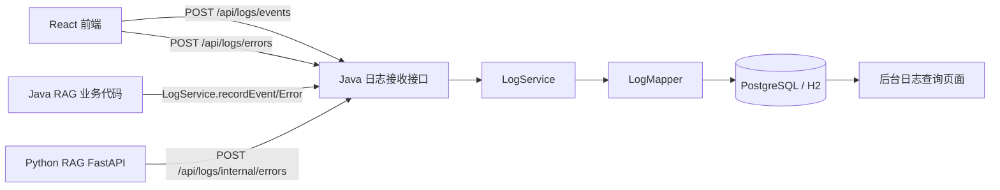

# 日志接收与报错日志接收详细设计

更新日期：2026-06-16

## 1. 设计目标

本设计面向“学迹智配 Agent：基于 RAG 的多模态学习证据库与岗位适配系统”的当前阶段。当前阶段只完成 RAG 闭环，不引入 Agent 编排、长任务调度、自主规划或工具调用。

日志模块分为两类能力：

- 日志接收：接收前端用户行为、页面性能、接口调用、RAG 资料处理状态变化等普通运行日志，用于审计、追踪和问题复盘。
- 报错日志接收：接收前端异常、接口失败、Java 业务异常、Python RAG 解析/检索异常等错误日志，用于快速定位失败来源、聚合相同错误和观察错误趋势。

核心原则：

- Java 后端统一对外接收、校验、脱敏、落库和查询。
- React 前端只调用 Java `/api/logs/**`，不直接写数据库、不直接调用 Python。
- Python RAG 只在内部异常场景主动上报 Java，或由 Java 调 Python 失败时在 Java 侧记录。
- 日志写入不能阻塞核心 RAG 流程，写入失败只记录本地 `warn`，不影响主业务响应。
- 第一阶段以数据库落库和后台查询为主，不引入 Kafka、ES、ClickHouse、APM SaaS 或复杂告警系统。
- 第一阶段优先实现 RAG 业务报错日志；普通运行日志只保留上传、解析、索引、检索这几类关键状态变化。

## 2. 总体架构



推荐落库边界：

| 来源 | 普通日志 | 报错日志 | 说明 |
| --- | --- | --- | --- |
| React | 页面访问、按钮点击、接口耗时、上传开始/完成 | JS 异常、Promise rejection、接口失败 | 前端批量或即时上报 |
| Java | 资料创建、上传、索引、检索、状态变更 | Controller/Service 异常、Python 调用失败 | 主服务统一补充 trace 信息 |
| Python | 可选记录索引耗时、解析质量摘要 | MinerU/OCR/解析/检索异常 | 只上报关键错误，不做业务审计 |

## 3. 模块划分

Java 新增包结构建议：

```text
backend-java/src/main/java/com/itxiang/evidence
+-- controller
|   `-- LogController.java
+-- dto
|   +-- LogEventCreateDTO.java
|   +-- LogErrorCreateDTO.java
|   `-- LogQueryDTO.java
+-- entity
|   +-- LogEvent.java
|   `-- LogError.java
+-- mapper
|   +-- LogEventMapper.java
|   `-- LogErrorMapper.java
+-- service
|   +-- LogService.java
|   `-- Impl/LogServiceImpl.java
`-- vo
    +-- LogEventVO.java
    +-- LogErrorVO.java
    +-- LogOverviewVO.java
    `-- PageVO.java
```

前端新增建议：

```text
frontend-react/src
+-- api/logs.ts
+-- utils/logClient.ts
+-- utils/errorCapture.ts
`-- pages/SystemLogs.tsx
```

Python 新增建议：

```text
ai-python/app
`-- observability.py
```

## 4. 数据库设计

### 4.1 普通日志表 `log_event`

用于记录用户行为、接口调用、业务状态变化和性能事件。

```sql
CREATE TABLE IF NOT EXISTS log_event (
    id BIGSERIAL PRIMARY KEY,
    trace_id VARCHAR(80) NOT NULL,
    session_id VARCHAR(120),
    user_id VARCHAR(120) NOT NULL DEFAULT 'anonymous',
    source VARCHAR(30) NOT NULL,
    domain VARCHAR(50) NOT NULL DEFAULT 'system',
    level VARCHAR(20) NOT NULL DEFAULT 'INFO',
    module VARCHAR(80) NOT NULL,
    stage VARCHAR(80),
    event_type VARCHAR(80) NOT NULL,
    action VARCHAR(120) NOT NULL,
    message VARCHAR(500),
    route VARCHAR(255),
    http_method VARCHAR(20),
    request_path VARCHAR(500),
    status_code INTEGER,
    success BOOLEAN NOT NULL DEFAULT TRUE,
    duration_ms INTEGER,
    material_id BIGINT,
    document_id VARCHAR(120),
    parser VARCHAR(80),
    client_time TIMESTAMPTZ,
    server_time TIMESTAMPTZ NOT NULL DEFAULT CURRENT_TIMESTAMP,
    ip_hash VARCHAR(128),
    user_agent VARCHAR(500),
    context_json TEXT NOT NULL DEFAULT '{}',
    created_at TIMESTAMPTZ NOT NULL DEFAULT CURRENT_TIMESTAMP
);

CREATE INDEX IF NOT EXISTS idx_log_event_created_at
    ON log_event(created_at DESC);

CREATE INDEX IF NOT EXISTS idx_log_event_trace_id
    ON log_event(trace_id);

CREATE INDEX IF NOT EXISTS idx_log_event_domain_module
    ON log_event(domain, module);

CREATE INDEX IF NOT EXISTS idx_log_event_material_id
    ON log_event(material_id);
```

字段说明：

| 字段 | 说明 |
| --- | --- |
| `trace_id` | 一次用户操作或接口链路的追踪 ID，前端可生成，Java 不存在时补齐 |
| `session_id` | 前端会话 ID，存 `sessionStorage` |
| `source` | `frontend/java/python` |
| `domain` | 业务域，当前 RAG 写 `rag`，后续 Agent 可写 `agent` |
| `module` | `dashboard/material/rag_query/settings/auth/system` |
| `stage` | 业务阶段，如 `upload/index/retrieve/evidence/sync` |
| `event_type` | `page_view/click/api_call/business_state/performance` |
| `action` | 具体动作，如 `material_upload_start`、`rag_query_submit` |
| `context_json` | JSON 字符串文本，保存经过白名单和脱敏的扩展上下文 |

### 4.2 报错日志表 `log_error`

用于记录异常堆栈、错误归因、聚合指纹和处理状态。

```sql
CREATE TABLE IF NOT EXISTS log_error (
    id BIGSERIAL PRIMARY KEY,
    trace_id VARCHAR(80) NOT NULL,
    session_id VARCHAR(120),
    user_id VARCHAR(120) NOT NULL DEFAULT 'anonymous',
    source VARCHAR(30) NOT NULL,
    domain VARCHAR(50) NOT NULL DEFAULT 'system',
    severity VARCHAR(20) NOT NULL DEFAULT 'ERROR',
    module VARCHAR(80) NOT NULL,
    stage VARCHAR(80),
    action VARCHAR(120),
    error_type VARCHAR(120) NOT NULL,
    error_code VARCHAR(120),
    message VARCHAR(1000) NOT NULL,
    stack_trace TEXT,
    fingerprint VARCHAR(128) NOT NULL,
    route VARCHAR(255),
    http_method VARCHAR(20),
    request_path VARCHAR(500),
    status_code INTEGER,
    duration_ms INTEGER,
    material_id BIGINT,
    document_id VARCHAR(120),
    parser VARCHAR(80),
    client_time TIMESTAMPTZ,
    server_time TIMESTAMPTZ NOT NULL DEFAULT CURRENT_TIMESTAMP,
    ip_hash VARCHAR(128),
    user_agent VARCHAR(500),
    context_json TEXT NOT NULL DEFAULT '{}',
    first_seen_at TIMESTAMPTZ NOT NULL DEFAULT CURRENT_TIMESTAMP,
    last_seen_at TIMESTAMPTZ NOT NULL DEFAULT CURRENT_TIMESTAMP,
    occurrence_count INTEGER NOT NULL DEFAULT 1,
    status VARCHAR(30) NOT NULL DEFAULT 'OPEN',
    created_at TIMESTAMPTZ NOT NULL DEFAULT CURRENT_TIMESTAMP,
    updated_at TIMESTAMPTZ NOT NULL DEFAULT CURRENT_TIMESTAMP
);

CREATE UNIQUE INDEX IF NOT EXISTS uk_log_error_fingerprint
    ON log_error(fingerprint);

CREATE INDEX IF NOT EXISTS idx_log_error_created_at
    ON log_error(created_at DESC);

CREATE INDEX IF NOT EXISTS idx_log_error_last_seen_at
    ON log_error(last_seen_at DESC);

CREATE INDEX IF NOT EXISTS idx_log_error_domain_module
    ON log_error(domain, module);

CREATE INDEX IF NOT EXISTS idx_log_error_trace_id
    ON log_error(trace_id);

CREATE INDEX IF NOT EXISTS idx_log_error_status_severity
    ON log_error(status, severity);

CREATE INDEX IF NOT EXISTS idx_log_error_material_id
    ON log_error(material_id);
```

字段说明：

| 字段 | 说明 |
| --- | --- |
| `domain` | 业务域，当前 RAG 写 `rag`，后续 Agent 可写 `agent` |
| `module` | 业务模块，如 `material/rag_query/evidence` |
| `stage` | 业务阶段，如 `upload/index/retrieve/evidence/sync` |
| `action` | 具体动作，如 `material_index_file_failed` |
| `severity` | `WARN/ERROR/FATAL` |
| `error_type` | `FrontendRuntimeError/HttpError/PythonRagError/ValidationError` |
| `error_code` | 可检索错误码，如 `RAG_PYTHON_TIMEOUT` |
| `fingerprint` | 错误聚合指纹，用于同类错误合并 |
| `occurrence_count` | 同类错误累计次数 |
| `status` | `OPEN/IGNORED/RESOLVED` |
| `parser` | RAG 解析器，如 `mineru`、`python-rag-error`、`bailian-qwen-ocr` |

### 4.3 RAG 错误专用字段建议

如果第一阶段只围绕 RAG 业务错误落地，可以先复用 `log_error.context_json` 保存 RAG 专用上下文，不急着拆成宽表字段。建议固定以下 key，方便后台筛选和后续迁移：

| 字段 | 示例 | 说明 |
| --- | --- | --- |
| `ragStage` | `parse` | RAG 阶段：`upload/dispatch/parse/chunk/index/retrieve/fusion/evidence/sync` |
| `materialId` | `12` | Java `learning_material.id`，表字段已有，也同步放入 context 便于 JSON 查询 |
| `documentId` | `material-12` | Python RAG 文档 ID |
| `documentType` | `pdf` | 文件类型或资料类型 |
| `filename` | `rag-note.pdf` | 只保留文件名，不保留用户本机绝对路径 |
| `parser` | `mineru` | 实际解析器 |
| `parseStatus` | `FAILED` | `PENDING/PARSING/READY/PARTIAL/FAILED/REINDEXING` |
| `fallbackUsed` | `true` | 是否启用本地降级解析、OCR 或备用检索 |
| `chunkCount` | `0` | 已生成 chunk 数 |
| `topK` | `5` | 检索请求 topK |
| `expandedQueryCount` | `4` | Multi-Query 展开数量，不记录原问题全文 |
| `candidateCount` | `20` | 检索候选数 |
| `evidenceCount` | `0` | 最终 evidence 数 |
| `metadataFilterKeys` | `["documentType"]` | 只记录过滤字段名，不记录敏感值 |
| `pythonEndpoint` | `/internal/rag/query` | Java 调 Python 的内部接口 |
| `elapsedMs` | `1203` | 当前阶段耗时 |

建议后续如果统计需求变强，再将 `rag_stage`、`document_type`、`error_code`、`parser`、`parse_status` 拆成 `log_error` 的实体列并补索引。

### 4.4 迁移脚本约定

实现时需要同步维护：

- `infra/sql/init.sql`：加入两张表和索引。
- `infra/sql/alter-database/20260616_0400_create_log_tables.sql`：增量迁移。
- `backend-java/src/main/resources/schema.sql`：测试 H2 环境同步表结构；JSONB 可在 H2 中降级为 `TEXT` 或兼容类型。

### 4.5 RAG 业务错误清单

RAG 业务错误应按阶段分类，而不是只按 `java/python/frontend` 来源分类。这样后台看到错误时能直接判断是上传校验、解析、切块、索引、检索还是 evidence 映射的问题。

#### 上传与资料记录

| errorCode | severity | 捕获位置 | 说明 | 必填上下文 |
| --- | --- | --- | --- | --- |
| `RAG_FILE_EMPTY` | `WARN` | Java `uploadMaterial` | 上传文件为空 | `filename/fileSize/documentType` |
| `RAG_FILE_TOO_LARGE` | `WARN` | Java Controller 或 Service | 文件超过限制 | `filename/fileSize/maxSize` |
| `RAG_FILE_TYPE_UNSUPPORTED` | `WARN` | Java `detectDocumentType` 后 | 文件类型不支持 | `filename/documentType` |
| `RAG_FILE_SAVE_FAILED` | `ERROR` | Java `saveUploadFile` | 保存原始文件失败 | `filename/documentType/storagePath` |
| `RAG_MATERIAL_INSERT_FAILED` | `ERROR` | Java Mapper | `learning_material` 创建失败 | `title/documentType/source` |

#### Java 调 Python RAG

| errorCode | severity | 捕获位置 | 说明 | 必填上下文 |
| --- | --- | --- | --- | --- |
| `RAG_PYTHON_TIMEOUT` | `ERROR` | `PythonRagClient` | Python 服务响应超时 | `pythonEndpoint/timeoutSeconds/materialId/documentId` |
| `RAG_PYTHON_UNAVAILABLE` | `ERROR` | `PythonRagClient` | Python 服务未启动、连接拒绝、网络不可达 | `pythonEndpoint/baseUrl` |
| `RAG_PYTHON_BAD_RESPONSE` | `ERROR` | `PythonRagClient` | Python 返回非预期 JSON 或字段缺失 | `pythonEndpoint/statusCode/responseShape` |
| `RAG_PYTHON_4XX` | `WARN` | `PythonRagClient` | Java 传参不合法或请求体不符合 Python schema | `pythonEndpoint/statusCode/documentId` |
| `RAG_PYTHON_5XX` | `ERROR` | `PythonRagClient` | Python 内部异常 | `pythonEndpoint/statusCode/documentId` |

#### 文档解析与 OCR

| errorCode | severity | 捕获位置 | 说明 | 必填上下文 |
| --- | --- | --- | --- | --- |
| `RAG_PARSER_ROUTE_FAILED` | `ERROR` | Python `DocumentParserRouter` | 无法为文件类型选择解析器 | `documentId/documentType/filename` |
| `RAG_MINERU_NOT_CONFIGURED` | `WARN` | Python `MineruDocumentLoader` | `MINERU_COMMAND` 未配置，使用降级解析 | `documentId/documentType/fallbackUsed` |
| `RAG_MINERU_COMMAND_FAILED` | `ERROR` | Python MinerU 调用 | MinerU 命令执行失败 | `documentId/documentType/exitCode/parser` |
| `RAG_OCR_AUTH_FAILED` | `ERROR` | Python OCR 调用 | 百炼/DashScope Key 无效或鉴权失败 | `documentId/documentType/parser/ocrModel` |
| `RAG_OCR_TIMEOUT` | `WARN` | Python OCR 调用 | OCR 超时，尝试本地降级 | `documentId/documentType/pageIndex/timeoutSeconds` |
| `RAG_PARSE_EMPTY_TEXT` | `ERROR` | Python 解析结果校验 | 解析后没有可索引文本 | `documentId/documentType/parser/nativeTextChars` |
| `RAG_PARSE_PARTIAL_LOW_QUALITY` | `WARN` | Python 质量评估 | 原生解析可用但质量低，状态应为 `PARTIAL` | `documentId/documentType/parser/qualityScore/messages` |
| `RAG_PARSE_UNHANDLED_EXCEPTION` | `ERROR` | Python 解析入口兜底 | 未捕获解析异常 | `documentId/documentType/parser` |

#### 递归切块与元数据

| errorCode | severity | 捕获位置 | 说明 | 必填上下文 |
| --- | --- | --- | --- | --- |
| `RAG_CHUNK_EMPTY_CONTENT` | `ERROR` | Python `chunking.py` | 输入为空，无法切块 | `documentId/parser/nativeTextChars` |
| `RAG_CHUNK_OVERSIZE_BLOCK` | `WARN` | Python `chunking.py` | 单块过大，递归切分后仍超过预算 | `documentId/blockId/tokenCount/maxTokens` |
| `RAG_CHUNK_METADATA_INVALID` | `WARN` | Python chunk 校验 | chunk 缺少 section/page/block/source 等关键字段 | `documentId/chunkId/missingKeys` |
| `RAG_CHUNK_COUNT_ZERO` | `ERROR` | Python 索引前校验 | 解析成功但 chunk 数为 0 | `documentId/documentType/parser` |

#### 索引与向量库

| errorCode | severity | 捕获位置 | 说明 | 必填上下文 |
| --- | --- | --- | --- | --- |
| `RAG_VECTOR_STORE_CONNECT_FAILED` | `ERROR` | Python `pgvector_store.py` | 向量库连接失败 | `documentId/databaseHost` |
| `RAG_VECTOR_EXTENSION_MISSING` | `ERROR` | Python 初始化 | PostgreSQL 未启用 pgvector | `documentId/vectorDimension` |
| `RAG_EMBEDDING_GENERATION_FAILED` | `ERROR` | Python embedding 生成 | embedding 模型或本地向量生成失败 | `documentId/chunkId/embeddingModel` |
| `RAG_EMBEDDING_DIMENSION_MISMATCH` | `ERROR` | Python 入库前校验 | embedding 维度和表定义不一致 | `actualDimension/expectedDimension` |
| `RAG_DOCUMENT_UPSERT_FAILED` | `ERROR` | Python `rag_document` upsert | 文档元数据写入失败 | `documentId/title/documentType` |
| `RAG_CHUNK_UPSERT_FAILED` | `ERROR` | Python `rag_chunk` upsert | chunk 或 embedding 写入失败 | `documentId/chunkId/chunkPosition` |
| `RAG_BM25_INDEX_FAILED` | `ERROR` | Python BM25 构建 | 关键词索引构建失败 | `documentId/chunkCount` |

#### 查询、Multi-Query 与混合检索

| errorCode | severity | 捕获位置 | 说明 | 必填上下文 |
| --- | --- | --- | --- | --- |
| `RAG_QUERY_EMPTY` | `WARN` | Java/Python 参数校验 | 用户问题为空 | `topK` |
| `RAG_METADATA_FILTER_INVALID` | `WARN` | Python 查询 schema | metadata filter 结构非法 | `metadataFilterKeys` |
| `RAG_MULTI_QUERY_FAILED` | `WARN` | Python query expansion | Multi-Query 生成失败，退回原始问题 | `expandedQueryCount/fallbackUsed` |
| `RAG_BM25_RETRIEVAL_FAILED` | `ERROR` | Python retrieval | BM25 召回失败 | `documentFilter/topK` |
| `RAG_VECTOR_RETRIEVAL_FAILED` | `ERROR` | Python retrieval | 向量召回失败 | `documentFilter/topK/vectorDimension` |
| `RAG_RRF_FUSION_FAILED` | `ERROR` | Python RRF/RAG-Fusion | 多路结果融合失败 | `bm25CandidateCount/vectorCandidateCount/expandedQueryCount` |
| `RAG_RETRIEVAL_EMPTY` | `INFO` | Python query result | 无 evidence 命中，不视为系统错误 | `topK/metadataFilterKeys/evidenceCount` |

`RAG_RETRIEVAL_EMPTY` 是业务状态，不是报错日志。它应写入 `log_event`，用于区分“系统坏了”和“知识库没有相关证据”。

#### Evidence 引用与回答结构

| errorCode | severity | 捕获位置 | 说明 | 必填上下文 |
| --- | --- | --- | --- | --- |
| `RAG_EVIDENCE_MAPPING_FAILED` | `ERROR` | Python evidence 构造 | chunk 到 evidence 字段映射失败 | `documentId/chunkId/missingKeys` |
| `RAG_EVIDENCE_SCORE_INVALID` | `WARN` | Python evidence 校验 | score 为空、NaN 或越界 | `documentId/evidenceId/score` |
| `RAG_EVIDENCE_SOURCE_MISSING` | `WARN` | Python evidence 校验 | 缺少来源、章节、页码或片段 | `documentId/evidenceId/missingKeys` |
| `RAG_ANSWER_WITHOUT_EVIDENCE` | `ERROR` | Python query response | 有回答但无 evidence，违反项目约定 | `questionLength/evidenceCount` |
| `RAG_RESPONSE_SCHEMA_INVALID` | `ERROR` | Java `PythonRagClient` | Python 返回结构不符合 `RagQueryVO` | `pythonEndpoint/missingKeys` |

本项目约定回答必须保留 evidence 引用结构，所以 `RAG_ANSWER_WITHOUT_EVIDENCE` 是高优先级错误，不应只当普通空结果处理。

#### Java 与 Python 状态一致性

| errorCode | severity | 捕获位置 | 说明 | 必填上下文 |
| --- | --- | --- | --- | --- |
| `RAG_DOCUMENT_ID_MISMATCH` | `ERROR` | Java/Python 响应校验 | Java 传入 `material-{id}`，Python 返回其他 documentId | `materialId/requestDocumentId/responseDocumentId` |
| `RAG_INDEX_FAILED` | `ERROR` | Java/Python 状态校验 | Python 正常响应但索引状态为 `FAILED` | `materialId/documentId/parser/parseStatus/chunkCount` |
| `RAG_STATUS_SYNC_FAILED` | `ERROR` | Java Mapper | Python 已返回结果，但 Java 状态回写失败 | `materialId/documentId/parseStatus` |
| `RAG_READY_WITH_ZERO_CHUNK` | `ERROR` | Java/Python 状态校验 | Python 返回 `READY` 但 chunkCount 为 0 | `materialId/documentId/parser` |
| `RAG_FAILED_WITH_EVIDENCE` | `WARN` | Java/Python 状态校验 | Python 返回 `FAILED` 但 evidence 或 chunk 不为空 | `materialId/documentId/chunkCount/evidenceCount` |

#### 第一阶段优先级

如果只做最小闭环，优先实现以下 12 个错误码：

1. `RAG_PYTHON_TIMEOUT`
2. `RAG_PYTHON_UNAVAILABLE`
3. `RAG_PYTHON_5XX`
4. `RAG_FILE_SAVE_FAILED`
5. `RAG_MINERU_COMMAND_FAILED`
6. `RAG_PARSE_EMPTY_TEXT`
7. `RAG_CHUNK_COUNT_ZERO`
8. `RAG_VECTOR_STORE_CONNECT_FAILED`
9. `RAG_EMBEDDING_DIMENSION_MISMATCH`
10. `RAG_CHUNK_UPSERT_FAILED`
11. `RAG_RESPONSE_SCHEMA_INVALID`
12. `RAG_STATUS_SYNC_FAILED`

这些覆盖了“文件进不来、Python 调不通、解析失败、切块失败、索引失败、响应结构坏、状态回写失败”七条主线，足够支撑第一轮后台排障。

## 5. 接口设计

统一前缀：`/api/logs`

所有接口沿用当前项目 `Result<T>` 响应：

```json
{
  "code": 1,
  "msg": null,
  "data": {}
}
```

### 5.1 接收普通日志

| 项目 | 内容 |
| --- | --- |
| 方法 | `POST` |
| 路径 | `/api/logs/events` |
| 请求体 | `LogEventCreateDTO` |
| 响应 | `Result<Long>`，返回日志 ID |

请求示例：

```json
{
  "traceId": "tr_20260616193000123_ab12",
  "sessionId": "ss_20260616193000_demo",
  "source": "frontend",
  "level": "INFO",
  "module": "material",
  "eventType": "business_state",
  "action": "material_upload_start",
  "message": "用户开始上传学习资料",
  "route": "/materials",
  "success": true,
  "durationMs": 0,
  "materialId": null,
  "documentId": null,
  "clientTime": "2026-06-16T19:30:00+08:00",
  "context": {
    "filename": "rag-note.md",
    "fileSize": 20480,
    "highPrecision": false
  }
}
```

### 5.2 批量接收普通日志

| 项目 | 内容 |
| --- | --- |
| 方法 | `POST` |
| 路径 | `/api/logs/events/batch` |
| 请求体 | `List<LogEventCreateDTO>`，最多 50 条 |
| 响应 | `Result<Integer>`，返回成功写入条数 |

使用场景：

- 前端页面访问、点击和性能事件可先缓存在内存队列。
- 页面隐藏、定时 5 秒、队列满 10 条时批量上报。
- 重要业务状态，如上传开始、上传完成，仍可即时上报。

### 5.3 接收报错日志

| 项目 | 内容 |
| --- | --- |
| 方法 | `POST` |
| 路径 | `/api/logs/errors` |
| 请求体 | `LogErrorCreateDTO` |
| 响应 | `Result<Long>`，返回错误日志 ID |

请求示例：

```json
{
  "traceId": "tr_20260616193144123_cd34",
  "sessionId": "ss_20260616193000_demo",
  "source": "frontend",
  "severity": "ERROR",
  "module": "rag_query",
  "errorType": "HttpError",
  "errorCode": "HTTP_500",
  "message": "RAG 检索请求失败",
  "stackTrace": "Error: HTTP 500\n    at request (...)",
  "route": "/knowledge-base",
  "httpMethod": "POST",
  "requestPath": "/api/rag/query",
  "statusCode": 500,
  "durationMs": 1203,
  "clientTime": "2026-06-16T19:31:44+08:00",
  "context": {
    "questionLength": 32,
    "topK": 5
  }
}
```

服务端行为：

- 根据 `source + module + errorType + errorCode + normalizedMessage + topStackFrame` 生成 `fingerprint`。
- 若 fingerprint 不存在，插入新错误。
- 若 fingerprint 已存在，只更新 `last_seen_at`、`occurrence_count`、`updated_at`，并保留首次堆栈。

### 5.4 Python 内部错误上报

| 项目 | 内容 |
| --- | --- |
| 方法 | `POST` |
| 路径 | `/api/logs/internal/errors` |
| 请求体 | `LogErrorCreateDTO` |
| 响应 | `Result<Long>` |

约束：

- 只允许本机或内网调用，第一阶段可通过配置开关和简单 shared token 保护。
- Header 建议：`X-Internal-Log-Token: ${EVIDENCE_INTERNAL_LOG_TOKEN}`。
- Java 调 Python 失败时由 Java 侧直接记录，不要求 Python 再上报。

### 5.5 查询普通日志

| 项目 | 内容 |
| --- | --- |
| 方法 | `GET` |
| 路径 | `/api/logs/events` |
| Query | `page/pageSize/source/module/eventType/traceId/materialId/startTime/endTime` |
| 响应 | `Result<PageVO<LogEventVO>>` |

### 5.6 查询报错日志

| 项目 | 内容 |
| --- | --- |
| 方法 | `GET` |
| 路径 | `/api/logs/errors` |
| Query | `page/pageSize/source/module/severity/status/traceId/materialId/fingerprint/startTime/endTime` |
| 响应 | `Result<PageVO<LogErrorVO>>` |

### 5.7 错误状态更新

| 项目 | 内容 |
| --- | --- |
| 方法 | `PATCH` |
| 路径 | `/api/logs/errors/{id}/status` |
| 请求体 | `{ "status": "RESOLVED" }` |
| 响应 | `Result<Void>` |

第一阶段可以只做只读查询，状态更新作为第二阶段实现。

### 5.8 日志概览

| 项目 | 内容 |
| --- | --- |
| 方法 | `GET` |
| 路径 | `/api/logs/overview` |
| Query | `days=7` |
| 响应 | `Result<LogOverviewVO>` |

响应示例：

```json
{
  "eventCount": 1260,
  "errorCount": 18,
  "openErrorCount": 5,
  "frontendErrorCount": 9,
  "javaErrorCount": 6,
  "pythonErrorCount": 3,
  "topErrorModules": [
    { "module": "material", "count": 8 },
    { "module": "rag_query", "count": 5 }
  ]
}
```

## 6. DTO 校验规则

`LogEventCreateDTO`：

| 字段 | 规则 |
| --- | --- |
| `source` | 必填，枚举 `frontend/java/python` |
| `level` | 默认 `INFO`，枚举 `DEBUG/INFO/WARN` |
| `module` | 必填，最大 80 |
| `eventType` | 必填，最大 80 |
| `action` | 必填，最大 120 |
| `message` | 可选，最大 500 |
| `durationMs` | 可选，`0..600000` |
| `context` | 可选，序列化后最大 20KB |

`LogErrorCreateDTO`：

| 字段 | 规则 |
| --- | --- |
| `source` | 必填，枚举 `frontend/java/python` |
| `severity` | 默认 `ERROR`，枚举 `WARN/ERROR/FATAL` |
| `module` | 必填，最大 80 |
| `errorType` | 必填，最大 120 |
| `errorCode` | 可选，最大 120 |
| `message` | 必填，最大 1000 |
| `stackTrace` | 可选，最大 20KB |
| `durationMs` | 可选，`0..600000` |
| `context` | 可选，序列化后最大 20KB |

超过长度的字段不直接拒绝核心日志，建议截断后写入，并在 `context_json.truncated=true` 中标记。

## 7. Trace ID 与链路关联

### 7.1 前端生成

前端启动时生成：

- `sessionId`：每个浏览器标签页会话一个，存 `sessionStorage`。
- `traceId`：每个关键动作一个，如上传文件、RAG 查询、登录、查看 evidence。

格式建议：

```text
ss_yyyyMMddHHmmss_random
tr_yyyyMMddHHmmssSSS_random
```

### 7.2 请求透传

前端所有 `fetch` 请求增加 Header：

```text
X-Trace-Id: tr_20260616193000123_ab12
X-Session-Id: ss_20260616193000_demo
```

Java 侧：

- Controller 或拦截器读取 Header。
- 若不存在则生成 `traceId`。
- 写入 MDC，后续 `log.info/warn/error` 自动带上 trace。
- 调 Python RAG 时透传 `X-Trace-Id`。

Python 侧：

- FastAPI middleware 读取 `X-Trace-Id`。
- RAG 异常上报 Java 时携带相同 `traceId`。

## 8. 前端采集设计

### 8.1 普通日志采集点

| 页面/模块 | 事件 |
| --- | --- |
| 工作台 | `page_view_dashboard` |
| 学习资料 | `material_list_view`、`material_upload_start`、`material_upload_success`、`material_upload_failed` |
| 知识库 | `rag_query_submit`、`rag_query_success`、`rag_query_no_evidence`、`rag_query_failed` |
| 简历适配 | `page_view_resume_adaptation` |
| 系统设置 | `settings_view` |

### 8.2 报错采集点

前端需要捕获：

- `window.onerror`
- `window.onunhandledrejection`
- React Error Boundary 捕获的渲染异常
- API request 包装层捕获的非 2xx 或 `Result.code != 1`
- 上传文件失败、超时、取消

### 8.3 上报策略

普通日志：

- 低优先级事件进入队列，批量上报。
- 关键业务事件即时上报。
- 页面关闭时使用 `navigator.sendBeacon` 或退化为 `fetch(..., { keepalive: true })`。

报错日志：

- 立即上报。
- 相同 `message + stack top frame + route` 在 10 秒内只上报一次，避免错误循环刷库。

### 8.4 脱敏规则

前端上报前禁止携带：

- 文件完整内容。
- RAG 问题全文，改为 `questionLength`、`topK`、`hasMetadataFilter`。
- 简历全文、JD 全文。
- 用户密码、token、cookie、Authorization header。
- 本机绝对路径，必要时只保留文件名。

## 9. Java 服务端设计

### 9.1 Controller

`LogController` 负责：

- 接收 `/api/logs/events`
- 接收 `/api/logs/events/batch`
- 接收 `/api/logs/errors`
- 接收 `/api/logs/internal/errors`
- 查询日志列表和概览

Controller 只做参数校验和 Result 包装，业务处理放在 `LogService`。

### 9.2 Service

`LogService` 职责：

- 补齐 `traceId`、`serverTime`、`userId`。
- 从请求中提取 `ipHash` 和 `userAgent`。
- 对 `message`、`stackTrace`、`context` 执行脱敏和截断。
- 普通日志直接插入 `log_event`。
- 报错日志生成 fingerprint 后 upsert。
- 日志写入异常不抛给主业务。

核心方法建议：

```java
Long recordEvent(LogEventCreateDTO dto);

int recordEvents(List<LogEventCreateDTO> dtoList);

Long recordError(LogErrorCreateDTO dto);

void recordJavaException(String module, String action, Throwable throwable, Map<String, Object> context);
```

### 9.3 Mapper

MyBatis Mapper 建议：

```java
void insertEvent(LogEvent event);

void insertError(LogError error);

void increaseErrorOccurrence(@Param("fingerprint") String fingerprint);

List<LogEvent> pageEvents(LogQueryDTO query);

List<LogError> pageErrors(LogQueryDTO query);
```

PostgreSQL 可用 `INSERT ... ON CONFLICT (fingerprint) DO UPDATE`。H2 测试环境可退化为先查再插/更新。

### 9.4 与现有 RAG 业务集成

建议在这些点补充普通日志和错误日志：

| 位置 | 日志 |
| --- | --- |
| `RagServiceImpl.indexText` 开始 | `material_index_text_start` |
| `RagServiceImpl.indexText` 成功 | `material_index_text_success` |
| `RagServiceImpl.indexText` 捕获异常 | `material_index_text_failed` + `PythonRagError` |
| `RagServiceImpl.uploadMaterial` 保存文件成功 | `material_file_saved` |
| `RagServiceImpl.uploadMaterial` Python 返回 `READY/PARTIAL/FAILED` | `material_index_file_result` |
| `RagServiceImpl.query` 调 Python 前后 | `rag_query_start/success/failed` |
| `PythonRagClient` HTTP 异常 | `python_rag_http_error` |

注意：RAG 查询日志只记录问题长度、topK、是否有过滤条件、evidence 数量、耗时，不记录问题全文和回答全文。

## 10. Python RAG 上报设计

Python 不负责普通业务审计，只在关键内部错误时调用 Java 内部接口：

- MinerU 命令不存在或执行失败。
- OCR 调用失败且本地降级也失败。
- 文档解析出现未捕获异常。
- pgvector 写入失败。
- 检索流程出现未捕获异常。

上报字段建议：

```json
{
  "source": "python",
  "severity": "ERROR",
  "module": "rag_parser",
  "errorType": "MineruParseError",
  "errorCode": "MINERU_COMMAND_FAILED",
  "message": "MinerU 命令执行失败",
  "documentId": "material-12",
  "parser": "mineru",
  "context": {
    "documentType": "pdf",
    "highPrecision": true,
    "fallbackUsed": true
  }
}
```

Python 上报必须设置短超时，例如 2 秒；失败后只写本地日志，不重试阻塞解析。

## 11. Fingerprint 设计

错误指纹生成规则：

```text
sha256(
  source + "|" +
  module + "|" +
  errorType + "|" +
  normalizedErrorCode + "|" +
  normalizedMessage + "|" +
  topStackFrame
)
```

规范化规则：

- 移除时间戳、UUID、数字 ID、文件上传随机名前缀。
- 堆栈只取第一条业务相关 frame。
- HTTP 错误保留 `status_code`，不保留完整 URL query。
- Python 解析错误保留 `parser + documentType`，不保留本地绝对路径。

目标：

- 同一代码缺陷聚合到一条 `log_error`。
- 不同模块、不同错误类型不误合并。

## 12. 安全与隐私

必须脱敏：

- `password`
- `token`
- `authorization`
- `cookie`
- `set-cookie`
- `apiKey`
- `DASHSCOPE_API_KEY`
- 简历正文
- JD 正文
- RAG 文档正文
- 用户本机绝对路径

建议处理：

- IP 地址不明文存储，使用 `sha256(ip + salt)` 存 `ip_hash`。
- `context_json` 只保留白名单字段。
- `stack_trace` 限长 20KB。
- 前端 source map 不在日志中存储，只存构建版本号，后续通过版本号定位。

## 13. 配置项

Java `application.yml`：

```yaml
evidence:
  logs:
    enabled: true
    max-batch-size: 50
    max-context-bytes: 20480
    max-stack-trace-bytes: 20480
    internal-token: ${EVIDENCE_INTERNAL_LOG_TOKEN:local-dev-token}
    retention-days: 30
    ip-hash-salt: ${EVIDENCE_LOG_IP_SALT:local-dev-salt}
```

前端 `.env`：

```text
VITE_LOG_ENABLED=true
VITE_LOG_BATCH_SIZE=10
VITE_LOG_FLUSH_INTERVAL_MS=5000
```

Python `.env`：

```text
JAVA_BACKEND_BASE_URL=http://127.0.0.1:7080
EVIDENCE_INTERNAL_LOG_TOKEN=local-dev-token
PYTHON_ERROR_REPORT_ENABLED=true
```

## 14. 后台页面设计

新增“系统日志”页面，保持当前后台管理风格。

页面结构：

- 顶部概览：总日志数、错误数、待处理错误、近 24 小时错误数。
- Tab：`运行日志`、`报错日志`。
- 筛选：来源、模块、级别/严重级别、状态、traceId、资料 ID、时间范围。
- 表格：时间、来源、模块、动作/错误类型、消息、traceId、资料 ID、耗时。
- 详情抽屉：展示 `context_json`、`stack_trace`、用户代理、请求路径。

报错日志额外展示：

- `occurrence_count`
- `first_seen_at`
- `last_seen_at`
- `fingerprint`
- `status`

## 15. 实施顺序

第一阶段：最小闭环

1. 新增 `log_event`、`log_error` 表和迁移脚本。
2. 新增 Java DTO、Entity、Mapper、Service、Controller。
3. 新增前端 `logs.ts` 和 `logClient.ts`，接入 API 失败与全局异常捕获。
4. 在 `RagServiceImpl` 和 `PythonRagClient` 的关键失败点记录错误。
5. 增加日志查询接口，后台页面可以先只显示最近 100 条。

第二阶段：可观测增强

1. 增加 traceId 拦截器和 MDC。
2. Python RAG 内部错误上报 Java。
3. 增加错误 fingerprint 聚合和状态流转。
4. 增加日志概览统计。

第三阶段：运维增强

1. 增加保留周期清理任务。
2. 增加错误趋势图。
3. 增加阈值告警，但不在当前 RAG 闭环阶段强制实现。

## 16. 验证方案

Java 单元/集成验证：

```powershell
cd backend-java
mvn test
```

重点用例：

- 普通日志写入成功。
- 批量日志超过 50 条时被拒绝或截断。
- 报错日志首次插入成功。
- 相同 fingerprint 的错误第二次上报后 `occurrence_count + 1`。
- `context` 中敏感字段被脱敏。
- 日志服务异常不影响 RAG 主业务。

前端验证：

```powershell
cd frontend-react
npm run build
```

重点用例：

- 页面访问产生普通日志。
- API 请求失败产生报错日志。
- `window.onerror` 能上报。
- 10 秒内重复错误不会重复刷库。

Python 验证：

```powershell
conda activate learning-evidence-rag
$env:PYTHONPATH='ai-python'
python -B -m pytest ai-python/tests -q
```

重点用例：

- Python 上报 Java 失败时不影响解析流程。
- Python 上报内容不包含 API Key、原始文档正文和本地绝对路径。

## 17. 示例链路

### 17.1 上传资料成功

```text
React material_upload_start
-> Java log_event: material_upload_start
-> Java RagServiceImpl.uploadMaterial
-> Java log_event: material_file_saved
-> Java call Python index-file
-> Python parse/index success
-> Java log_event: material_index_file_result(status=READY)
-> React material_upload_success
-> Java log_event: material_upload_success
```

### 17.2 RAG 查询失败

```text
React rag_query_submit
-> Java log_event: rag_query_start
-> Java call Python /internal/rag/query
-> Python timeout or 5xx
-> Java log_error: python_rag_http_error
-> Java Result.error(...)
-> React API wrapper throws HttpError
-> React log_error: HttpError
```

同一个 `traceId` 可以串起前端提交、Java 调用、Python 失败、前端收到失败四段记录。

## 18. 不做范围

当前阶段不实现：

- ELK、OpenTelemetry Collector、Prometheus、Grafana。
- 自动告警机器人。
- Agent 任务日志和工具调用日志。
- 长任务调度日志。
- 用户行为画像和推荐分析。

这些能力会扩大系统复杂度，建议等 RAG 闭环稳定后再引入。
