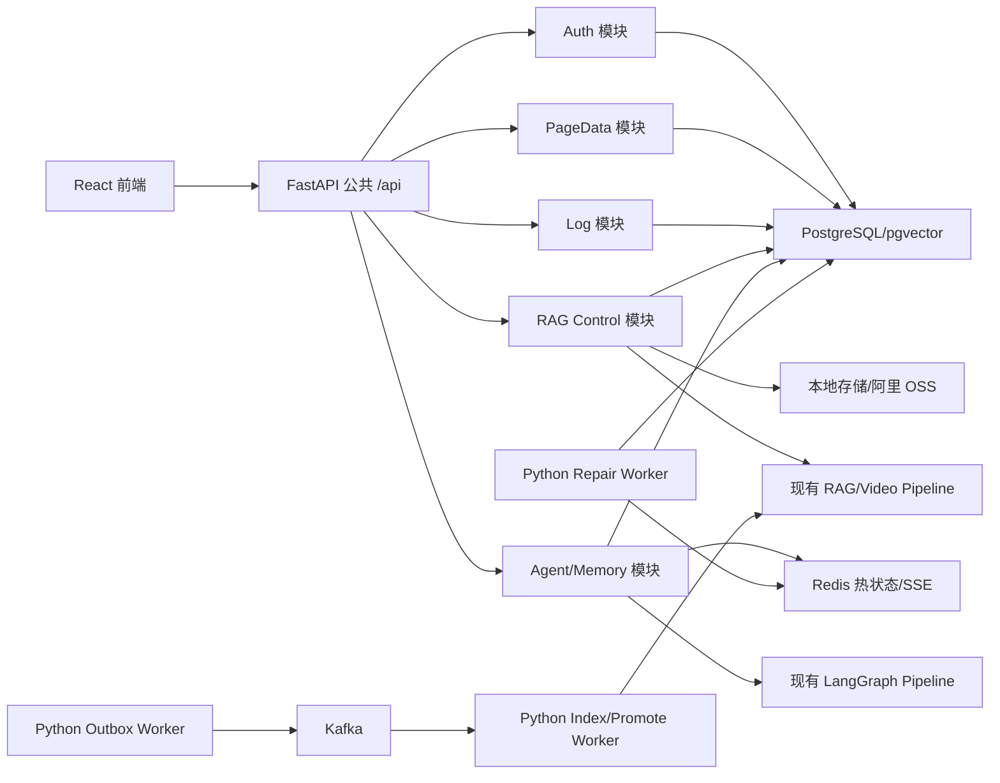

# 完全脱离 Spring 的纯 Python FastAPI 后端迁移计划

更新日期：2026-07-21

## 1. 文档目标

本文记录把 `React + Spring Boot + FastAPI` 迁移为 `React + FastAPI` 的实施方案、契约和验收结果。2026-07-21 的实现已完成公开业务切流；文档中后续出现的 Java/Spring 组件清单均是迁移前基线或历史步骤，不是当前运行依赖。

## 0. 最终实现状态（2026-07-21）

- FastAPI 已提供 47 个原有 `/api/*` 对外方法：认证、页面数据、日志、RAG、Agent、记忆和 SSE。
- React Vite 默认代理为 `http://127.0.0.1:8090`；`ai-python/run.py` 统一监督 API、Agent/RAG durable worker、cron 和可选 Kafka worker。
- PostgreSQL/pgvector 是唯一权威数据源。查询任务、索引任务、Outbox、Kafka 进度/结果/DLQ、Agent 任务和记忆均在 Python 服务或 worker 内进程调用，不再依赖 Java HTTP gateway。
- Python 启动入口只执行幂等增量迁移；空库使用 `python -m app.core.database_bootstrap` 对 `infra/sql/init.sql` 生成非破坏性初始化计划，再由 `run.py` 正常启动。
- `backend-java/` 已从 Git 工作区移除，Maven/JDK CI job 和 Java callback 配置均已删除。
- 本地验收命令：`conda run -n learning-evidence-rag python -B -m pytest ai-python/tests -q` 与 `cd frontend-react; npm run build`。

> 实施结论：公开业务已切换到 FastAPI，Python 直接持久化认证、资料、日志、RAG、Agent、记忆、SSE、Outbox 和 Kafka 终态。历史 Java 代码已删除；本文件后续的 Java 规模、阶段和风险说明保留为迁移前基线，不描述当前运行态。

迁移的核心目标是在不丢失现有业务语义的前提下，把 Java 当前承担的认证、权限、状态机、事务、审计、幂等、Outbox 写入、Kafka 消费终态、Redis 热状态、SSE、日志和对象存储能力完整迁入 Python，最终删除 Spring Boot 运行时及 Java-Python 内部网关。

最终结论：

- 目标形态采用模块化 FastAPI 单体加独立 Python worker，不保留 Spring Boot、Maven 或 Java 运行进程。
- 迁移期间直接演进现有 `ai-python/`；完成全部业务切换后将其整理为 `backend-python/`，并删除 `backend-java/`。
- React 继续使用现有 `/api/*` 路径、Bearer Token、camelCase 字段和 `{code,msg,data}` 响应，第一轮迁移不同时改变前端契约。
- PostgreSQL/pgvector 继续作为权威数据库，先兼容现有 28 张表及字段类型，不在服务迁移时顺便重构主键、时间类型或 JSON 存储方式。
- 采用渐进式迁移。读接口可进行 shadow 对比，写接口禁止无约束双写，必须按领域切换唯一写入方。
- 为保持现有 PyCharm 入口和目录契约，后端目录继续命名为 `ai-python/`，不执行与运行无关的目录重命名。
- 测试无法从数学上保证系统“一定可靠”。可靠性由特征锁定、真实依赖集成、并发与故障测试、RAG 效果门禁、灰度观测和可回滚机制共同保证。

## 2. 迁移前基线与已完成切片（仅供追溯）

### 2.1 已完成：RAG Outbox 发布器与 Python worker 基础

当前已经完成的范围：

| 能力 | 当前状态 | 说明 |
| --- | --- | --- |
| Python Outbox Repository/Publisher | 已完成 | `app.workers.outbox_publisher` 使用 PostgreSQL `FOR UPDATE SKIP LOCKED`、租约、Kafka ACK 后 `PUBLISHED`、失败退避和脱敏错误摘要 |
| Python cron scheduler/supervisor | 已完成 | `run.py` 在 Uvicorn API 进程外监督独立 cron 子进程，避免 reload 复制定时任务 |
| Python Kafka worker 正式入口 | 已完成 | 正式入口整理为 `app.workers.kafka_worker`，旧入口只做兼容转发 |
| Java/Python 发布器互斥 | 已完成 | Java `publisher-enabled=false` 与 Python `RAG_OUTBOX_PUBLISHER_ENABLED=true` 互斥，避免重复发布 |
| 对应自动化测试 | 已完成基础测试 | Python 新增 Outbox、scheduler、配置和 worker 测试；Java 新增发布器所有权测试 |

这部分完成后，Java 仍然承担以下职责，因此项目仍是 Spring Boot 业务后端：

- Java 在业务事务内写入 `learning_material`、`rag_index_job` 和 `rag_outbox_event`。
- Java 探测 Kafka 并决定 Kafka 或 `@Async + HTTP` fallback。
- Java 消费 progress、index result、promote result、DLQ 和 upload finalize 等消息并更新权威状态。
- Python worker 仍通过 Java Source API 下载资料，通过 Java active-check 决定能否 promote。
- React 仍只调用 Java 7080；Python 8090 仍主要是内部 AI/RAG 服务。
- 认证、权限、日志、对象存储、RAG 查询历史、Agent、审批、撤销、记忆和 SSE 均未迁出 Spring。

### 2.2 代码与接口规模

截至 2026-07-20，Java 后端包含：

| 项目 | 数量 |
| --- | ---: |
| Controller | 8 |
| HTTP 映射 | 55 |
| 对外映射 | 47 |
| Java-Python 内部映射 | 8 |
| Service 接口 | 12 |
| Service 实现 | 20 |
| Mapper 接口/XML | 23 / 23 |
| Java 测试类 | 24 个实际测试类，另有 1 个测试基类 |
| Java 测试用例 | 103 |

现有 Python 服务包含 22 个 `test_*.py` 文件和 237 个测试用例。Python 已经实现 AI/RAG、视频处理、Agent 图编排、Kafka worker 和 Outbox 发布器，但尚不是完整业务后端。

### 2.3 2026-07-20 本地验证结果

```powershell
cd backend-java
mvn test
# Tests run: 103, Failures: 0, Errors: 0, Skipped: 0

cd ..
conda run -n learning-evidence-rag python -B -m pytest ai-python/tests -q
# 237 passed, 2 warnings
```

该基线只能证明当前测试集通过，不能证明生产级可靠。Java 测试大量使用 H2 和 Mockito，Python pgvector/Kafka 测试大量使用 fake connection 或 mock，尚未覆盖真实 PostgreSQL 锁、pgvector 索引、Redis、Kafka 重放、对象存储、跨进程恢复和完整前端流程。

## 3. 迁移范围裁决

迁移前先把接口分为三类，防止根据过期文档重复实现已经删除或从未落地的能力。

| 分类 | 定义 | 处理方式 |
| --- | --- | --- |
| A：前端当前依赖 | React 已实际调用的认证、页面数据、RAG、Agent、记忆接口 | 最高优先级，路径和行为必须兼容，未通过差异测试不得切流 |
| B：Java 已实现但前端未直接使用 | 日志管理接口、记忆详情/PATCH、Java-Python 内部接口等 | 外部能力迁入 FastAPI；内部接口改为进程内 service 后必须删除 |
| C：文档规划、历史或已废弃 | 文档中的 JD 独立页面、简历模板外部接口、Agent cancel 等 | 不作为现有 Java 功能迁移；如未来需要，重新立项和更新契约 |

必须明确的文档漂移：

- `docs/api/rag.md` 仍描述 `/api/page-data/jd-analysis/analyze` 和 `/api/rag/resume-templates*`，但对应表已由 `20260628_0100_drop_deprecated_page_modules.sql` 删除，当前 Java Controller 和 React 均无这些调用。
- `docs/api/agent.md` 描述 `POST /api/agent/tasks/{taskId}/cancel`，当前 Java 和 React 均未实现。
- `backend-java/README.md` 仍列出已经不再存在的 JD 分析外部接口。
- 当前没有独立完整的认证和 PageData API 文档，也没有提交到仓库的 OpenAPI 快照。
- Python 内部仍保留 JD 分析和简历模板处理代码。这些可以继续作为内部能力或 Agent 工具候选，但不属于“Java 现有外部功能兼容”的阻断项。

### 3.1 最终状态硬约束

本计划所称“纯 Python 后端”必须同时满足：

- 生产和本地完整运行不需要 JDK、Maven、Spring Boot 或 `backend-java/`。
- 所有 47 个现有外部映射由 FastAPI 提供；React 默认代理到 Python 8090。
- Java 的 8 个内部映射全部消失，Python 模块之间使用进程内 service/repository，跨 worker 使用数据库或 Kafka。
- 不再存在 `RAG_JAVA_BASE_URL`、`EVIDENCE_AGENT_JAVA_BASE_URL`、Java 日志 callback、Java source API 或 active-check HTTP 调用。
- 不再存在 `@Scheduled`、`@Async`、`@KafkaListener`、MyBatis、Spring Redis、`SseEmitter` 等 Spring 运行能力。
- CI 不再运行 `mvn test`，只运行 Python、前端、数据库迁移和真实基础设施测试。
- `backend-java/` 在回滚观察期结束后从主项目删除，而不是长期保留为备用业务后端。

## 4. Java 当前实际功能

### 4.1 HTTP 接口清单

| Controller | 数量 | 当前映射 |
| --- | ---: | --- |
| `AuthController` | 3 | `POST /api/auth/login`；`GET /api/auth/me`；`POST /api/auth/logout` |
| `PageDataController` | 2 | `GET /api/page-data/dashboard`；`GET /api/page-data/settings` |
| `LogController` | 8 | `POST /api/logs/events`；`POST /api/logs/events/batch`；`POST /api/logs/internal/events`；`POST /api/logs/errors`；`POST /api/logs/internal/errors`；`GET /api/logs/events/recent`；`GET /api/logs/errors/recent`；`GET /api/logs/overview` |
| `RagController` | 13 | `GET /api/rag/overview`；`GET /api/rag/materials`；`GET /api/rag/materials/{id}`；`GET /api/rag/materials/{id}/evidences`；`GET /api/rag/materials/{id}/preview`；`POST /api/rag/materials/text`；`POST /api/rag/materials/upload`；`POST /api/rag/materials/upload/chunk`；`POST /api/rag/materials/{id}/reindex`；`POST /api/rag/query`；`GET /api/rag/query/history`；`POST /api/rag/query/tasks`；`GET /api/rag/query/tasks/{taskId}` |
| `RagInternalController` | 2 | `GET /api/internal/rag/materials/{materialId}/source`；`GET /api/internal/rag/materials/{materialId}/index-jobs/{jobId}/active` |
| `AgentController` | 13 | `POST /api/agent/tasks`；`GET /api/agent/tasks`；`GET /api/agent/tasks/{taskId}`；`GET /api/agent/tasks/{taskId}/messages`；`GET /api/agent/conversations/tree`；`POST /api/agent/conversation-folders`；`PUT /api/agent/conversation-folders/{folderId}`；`DELETE /api/agent/conversation-folders/{folderId}`；`POST /api/agent/tasks/{taskId}/folder`；`GET /api/agent/tasks/{taskId}/stream`；`POST /api/agent/tasks/{taskId}/reviews/{reviewId}/decide`；`POST /api/agent/operations/{operationId}/undo`；`GET /api/agent/tools` |
| `AgentInternalController` | 6 | `POST /api/internal/agent/tools/read`；`POST /api/internal/agent/tools/mutation/execute`；`POST /api/internal/agent/tasks/{taskId}/events`；`GET /api/internal/agent/tasks/{taskId}/context`；`POST /api/internal/agent/tasks/{taskId}/summaries`；`GET /api/internal/agent/tasks/{taskId}/context/messages` |
| `AgentMemoryController` | 8 | `POST/GET /api/agent/memories`；`GET /api/agent/memories/{memoryId}`；`POST /api/agent/memories/{memoryId}/confirm`；`POST /api/agent/memories/{memoryId}/reject`；`PATCH /api/agent/memories/{memoryId}`；`POST /api/agent/memories/{memoryId}/archive`；`DELETE /api/agent/memories/{memoryId}` |

### 4.2 不能遗漏的业务职责

| 领域 | Java 当前职责 | 关键数据或外部依赖 | 迁移风险 |
| --- | --- | --- | --- |
| 统一响应与异常 | 返回 `Result<T>`；大量业务错误保持 HTTP 200、`code=0`；RAG 异常补充阶段信息并落日志 | `Result`、`GlobalExceptionHandler` | FastAPI 默认 422/JSON 字段格式会破坏前端兼容 |
| 认证与用户边界 | PBKDF2 密码兼容；登录会话、Token hash、过期、注销、登录记录；从会话派生用户 ID | `app_user`、`auth_session`、`auth_login_record` | Python 不能信任 body 中的 `userId` 或 `metadataFilter.userId` |
| 页面聚合 | 按用户和日期聚合 Dashboard；读取系统设置；钳制日期和 limit | `learning_material`、`agent_task`、`system_setting` | 当前没有专门测试，容易在 ORM 查询迁移时改变统计口径 |
| 日志 | 单条/批量事件；错误 fingerprint 聚合；递归脱敏；RAG 进度同步资料状态；最近记录和概览 | `log_event`、`log_error` | 日志正文、Token、JD、简历、问题和回答不得泄漏 |
| 资料控制面 | 资料记录和用户隔离；状态机；上传；分片断点续传；后台合并；预览来源校验；reindex | `learning_material`、本地文件、阿里 OSS | 分片重复、乱序、失败重试和路径安全是高风险点 |
| RAG 查询控制 | 强制用户和 `private` 范围；同步/异步查询；查询历史；回答准入字段；错误映射 | `rag_query_history`、Python RAG | 现有 Python 内部 API会信任调用方传入的过滤条件 |
| Kafka 索引调度 | 业务记录与 Outbox 同事务；Broker 探测；消费去重；进度、结果、promote、DLQ；Kafka 不可用时 HTTP fallback。定时发布租约已迁入 Python | `rag_index_job`、`rag_outbox_event`、`rag_consumed_event`、Kafka | 删除 Java 后最容易丢失 stale result 防护和至少一次语义 |
| Agent 权威状态 | 任务、消息序号、事件去重、会话文件夹、审批、工具记录、摘要、上下文恢复、撤销快照 | `agent_*` 业务表、Python Agent | Python 目前只运行图并回调 Java，权威状态尚未迁移 |
| Redis 与 SSE | Redis 作为可降级热状态；SSE 缓冲、TTL；Redis 删除失败写持久修复任务；回源 PostgreSQL | Redis、`agent_cache_repair_task` | 必须验证断线重连、缓存丢失、进程重启和修复任务 |
| Agent Tool Gateway | 从 `taskId` 推导 owner；工具白名单；下游错误分类；审批后变更；幂等；before/after snapshot；Tavily 脱敏结果 | RAG、Memory、Tavily、Agent 表 | 不能让 LLM 或客户端绕过 owner、审批和 mutation guard |
| Agent 记忆 | 生命周期、版本链、审计、敏感内容拒绝、scope 只能收窄、索引成功后激活、删除擦除 | 记忆表、Python Memory Service | Python 当前只负责 embedding 和检索，不负责权威状态 |
| 对象存储 | 本地/阿里 OSS 存储、读取、流式打开、删除、对象 key 与用户隔离 | 本地文件系统、Aliyun OSS | 路径穿越、对象归属、失败补偿和大文件内存占用 |

### 4.3 Spring 组件逐项替换

| 当前 Spring/Java 能力 | 纯 Python 替代 | 关键要求 |
| --- | --- | --- |
| Spring Boot Application | FastAPI application + lifespan | 启动时只初始化连接池和轻量资源，耐久 worker 独立运行 |
| `@RestController` | FastAPI `APIRouter` | 保留路径、方法、multipart、SSE 和 `Result<T>` 外部契约 |
| Jakarta Validation | Pydantic 2 model/validator | 将默认 422 转换为现有业务错误格式 |
| `GlobalExceptionHandler` | FastAPI exception handlers | 保留阶段化错误、中文信息、日志脱敏和 traceId |
| `@Service` | application/domain service | Router 不直接写 SQL，状态机和权限集中在 service |
| MyBatis Mapper/XML | SQLAlchemy 2 Core/ORM + psycopg repository | 复杂锁、pgvector 和批量 SQL 可保留显式 SQL，不追求全 ORM |
| `@Transactional` | SQLAlchemy `Session.begin()` / Unit of Work | Outbox、状态更新、审计和幂等必须同事务 |
| `@Scheduled` | 已有 `app.workers.scheduler` | Outbox publisher 已迁移；后续接管 cache repair、过期清理等任务 |
| `@Async` | 持久任务表、Outbox 或 Kafka worker | 禁止用进程内 `BackgroundTasks` 承担可丢失长任务 |
| `KafkaTemplate` | `KafkaJsonProducer` | 发送成功必须等待 broker ACK，错误摘要必须脱敏 |
| `@KafkaListener` | `confluent-kafka` consumer worker | manual commit、幂等、retry/DLQ、重启恢复 |
| Spring Data Redis | `redis.asyncio` | PostgreSQL 为权威源，Redis 仅为可丢失热状态 |
| `MultipartFile` | FastAPI `UploadFile` + 流式文件处理 | 大文件不整块驻留内存，保留分片续传语义 |
| `SseEmitter` | FastAPI `StreamingResponse` | 保留 `agent_event/task/done`、重连、去重和终态关闭 |
| Java HTTP Client | `httpx` 仅调用真正外部服务 | Python 内部模块不得继续通过 HTTP 绕行调用自身 |
| `@ConfigurationProperties` | Pydantic Settings/现有 runtime config | 配置校验、敏感项仅环境变量、启动失败信息中文可定位 |
| Aliyun OSS Java SDK | Python `oss2` + storage abstraction | local/OSS 行为一致，路径和 owner 校验统一 |

## 5. Java 现有测试清单与 Python 对应测试

当前 Java 共 103 个测试。迁移时不能只追求“Python 测试数量更多”，而要让每一组 Java 行为都有明确的 Python 接班测试。

| Java 测试类 | 数量 | 当前覆盖重点 | Python 迁移后的对应测试 |
| --- | ---: | --- | --- |
| `AgentCacheRepairServiceImplTests` | 3 | Redis 删除成功/失败、持久修复任务、错误脱敏 | Redis 真实实例 + repair worker 重试、异常摘要脱敏、重启恢复 |
| `AgentControllerTests` | 2 | 任务创建/详情、审批 owner 校验 | FastAPI 外部 Agent API + PostgreSQL owner/审批集成测试 |
| `AgentInternalControllerTests` | 7 | 内部 Token、只读/变更 Tool、事件回调 | 迁移期内部 API 契约测试；完成后改为 service 权限边界测试 |
| `AgentInternalTokenResolverTests` | 2 | 环境变量与本地共享 Token 文件优先级 | 过渡期配置测试；Java 下线后删除共享 Token 依赖 |
| `AgentMemoryServiceImplTests` | 5 | 待审/归档过滤、scope 防扩大、确认激活、owner fallback | 记忆状态机、scope 属性测试、真实 pgvector 索引一致性、跨用户隔离 |
| `AgentServiceImplTests` | 21 | 任务启动、事件去重、消息序号、审批恢复、摘要幂等与范围、Redis 热态、撤销 | Agent 状态机单元测试 + 真 PostgreSQL/Redis 并发和进程重启测试 |
| `AgentToolGatewayServiceImplTests` | 17 | 工具白名单、owner、下游错误、脱敏、Tavily、审批、snapshot、幂等冲突 | Python Tool service 单元/集成测试，关键 mutation 分支做 mutation testing |
| `AuthControllerTests` | 2 | 登录/me/logout、错误密码 | PBKDF2 旧 hash、过期/撤销/禁用用户、Token hash、跨用户授权完整测试 |
| `EvidenceBackendApplicationTests` | 1 | Spring Context 启动 | FastAPI lifespan、配置、DB/Redis/Kafka readiness 测试 |
| `GlobalExceptionHandlerTests` | 1 | 错误方法提示包含路径 | `Result` 兼容、404/405/422/异常映射 golden 测试 |
| `KafkaEnabledApplicationIntegrationTests` | 1 | Kafka 模式 Bean 与嵌入 broker | 真实 Kafka/Redpanda 容器启动、producer/consumer readiness |
| `KafkaRagIndexTaskPublisherTests` | 2 | Kafka 可用写 job/outbox；不可用 HTTP fallback | 真实事务 Outbox、可用性探测、唯一写入方和 fallback 测试 |
| `LogServiceImplTests` | 3 | RAG 进度同步资料状态 | 真实数据库状态同步、乱序进度和终态不可回退测试 |
| `LogServiceTests` | 2 | context 脱敏、错误 fingerprint 聚合 | API + PostgreSQL 集成、并发聚合、递归脱敏属性测试 |
| `PythonAgentClientTests` | 2 | octet-stream JSON 兼容 | 迁移期 Java/Python parity；完成进程内调用后删除客户端测试 |
| `RagErrorHandlingTests` | 2 | 阶段化异常与 fallback 日志、reindex 返回 | FastAPI 异常映射、日志写入失败降级、reindex API 集成测试 |
| `RagHttpFallbackTaskDispatcherTests` | 1 | 事务提交后才启动 fallback | SQLAlchemy after-commit/outbox 原子性测试，禁止未提交任务被 worker 读取 |
| `RagIndexWorkerTests` | 1 | HTTP fallback 索引与状态回写 | Python worker 端到端状态回写、失败重试、进程强杀恢复 |
| `RagInternalControllerTests` | 3 | 内部 Token、源文件流、active job | 迁移期契约测试；最终改为 storage/service 调用和 active job 单元测试 |
| `RagKafkaConsumerServiceTests` | 4 | 进度幂等、stale 结果、收尾 DLQ、终态失败 | 真实 broker offset replay、stale version、DLQ、重复 promote 与 crash 测试 |
| `RagKafkaDeadLetterPublisherTests` | 2 | DLQ 脱敏、禁止 DLQ 自循环 | 真实 Kafka DLQ 内容契约、敏感字段扫描和循环防护 |
| `RagOutboxPublisherOwnershipTests` | 1 | Java 发布器可通过配置关闭，避免与 Python 双开 | 保留为迁移期互斥测试；Spring 删除后由 Python 单发布者/多实例抢占测试取代 |
| `RagServiceImplTests` | 17 | RAG 用户过滤、查询历史、拒答字段、预览、上传与分片重试 | 资料/RAG API characterization、真实 PostgreSQL、文件系统和并发上传测试 |
| `RedisAgentRuntimeStateAdapterTests` | 1 | 存在 repair task 时绕过脏缓存 | Redis/DB 一致性、缓存版本、TTL、回源和修复队列集成测试 |

### 5.1 Java 测试当前缺口

- PageData 没有专门的 Controller/Service 测试。
- 对象存储没有本地/OSS 契约测试。
- 外部接口并未全部覆盖，Agent Controller 和记忆 Controller 覆盖尤其有限。
- H2 不能验证 PostgreSQL 的 `FOR UPDATE`、`SKIP LOCKED`、条件唯一索引、JSONB、GIN、HNSW、`VECTOR(1024)` 和时区语义。
- 只有一个 Embedded Kafka 启动测试，大部分 Kafka 行为仍由 Mockito 验证。
- Redis 只有 mock 级测试，没有真实 TTL、断线、数据丢失和并发验证。
- 没有完整 Java-Python 契约快照、跨服务 E2E、负载测试或进程强杀恢复测试。
- 前端只有 `npm run build`，没有 Vitest/MSW 或 Playwright 测试。

## 6. 现有 Python 能力与测试资产

### 6.1 可直接保留的能力

- FastAPI、Pydantic 2 和内部 RAG/Agent/Memory 路由。
- 多格式解析、MinerU 优先与本地降级、递归切块、父子索引、摘要索引。
- Multi-Query、BM25、pgvector、weighted RRF/RAG-Fusion、rerank、answer guard 和 evidence 引用。
- 图片 OCR、视频 ASR、关键帧 OCR、字幕和时间范围证据。
- pgvector staging/promote、旧 requestVersion 拒绝、Python Kafka worker。
- Python Outbox publisher、固定延迟 scheduler、cron supervisor 和 Java/Python 发布器互斥配置。
- LangGraph PAE/ReAct、工具白名单、审批节点、记忆检索和候选生成。
- Ragas 小样本评估工具和当前离线/真实模型门槛。

### 6.2 237 个 Python 测试的分布

| 领域 | 约有测试数 | 当前强项 |
| --- | ---: | --- |
| RAG、解析、检索、API、Ragas harness | 113 | 切块、融合、重排、拒答、引用、解析和指标计算 |
| 视频、OCR、ASR | 37 | 字幕、时间戳、OCR 降级、关键帧去重和长视频覆盖 |
| Agent 与 Memory | 37 | 图路由、工具白名单、审批路径、上下文压缩和记忆检索 |
| 简历模板 | 14 | 字段补丁、Layout Guard、预览和导出约束 |
| Kafka、Outbox、scheduler、配置与日志 | 36 | staging/promote、retry/DLQ、Outbox 发布、cron 监督、配置映射和日志回调 |

当前完成切片新增或扩展的测试：

- `test_outbox_publisher.py`：4 个，覆盖 ACK 后标记、失败释放与脱敏、退避上限和发布超时下限。
- `test_worker_scheduler.py`：4 个，覆盖固定延迟、Outbox 所有权开关、staging cleanup 独立注册和 supervisor 参数转发。
- `test_run_config.py`：当前 7 个，其中新增 cron/worker 配置、CLI 覆盖和子进程生命周期验证。
- `test_kafka_worker.py`：当前 19 个，增加正式 worker 入口相关回归。

这些测试验证的是已迁入 Python 的基础设施逻辑，不能替代 Outbox 事务写入、Java Kafka consumer、资料状态和公开 API 的迁移测试。

### 6.3 Python 当前缺口

- 没有认证、会话、用户授权和外部 `/api/*` 兼容层。
- 没有 Java 当前的资料业务状态、Outbox 事务创建、分片收尾、查询历史、Agent 权威状态、审批/撤销、日志管理和对象存储完整实现。
- Python Agent 和 Kafka worker 仍深度依赖 Java Gateway、Java source API、active-check 和日志回调。
- progress、index result、promote result、DLQ、upload finalize 等 Kafka 业务消费者仍在 Java。
- 没有 SQLAlchemy/Alembic、Redis 客户端、Aliyun OSS Python SDK 和完整业务 repository 层。
- 常规 pytest 强制本地 hash embedding/local answer/local rerank；真实模型不是 PR 门禁。
- pgvector 测试使用 fake connection，Kafka 测试使用 fake producer/consumer，Agent 大量 mock Java Gateway。
- CI 没有 coverage、branch coverage、lint、type check、真实服务容器和迁移验证。

## 7. 目标 Python 架构

### 7.1 总体结构



迁移期和最终运行进程：

- `api`：公开 `/api/*`、SSE 和迁移期内部兼容路由。
- `rag-worker`：解析、索引、retry、promote 和 DLQ。
- `outbox-worker`：当前已迁入 Python，抢占并发布 Java 事务写入的到期 Outbox；后续再迁移 Outbox 写入事务。
- `repair-worker`：Redis 缓存修复、过期任务和必要补偿。

当前与最终所有权：

| 链路 | 当前所有者 | 完成纯 Python 后的所有者 |
| --- | --- | --- |
| Outbox 事件创建 | Java `RagServiceImpl` 事务 | Python `materials/rag_control` Unit of Work |
| Outbox 定时发布 | Python `app.workers.outbox_publisher` | Python `outbox-worker` |
| index/promote 解析 worker | Python | Python |
| progress/result/promote-result/DLQ 消费 | Java Kafka listeners | Python Kafka worker |
| Source API/active-check | Java 内部 HTTP | Python storage/job repository 进程内调用 |
| 资料状态和查询历史 | Java service | Python domain service |

耐久任务不得依赖 FastAPI `BackgroundTasks` 或单进程内存队列。Kafka 关闭时也应使用数据库任务/Outbox 或明确的本地 worker，不再依赖请求进程中的易失 `asyncio.create_task`。

### 7.2 推荐目录

```text
ai-python/                 # 迁移期间的 Python 后端目录
  app/
    main.py
    api/
      public/
        auth.py
        page_data.py
        logs.py
        rag.py
        agent.py
        agent_memory.py
      internal/              # 仅迁移期保留
    core/
      config.py
      result.py
      errors.py
      security.py
      observability.py
    modules/
      auth/
      page_data/
      logs/
      materials/
      rag_control/
      agent_state/
      agent_memory/
    infrastructure/
      db/
      redis/
      kafka/
      storage/
      external/
    workers/
  rag/                       # 保留现有 RAG 算法代码
  agents/                    # 保留现有 Agent 图代码
  video/                     # 保留现有多模态代码
  migrations/               # Alembic
  tests/
    unit/
    characterization/
    contract/
    integration/
    property/
    e2e/
    evaluation/
```

完成全部切流后，将 `ai-python/` 统一重命名为 `backend-python/`，让目录职责与“完整业务后端”一致。

### 7.3 技术决策

| 关注点 | 决策 |
| --- | --- |
| Web/API | FastAPI + Pydantic 2，公开接口保留 Java `Result<T>` 和 camelCase alias |
| 业务数据库 | SQLAlchemy 2 + psycopg 3；显式 repository/service/transaction 边界 |
| 迁移 | Alembic；现有数据库先 baseline/stamp，历史破坏性 SQL 不重放 |
| 向量热点 | 允许继续使用 psycopg 原生 SQL，保留 pgvector、GIN/HNSW 和可解释检索诊断 |
| 认证 | 兼容现有 PBKDF2WithHmacSHA256 hash、Token hash、session 过期和撤销语义 |
| Redis | `redis.asyncio`；PostgreSQL 始终是权威状态，Redis 只做可丢失热状态 |
| Kafka | 继续使用现有 `confluent-kafka`；Outbox 发布器已在 Python，后续迁移 Outbox 创建、Java consumers、消费幂等和 active job 状态 |
| 对象存储 | 抽象 `ObjectStorage`，实现 local 与 Aliyun OSS；禁止把完整大文件长期读入内存 |
| SSE | FastAPI `StreamingResponse`，保持 query token 兼容和 `agent_event/task/done` 事件名 |
| Agent 恢复 | 首选 PostgreSQL LangGraph checkpointer；如继续确定性重建，必须保留重启等价测试 |

## 8. 数据库迁移原则

当前 `infra/sql/init.sql` 包含 28 张表，覆盖认证、资料、查询历史、日志、Agent、Kafka、RAG 和 Ragas。它是破坏性重建脚本，不是生产升级脚本。

迁移原则：

1. Python 第一版按现有表、列、默认值、索引和状态字符串建模，不改变数据契约。
2. 使用 Alembic 生成“当前 schema baseline”，现有数据库执行 `stamp`，新数据库才执行完整建表。
3. `20260617_0100_migrate_embedding_1024.sql` 等历史破坏性迁移标记为已执行，禁止在现库重放。
4. `app_user.id` 的 BIGINT 与其它表中 VARCHAR `user_id` 暂时保持现状，不在迁移期强制统一。
5. `TIMESTAMP/TIMESTAMPTZ`、TEXT/JSONB 和 VECTOR 类型逐列兼容，禁止 ORM 自动猜测后批量修改。
6. 状态字段多数没有数据库 CHECK，必须在 Python domain service 中显式实现合法状态转换并测试非法转换。
7. 写接口切换期间，同一业务流只能有一个权威写入方；不得让 Java 和 Python 同时处理同一个 upload、Agent event 或 Kafka result。

## 9. 分阶段实施计划

### 阶段 0：Python Outbox/worker 基础切片（当前已完成）

已完成内容：

- 将 Java `RagOutboxPublisher` 的定时发布逻辑迁入 `app.workers.outbox_publisher`。
- 增加 Python cron scheduler/supervisor，避免 Uvicorn reload 重复执行定时任务。
- 统一 Kafka worker 正式入口，保留旧入口兼容转发。
- 增加 Java/Python 发布器互斥配置和基础单元测试。

仍未完成：

- Outbox 事件仍由 Java 业务事务创建。
- Java Kafka listeners 仍负责多数业务消费和终态回写。
- Python worker 仍依赖 Java Source API、active-check 和日志回调。

该阶段只能标记为“基础设施切片完成”，不能标记为“Java 后端迁移完成”。在最终切流前，还要补真实 PostgreSQL + Kafka 多实例抢占、进程强杀和 broker 故障测试。

### 阶段 1：契约冻结与 FastAPI 业务底座

工作内容：

- 新增完整外部 API 基线文档，补齐 auth、page-data、logs 和当前真实 RAG/Agent 接口。
- 从 Java springdoc 导出 OpenAPI JSON；对 47 个外部映射建立 golden request/response。
- 对 8 个内部映射记录最终替代方式，禁止在新 Python 模块中复制内部 HTTP 绕行。
- 增加 `ApiResult`、camelCase alias、统一异常映射、Bearer auth dependency 和 trace/context。
- 引入 SQLAlchemy 2、Alembic、Redis、OSS storage abstraction 和 Python Unit of Work。
- 把 `/health` 拆分为 liveness/readiness，检查数据库、Redis、Kafka、worker 和必要配置。
- 建立真实 PostgreSQL/pgvector、Redis、Kafka 测试基座。

退出条件：

- Python 可读取现有 28 张表且不会产生 schema 漂移。
- FastAPI 的验证错误、时间、null 和 `Result<T>` 通过 golden 测试。
- A/B/C 接口分类完成，所有前端真实调用都有 characterization case。
- 新增业务只允许写入 Python 模块，不再扩展 Spring 业务层。

### 阶段 2：迁移 Auth、PageData、Logs 与 Storage

工作内容：

- 迁移登录/me/logout、PBKDF2 旧 hash、session 过期、Token hash 和登录记录。
- 迁移 Dashboard 聚合、日期边界、limit 和 settings。
- 迁移日志写入、批量限制、fingerprint 聚合、递归脱敏、查询和概览。
- 迁移 local/OSS 流式存储、读取、删除、owner 校验和失败补偿。
- Python RAG/Agent 日志改为进程内 LogService，不再回调 Java `/api/logs/internal/*`。
- 为每个领域提供临时路由所有权开关；读请求可 shadow，写请求只能有一个所有者。

退出条件：

- Auth、PageData、Logs、Storage 的 Java/Python differential 测试无未批准差异。
- A 用户不能读取或操作 B 用户数据，伪造 body `userId` 不产生授权效果。
- 日志敏感字段扫描为 0 泄漏。
- Python 已能独立完成登录后公开 API 鉴权。

### 阶段 3：RAG 业务控制面完全迁出 Spring

工作内容：

1. 迁移 `RagController/RagServiceImpl`：资料概览、列表、详情、evidence、预览、文本索引、上传、分片、reindex、同步/异步查询和历史。
2. 在 Python Unit of Work 中同事务写入 `learning_material`、`rag_index_job` 和 `rag_outbox_event`；当前已完成的 Python publisher 直接发布这些事件。
3. 迁移 Java `KafkaRagIndexTaskPublisher` 的 broker 探测、任务创建、Outbox envelope 和 fallback 决策。
4. 迁移 Java Kafka consumers：progress、index result、promote result、DLQ、upload finalize；将 `rag_consumed_event` 幂等与资料终态写入 Python。
5. 将 Java Source API 替换为 Python storage service，将 active-check API 替换为 Python job repository，不再进行 7080 HTTP 回调。
6. 将 Java `@Async + HTTP` fallback 改为 Python 持久任务/worker，不允许请求进程内易失后台任务承担索引。
7. 强制当前登录用户和 `visibilityScope=private`，迁移查询历史、answer guard 字段和错误映射。
8. 删除 Python 配置中的 `RAG_JAVA_BASE_URL`、Java internal token、RAG event/error callback。

退出条件：

- 13 个 `/api/rag/*` 和 2 个 Java RAG 内部接口的替代路径全部通过测试。
- 关闭 Java RAG Controller、Service、Kafka listeners 后，上传、索引、查询、promote 和 DLQ 仍完整运行。
- 重复、乱序、旧版本、offset replay 和进程崩溃不会污染 canonical 索引或资料终态。
- 前端上传、轮询、拒答、历史和 evidence 流程通过 Playwright。
- 当前 RAG 评估门槛不低于迁移前基线。

### 阶段 4：Agent、Tool Gateway、Memory 与 SSE 迁出 Spring

工作内容：

- 迁移任务、消息 sequence、事件 dedupe、会话树、文件夹、摘要、上下文回捞和 SSE。
- 迁移 PLAN/OUTPUT/CRUD 审批、工具调用记录、mutation 幂等、snapshot 和 undo。
- 把 `JavaAgentGatewayClient` 替换为进程内授权 service；`taskId -> userId` 仍从权威数据库推导。
- 迁移 Redis 热状态、TTL、回源 PostgreSQL 和 cache repair worker。
- 迁移记忆生命周期、版本、审计、scope 收窄、敏感内容拒绝、索引一致性和删除擦除。
- 接入 PostgreSQL LangGraph checkpointer，或完成确定性重建的重启等价证明。
- 删除 `/api/internal/agent/*`、共享内部 Token 和 Java Agent callback。

退出条件：

- Agent 全状态机、审批、SSE 重连、并发序号、撤销和重启恢复测试通过。
- 未批准 mutation 无法通过任何外部、模型或 worker 路径执行。
- Redis/Kafka/模型不可用时按文档降级或返回稳定错误，不产生幽灵终态。
- Python Agent、Memory 和 RAG 之间只使用受控 service，不再调用 Java。

### 阶段 5：公开 API 切流与 Spring 运行时归零

工作内容：

- 将 `VITE_API_PROXY_TARGET` 默认目标从 Java 7080 切换到 FastAPI 8090。
- 按 Auth/Logs/RAG/Agent 领域依次切流；读流量允许 shadow，写流量禁止双写。
- 删除 Python 中全部 Java base URL、内部 Token、callback 和兼容 client。
- 停止 Java 进程，执行完整 E2E、故障注入、数据核对、RAG 评估和回滚演练。
- 保留只读代码快照或 Git tag 作为观察期回滚依据，不让 Spring 继续承担在线业务。

退出条件：

- 47 个外部映射全部由 FastAPI 提供，React 无 Java 兼容分支。
- 8 个 Java-Python 内部映射全部消失。
- Java 7080 停止后完整系统连续通过一个观察周期。
- 仓库运行配置搜索不到 Java callback/gateway 地址。

### 阶段 6：删除 Spring 工程并收口仓库

工作内容：

- 删除 `backend-java/`、`pom.xml` 相关启动说明、Maven CI job 和 Spring 环境变量。
- 将 `ai-python/` 重命名为 `backend-python/`，更新 import、启动脚本、CI 和 IDE 配置。
- 统一数据库迁移到 Alembic，保留 `infra/sql/init.sql` 作为可审计快照而非运行时升级入口。
- 更新 README、API、架构、部署、故障恢复和开发约束文档，使其不再把 Java 描述为业务边界。

退出条件：

- 新环境只安装 Node.js、Python、PostgreSQL/pgvector、Redis、Kafka 和多媒体工具即可运行全部功能。
- CI、启动命令、部署文件和文档均不再依赖 JDK/Maven/Spring。
- `backend-java/` 已从主项目删除，纯 Python 后端迁移正式完成。

## 10. Python 可靠性测试设计

### 10.1 测试分层

| 层级 | 目标 | 必须使用的真实依赖 |
| --- | --- | --- |
| Unit | 状态转换、校验、脱敏、错误映射、融合算法、工具白名单 | 无 |
| Characterization | 锁定 Java 当前真实行为 | Java 基线服务或已保存 golden |
| Contract | OpenAPI、Pydantic alias/nullability、Kafka envelope、SSE 事件 | 无或 TestClient |
| Repository Integration | SQL、事务、锁、索引、时区、JSONB/vector | PostgreSQL 16 + pgvector |
| Infrastructure Integration | TTL、offset、重放、Outbox、存储流 | Redis、Kafka/Redpanda、本地文件系统；OSS sandbox 作为夜间测试 |
| Property/Concurrency | 任意事件顺序、重复请求、并发 sequence、幂等 | PostgreSQL/Redis/Kafka |
| E2E | 从登录到用户可见结果 | React、FastAPI、worker、PostgreSQL、Redis、Kafka |
| Fault/Recovery | 进程强杀、网络超时、依赖不可用和恢复 | Toxiproxy 或等效故障注入 |
| Evaluation | RAG 检索、拒答、引用和生成质量 | 固定评估集；夜间可调用真实模型 |
| Performance | p95、内存、连接池、长视频和并发用户 | 与目标部署接近的环境 |

### 10.2 必须新增的测试矩阵

| 领域 | Python 必须设计的测试 |
| --- | --- |
| API 兼容 | 47 个外部映射逐个比较 Java/Python；FastAPI 422 转换；camelCase；null；时间；multipart；`Result`；错误文案；SSE 事件顺序 |
| OpenAPI | Java snapshot 与 Python OpenAPI diff；路径、方法、参数、必填、枚举和响应 schema 不得有未批准差异 |
| 认证 | 旧 PBKDF2 hash 登录、错误密码、禁用用户、过期 session、logout revoke、Token hash、并发登录、伪造 userId 无效 |
| 用户隔离 | 每个 material/evidence/history/query-task/agent/message/folder/review/operation/memory/SSE 端点执行 A 用户访问 B 用户资源测试 |
| 数据库 | 空库迁移到 head；旧库 baseline/stamp 后升级；28 表 schema diff；行数/hash；事务回滚；条件索引；`FOR UPDATE SKIP LOCKED`；时区；JSONB；VECTOR(1024) |
| 上传 | 空文件、超限、中文名、MIME/扩展名冲突、20MB 边界、路径穿越、0-based 分片、重复/乱序/丢片、最终片重复、并发 uploadId、失败后复用 material ID |
| 资料状态 | `PENDING -> PARSING -> READY/PARTIAL/FAILED/REINDEXING` 合法与非法转换；旧结果不得覆盖新结果；终态不得被迟到进度回退 |
| RAG | 保留现有 113 个相关测试；新增真实 pgvector、各格式 golden corpus、MinerU 超时/坏输出/降级、metadata 白名单、跨用户零泄漏、引用字段完整性 |
| 查询任务 | `RUNNING -> COMPLETED/FAILED/EXPIRED`；成功、拒答、超时、重启、重复轮询、历史唯一性、日期边界和排序 |
| Kafka/Outbox | 业务数据与 Outbox 原子提交；publisher crash；租约过期；offset replay；重复 progress/result/promote；retry `notBefore`；DLQ 脱敏；DLQ 不自循环 |
| Agent | 事件重复与并发 sequence；全部等待/终态；审批重复提交；mutation 未审批拒绝；operation 幂等冲突；undo/过期；摘要覆盖范围；重启 resume |
| SSE | query token；`agent_event -> task -> done`；断线重连；Redis 缓冲去重；TTL 过期；多客户端；终态后关闭连接；URL Token 脱敏 |
| Memory | 所有状态；scope 只能收窄；敏感内容拒绝；ACTIVE 才可默认检索；删除正文擦除；embedding/item 一致；跨用户与 scope 隔离 |
| 日志 | fingerprint 并发聚合；批量上限；递归脱敏；超长截断；日志写入失败不遮蔽主错误；问题/回答/简历/JD/Token 零明文 |
| 存储 | local/OSS 同一契约；对象归属；流式读写；失败清理；重建索引；不存在对象；路径穿越；大文件内存峰值 |
| 外部模型 | embedding/rerank/LLM/OCR/ASR 的 4xx、5xx、timeout、空结果、重试和 deterministic fallback；日志不输出密钥或正文 |
| 前端 | Vitest/MSW 契约测试；Playwright 登录、上传、轮询、查询/拒答/历史、Agent SSE/审批/撤销/记忆 |
| 安全 | Schemathesis/OpenAPI fuzz、文件炸弹、SSRF、路径穿越、越权、Token 泄漏、依赖漏洞扫描 |
| 性能 | 非 AI API 相对 Java 基线无明显回退；并发上传、SSE、查询任务、Outbox 和长视频的 p95、连接池、CPU/内存 |

### 10.3 建议测试工具

- `pytest`、`pytest-asyncio`、`httpx`、`pytest-cov`。
- `Hypothesis`：状态机、重复/乱序事件、scope、脱敏和输入边界属性测试。
- `Testcontainers` 或 CI service containers：PostgreSQL/pgvector、Redis、Kafka/Redpanda。
- `respx`：外部 HTTP 模型、Tavily 和 OSS 客户端错误注入。
- `Schemathesis`：OpenAPI schema 驱动测试。
- `time-machine`：session 过期、undo deadline、租约、retry 和 TTL。
- `Toxiproxy`：数据库、Redis、Kafka 和外部服务网络故障。
- `mutmut`：auth、owner、状态机、幂等、审批和 undo 等关键模块的 mutation testing。
- `ruff`、`mypy`、`bandit`、`pip-audit`：静态质量和依赖安全门禁。
- `Playwright`：跨前端与 Python 后端的用户流程。

### 10.4 CI 门禁

PR 必须通过：

- 现有 237 个 Python 测试和已迁移的 Java 行为测试。
- Ruff、mypy、Bandit、依赖审计。
- OpenAPI/Pydantic/Kafka/SSE contract snapshot。
- 真实 PostgreSQL/pgvector 与 Redis 集成测试。
- 整体 line coverage 初始不低于 85%，branch coverage 不低于 80%。
- auth、owner、状态机、审批、幂等、撤销等关键模块 branch coverage 不低于 90%。
- 任何跨用户数据泄漏、未审批 mutation、未引用 evidence 或敏感日志直接阻断。

合并到主分支必须额外通过：

- 真实 Kafka/Redpanda、Outbox、重放、DLQ 和 crash recovery。
- local storage 完整测试及 OSS 客户端契约测试。
- React Playwright 核心流程。
- 迁移脚本从空库和旧库 baseline 两条路径验证。

Nightly/Release 必须额外通过：

- 真实百炼/MinerU/OCR/ASR、长视频和 OSS sandbox。
- Ragas、故障注入、进程强杀、负载和长时间稳定性测试。
- 关键 property test 扩大样本数，关键 mutation testing 达到团队设定阈值。

### 10.5 Spring 归零门禁

最终发布必须在一个没有安装 JDK 和 Maven 的干净环境中完成以下验证：

- 仅启动 React、FastAPI、Python workers、PostgreSQL/pgvector、Redis 和 Kafka 即可完成全部 E2E。
- 网络策略拒绝访问 `127.0.0.1:7080`，所有用例仍通过。
- 启动日志和运行配置中不存在 Java base URL、Java internal token 或 Spring profile。
- CI 中不存在 Maven job，容器镜像中不存在 JRE/JDK。
- `rg` 检查运行代码与部署文件，不再引用 `backend-java`、`RAG_JAVA_BASE_URL`、`EVIDENCE_AGENT_JAVA_BASE_URL` 和 Java callback URL。
- Python Agent、RAG、Memory、日志和 worker 的内部交互通过函数/service、PostgreSQL、Redis 或 Kafka 完成，不通过自身 HTTP 接口绕行。
- 将 `backend-java/` 临时移出工作区后，Python 与前端全量测试仍通过。

### 10.6 RAG 效果门禁

迁移不得只比较 HTTP 成功率，还要保留当前 `docs/testing/ragas-small-evaluation-plan.md` 的效果门禁：

| 指标 | 当前最低门槛 |
| --- | ---: |
| 主样本文档级 Top 3 命中 | `>= 9 / 10` |
| 主样本引用结构 | `10 / 10` |
| 边界样本 | `5 / 5` |
| 主样本 evidence 为空 | `<= 2` |
| Faithfulness | `>= 0.85` |
| Response Relevancy | `>= 0.80` |
| Context Precision | `>= 0.70` |
| Context Recall | `>= 0.75` |

除绝对门槛外，迁移版本还必须满足“不得低于迁移前固定基线”。回答引用不存在的 evidenceId、跨用户/过滤范围返回资料、无 evidence 编造确定答案，均为零容忍阻断项。

## 11. 切流、观测与回滚

### 11.1 切流规则

- 读接口可同时调用 Java 和 Python，但只返回主实现结果，并异步记录差异。
- 写接口不得直接双写生产表。使用固定输入在隔离数据库重放，或按用户/领域选择唯一写入方。
- 每次只切一个领域，例如先 Auth，再 Logs，再 RAG，最后 Agent；不要一次性切换全部 `/api`。
- schema 在 Java 回滚窗口内保持双端可读，破坏性 schema 清理放到 Java 完全下线后。

### 11.2 观测指标

- API：请求量、错误率、p50/p95/p99、超时、验证失败和 Java/Python 差异数。
- 数据：状态分布、卡住任务、重复消息、Outbox backlog、DLQ、repair backlog、跨表不一致。
- Agent：等待审批数、事件重复、sequence 冲突、SSE 重连、恢复失败、未授权 mutation 拦截数。
- RAG：解析状态、chunk 数、召回数、拒答率、引用完整性、用户隔离拦截、Ragas 指标。
- 基础设施：DB pool、Redis hit/fallback、Kafka lag、对象存储失败和 worker restart。

### 11.3 回滚条件

出现以下任一情况立即回滚当前领域：

- 数据丢失、重复写入、状态回退或跨用户数据泄漏。
- mutation 绕过审批、undo 无法恢复或 Agent 任务无法重启恢复。
- Kafka stale result 污染 canonical 索引，或任务在重启后丢失。
- 关键 API 出现未批准的 schema/错误语义差异。
- RAG 引用或效果低于门槛。
- 错误率、p95 或资源占用相对基线出现无法解释的明显恶化。

## 12. 完成定义

只有同时满足以下条件，项目才算完成纯 Python 后端迁移：

- React 的全部真实功能只依赖 Python 8090，默认不再访问 Java 7080。
- 47 个现有外部映射已经迁移或经过明确废弃决策，前端契约没有未批准差异。
- 8 个内部 Java-Python 映射已经被进程内 service 或 Python worker 替代。
- 103 个 Java 测试覆盖的行为均有 Python 接班测试；不是简单复制类名，而是验证相同行为与更真实的依赖。
- 现有 237 个 Python 测试继续通过，并补齐业务、真实基础设施、并发、故障、E2E 和效果测试。
- PostgreSQL/pgvector、Redis、Kafka、对象存储和 worker 的故障恢复经过自动化验证。
- 所有用户资源按会话 owner 强制隔离，客户端传入的 `userId` 不具备授权意义。
- Java Gateway、Java callbacks、Java source API 和共享内部 Token 不再是运行依赖。
- `backend-java/`、Maven CI 和 Spring 启动配置已经删除，干净环境不安装 JDK 仍可运行全部功能。
- 完整 FastAPI 后端目录为 `backend-python/`，不再把 Python 误描述为仅供 Java 调用的 AI sidecar。
- 回滚演练和一个完整观察周期已经通过；历史 Java 版本只通过 Git tag 保留。

## 13. 后续文档任务

实施时按阶段更新，不与本计划一次性混写：

1. 新增外部 API 基线文档，覆盖 Auth、PageData、Logs、RAG、Agent 和 Memory。
2. 提交 Java OpenAPI snapshot，并为 Python OpenAPI diff 建立 CI。
3. 将 `docs/api/rag.md` 中历史 JD/简历模板接口标记为废弃或单独归档。
4. 修正 `backend-java/README.md` 和根 README 中已过期的接口、迁移脚本引用。
5. 新增 Alembic baseline、数据库升级/回滚和数据校验文档。
6. 新增 Python worker、Kafka、Redis、对象存储和故障恢复运行手册。
7. Java 下线后更新最终纯 Python 架构图、启动命令、环境变量和 CI 说明。
