# RAG 架构说明

## 当前边界

当前项目已经同时提供确定性 RAG 链路和 Agent 任务编排。本文聚焦资料索引与查询架构；普通上传、分片上传、重建索引和视频处理仍由 React -> Java -> Python RAG 的确定性接口完成，不交给 Agent 自主调度。

Agent 由 Python `ai-python/agents/orchestration/pae_react_graph.py` 统一编排 PAE/ReAct 流程，并通过 Java Tool Gateway 执行资料读取、RAG 探针或经过审批的业务操作。Java 仍是用户权限、任务状态、审批、幂等和审计的权威边界。当前 LangGraph 使用 `workflow.compile()`，尚未接入持久 checkpointer；审批后的恢复使用同一 `threadId`，并根据 Java 保存的任务状态和恢复请求重建确定性状态。具体契约见 `docs/api/agent.md`。

```mermaid
flowchart LR
    A["React 前端"] --> B["Java Spring Boot API"]
    B --> C["MyBatis Mapper / H2 或 PostgreSQL"]
    B --> D{"Kafka 是否开启"}
    D -->|"否"| E["旧 @Async + HTTP 索引<br/>本地开发默认路径"]
    D -->|"是"| O["rag_index_job + rag_outbox_event<br/>事务内创建索引任务"]
    O --> KAFKA["Kafka request/progress/result/promote topics"]
    KAFKA --> PYW["Python Kafka Index Worker"]
    E --> PYHTTP["Python FastAPI RAG 服务"]
    PYW --> PYPIPE["多格式解析路由<br/>原生结构解析 + MinerU/OCR 补充"]
    PYHTTP --> PYPIPE
    PYPIPE --> F["DocumentBlock 统一模型"]
    F --> V["视频画面 OCR 近重复治理<br/>frame_ocr 聚合与时间范围保留"]
    V --> G["递归切块"]
    G --> H["摘要索引"]
    H --> S["staging pgvector 文档<br/>visibility_scope=staging"]
    S --> PR["Java 校验 active job + requestVersion"]
    PR --> PM["Python Promote Worker<br/>staging 提升 canonical"]
    PM --> I["BM25 + PostgreSQL/pgvector private 检索"]
    I --> J["RRF / RAG-Fusion"]
    J --> R["证据引用回答"]
```

Kafka 是高吞吐索引通道，不是查询通道。`/api/rag/query` 和查询任务继续由 Java 通过 HTTP 调 Python，并由 Java 强制当前用户与 `visibilityScope='private'` 过滤。Kafka 关闭时，架构退回旧的 `@Async + HTTP` 索引路径，资料状态、进度和最终结果保持兼容。

## Kafka 索引流水线

索引链路升级后的关键步骤：

1. Java 上传或重建资料时，在同一事务内写 `learning_material`、`rag_index_job` 和 `rag_outbox_event`。
2. Java Outbox Publisher 多实例安全抢占到期事件，发布 `rag.material.index.request.v1`。
3. Python Index Worker 按 `canonicalDocumentId` 串行处理同一资料的索引请求，不同资料可并发；解析、切块、摘要和 embedding 后只写 `stagingDocumentId`。
4. Python 通过 `rag.material.index.progress.v1` 上报节流进度，通过 `rag.material.index.result.v1` 上报 staging 索引终态。
5. Java Result Consumer 写进度、校验 `active_index_job_id` 和 `index_request_version`。只有当前 active job 才发布 `rag.material.index.promote.request.v1`。
6. Python Promote Worker 在执行 pgvector promote 前再次调用 Java active-check；仍为 active job 才能把 staging 复制为 canonical，重复 promote 必须幂等成功。pgvector 层还会拒绝低 `requestVersion` 覆盖高版本 canonical。
7. Java Promote Result Consumer 更新 `learning_material` 和 `rag_index_job` 终态。stale job、过期 retry 或取消 job 不会污染 private 查询。

长视频分片收尾仍由接收最后一个分片的 Java 实例本机 `@Async` 合并并上传对象存储；Kafka 只接管合并完成后的 RAG 索引。`rag.upload.finalize.request.v1` 保留给未来共享 chunkRoot 或 host affinity 模式。

Outbox 表和消费者幂等表承担 Java 侧“至少一次发布、消费幂等”的职责。Python 消费 request 时使用 manual commit：result、retry 或 DLQ 消息发送成功后才提交原 offset，避免 worker 重启造成请求丢失。

## Python RAG 流程

索引阶段：

1. 接收 Java 传入的文件或文本。
2. Python 按文件类型选择解析器，DOCX/PPTX/XLSX/Markdown/TXT 优先走原生结构解析，PDF 优先 MinerU。
3. 解析器统一输出 `DocumentBlock`，保留 block 类型、页码、幻灯片、sheet、cell range、来源路径和解析器置信度。
4. 低置信、截图型或高精度模式时，Python 通过 LibreOffice 转 PDF 后补跑 MinerU/OCR；补跑失败但原生块可用时返回 `PARTIAL`。
5. 按标题、章节、页面、幻灯片、段落、句子和长度预算做递归切块；表格、图片、代码块、公式和图表默认作为原子块。
6. 视频 `frame_ocr` 在递归切块前先做近重复聚合，保留 `duplicateGroupId`、`representativeTime`、`timeRanges` 和 `mergedFrameCount`，避免同一画面以多个原子块重复入库。
7. 为文档和章节建立摘要索引。
8. 为 chunk 建 BM25 词项统计，调用百炼 `text-embedding-v4` 生成 1024 维向量，并写入 PostgreSQL/pgvector 的 `rag_chunk.embedding`，evidence 元数据保存在 `rag_chunk.metadata`。
9. Kafka worker 模式先写 staging 文档，metadata 保留 `canonicalDocumentId/jobId/requestVersion/stagingDocumentId/sourceJobId`；Java 校验通过后再由 Python promote 为 canonical 文档。

查询阶段：

1. 基于原问题生成 Multi-Query 变体。
2. 按 metadata 过滤用户、文档类型、来源和可见范围。
3. 对每个 query 同时执行 BM25 和 pgvector 向量召回。
4. 使用可配置的确定性 weighted RRF 合并多路排名；非法配置自动回退等权 RRF，并在 diagnostics 中保留逐路 rank、raw score 和贡献值。
5. 对融合候选调用百炼 rerank；未配置、显式本地模式或调用失败时使用可解释的确定性特征重排，再按 `duplicateGroupId` 和视频时间窗执行 evidence 多样性过滤。
6. 通过严格 evidence guard 后返回可追溯 evidence，并调用已配置的回答模型生成带引用回答；证据不足时跳过回答模型并结构化拒答。

后续模型训练、可学习融合、领域 reranker、双塔 embedding、视觉检索和模型发布治理不属于当前已实现能力，统一按 [模型微调与可学习融合实施清单](../training/model-finetuning-checklist.md) 推进。

## Stitch 前端视觉基准

前端基于 Chrome 中 Stitch 项目 `学迹智配管理后台` 的生成页面复刻：

| 维度 | 取值 |
| --- | --- |
| 主色 | `#4F46E5` |
| 辅色 | `#0EA5E9` |
| 强调色 | `#A54100` |
| 背景 | `#F9FAFB` |
| 字体 | `Inter`，代码/标签使用 `JetBrains Mono` |
| 卡片圆角 | 约 `8px` |
| 布局 | 左侧固定导航 + 顶部搜索/上传栏 + 信息密度适中的工作台 |

Stitch 页面包含的核心模块：

- 工作台统计卡片。
- 知识库智能检索 RAG。
- 多模态数据接入通道。
- 岗位适配分析入口。
- 视频知识切片回顾。
- 简历证据对齐。
