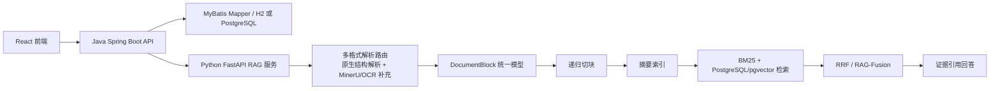

# RAG 架构说明

## 阶段边界

第一阶段完成 RAG，不实现 Agent 任务编排。页面中可以保留 Agent 入口和业务概念，但后端不提供自主规划、工具调用、长任务调度等 Agent 能力。

## Python RAG 流程

索引阶段：

1. 接收 Java 传入的文件或文本。
2. Python 按文件类型选择解析器，DOCX/PPTX/XLSX/Markdown/TXT 优先走原生结构解析，PDF 优先 MinerU。
3. 解析器统一输出 `DocumentBlock`，保留 block 类型、页码、幻灯片、sheet、cell range、来源路径和解析器置信度。
4. 低置信、截图型或高精度模式时，Python 通过 LibreOffice 转 PDF 后补跑 MinerU/OCR；补跑失败但原生块可用时返回 `PARTIAL`。
5. 按标题、章节、页面、幻灯片、段落、句子和长度预算做递归切块；表格、图片、代码块、公式和图表默认作为原子块。
6. 为文档和章节建立摘要索引。
7. 为 chunk 建 BM25 词项统计和确定性哈希向量，并写入 PostgreSQL/pgvector 的 `rag_chunk.embedding`，evidence 元数据保存在 `rag_chunk.metadata`。

查询阶段：

1. 基于原问题生成 Multi-Query 变体。
2. 按 metadata 过滤用户、文档类型、来源和可见范围。
3. 对每个 query 同时执行 BM25 和 pgvector 向量召回。
4. 使用 Reciprocal Rank Fusion 合并多路排名。
5. 返回可追溯 evidence，并生成确定性回答摘要。

## Stitch 前端视觉基准

前端基于 Chrome 中 Stitch 项目 `学迹智配管理后台` 的生成页面复刻：

| 维度 | 取值 |
| --- | --- |
| 主色 | `#4F46E5` |
| 辅色 | `#0EA5E9` |
| 强调色 | `#A54100` |
| 背景 | `#F9FAFB` |
| 字体 | `Inter`，代码/标签使用 `JetBrains Mono` |
| 卡片圆角 | 约 `8px` |
| 布局 | 左侧固定导航 + 顶部搜索/上传栏 + 信息密度适中的工作台 |

Stitch 页面包含的核心模块：

- 工作台统计卡片。
- 知识库智能检索 RAG。
- 多模态数据接入通道。
- 岗位适配分析入口。
- 视频知识切片回顾。
- 简历证据对齐。
