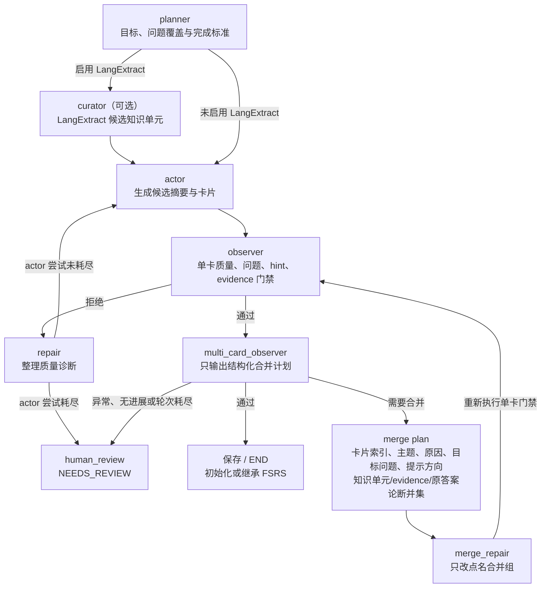

# 复习卡片 PAE/ReAct 生成图设计

更新日期：2026-08-10

## 目标

一次性复习模型输出可能因为问题不完整、问答错位、引用不存在、答案缺少 evidence 支撑或结构化问题覆盖不足而被整批拒绝。复习中心需要把这些确定性的质量门禁结果反馈给模型继续修正，并在自动修复确实无法完成时让用户参与，而不是让用户无上下文地重复点击生成。

## 图边界

复习生成使用 `ai-python/app/review/generation_graph.py` 中的独立 LangGraph，不接入统一 Agent 图。当前运行形态不接入 Java；Python 负责 evidence 清洗、默认 Terra 调用、DeepSeek 故障降级、图循环、质量校验与人工处理终态。

- `planner`：固定生成目标、问题覆盖范围和完成标准；卡片数量不设固定上限，也不使用 `maxCards` 截断。
- `actor`：调用复习模型输出唯一 JSON；第 2 轮起必须接收上一轮逐项质量反馈。
- `observer`：运行单卡问题完整性、提示质量、`sourceQuestion(s)`、`knowledgeUnitIds`、evidence 引用、逐论断忠实度和结构化问题覆盖门禁；通过后只把最后一次完整有效候选交给多卡复查。
- `multi_card_observer`：只输出结构化合并计划，不直接改卡。它应合并同一回忆路径下的并列定义、类型、策略和组成项，但不能合并独立原理、故障场景、解决方案或不同回忆路径。
- `merge_repair`：只接收被点名合并组的替换卡；图本身重建未点名卡片，并确定性校验 knowledge unit、原始问题覆盖、evidence 和答案论断并集，然后重新进入 `observer`。
- `repair`：整理并去重 Actor 质量诊断，未达模型尝试上限时回到 `actor`；合并轮次单独计数，不消耗 Actor 预算。
- `human_review`：把结果标记为 `NEEDS_REVIEW`，保存尝试次数、合并轮次和质量反馈；保留最后一次完整有效候选，发布层继续保留旧活动卡片，不再参加后台自动重试。

## 循环与失败控制

- LangGraph 调用固定使用 `recursion_limit=999`，为多节点循环留出足够空间。
- 真实质量修复默认最多 8 次，由 `REVIEW_GENERATION_MAX_ATTEMPTS` 配置并限制在安全范围内；空响应或非法 JSON 在当前质量轮内短程重试，不额外消耗质量修复轮次。递归限制与模型调用预算相互独立。
- 多卡合并默认最多 4 轮，由 `REVIEW_GENERATION_MAX_MERGE_ROUNDS` 配置并限制在 1-12；`merge_round` 与 Actor/模型质量尝试独立计数。
- 候选指纹至少包含问题集合、`knowledgeUnitIds` 和 `evidenceIds`；连续合并后指纹无变化即判定不收敛并转人工处理。
- 合并计划至少包含 `cardIndexes`、`parentTopic`、`reason`、`targetQuestion`、`hintTopics`、`mustPreserveKnowledgeUnitIds`、`mustPreserveEvidenceIds` 和 `mustPreserveClaims`。
- 缺少 `REVIEW_LLM_API_KEY`、资料无 evidence 等无法通过修复 Prompt 解决的问题直接保存为 `FAILED`。
- 质量门禁耗尽或 `GraphRecursionError` 保存为 `NEEDS_REVIEW`。用户提交 `userFeedback` 后启动一轮新的图执行，尝试次数按本轮重新计算，历史持久化反馈作为界面诊断，不污染原始 evidence。
- 只有完整通过单卡与多卡门禁的候选才会发布；合并轮次耗尽、指纹无进展或模型异常时不发布新候选，保留最后一次完整有效候选供审计，并保留旧活动卡片。

## 持久化与公开状态

`learning_review_material` 新增：

- `generation_attempts INTEGER NOT NULL DEFAULT 0`
- `quality_feedback JSONB NOT NULL DEFAULT '[]'`

状态约束新增 `NEEDS_REVIEW`。公开 `ReviewMaterial` 增加 `generationAttempts`、`qualityFeedback` 和 `needsManualReview`。后台同步跳过 `NEEDS_REVIEW`，只有当前认证用户的显式生成接口可以重新启动图。

## 文件夹拖拽语义

今日资料组的标题手柄写入文档 `materialId`。文件夹卡片只接受当前复习中心的文档拖拽，投放后调用 `PUT /api/reviews/materials/folder`。拖拽期间今日队列可提供临时排序预览，但投放文件夹时必须恢复拖拽前顺序，不调用排序接口；文件夹归属、FSRS 到期状态和资料优先级保持互相独立。批量选择移动继续作为键盘与触屏替代路径。
